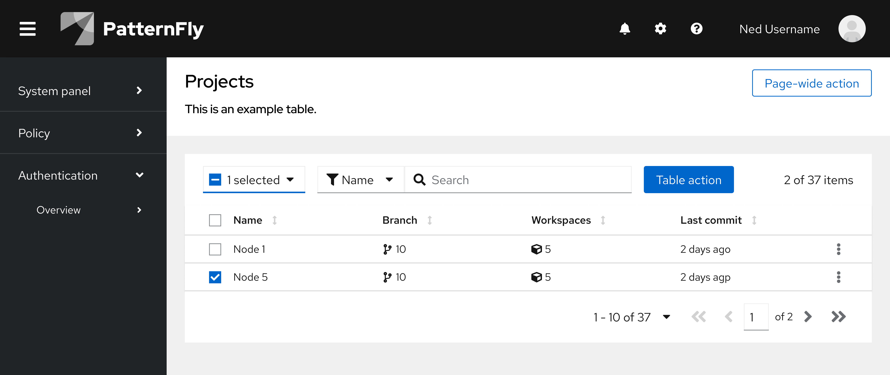
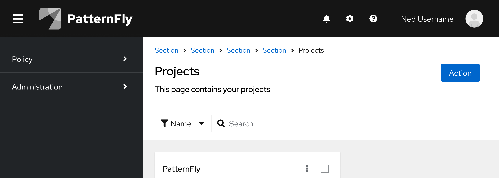

An **action** is any process that a user can trigger by clicking or selecting a linked component. Common actions include adding, deleting, editing, filtering, and submitting, for example. In PatternFly, most actions are shown in the UI as action buttons, action items (in menus), and action cards. These components are incorporated into the design of other components, such as a toolbar with action buttons, a dropdown menu with action items, and so on.

## Elements 

The following image of a card view demonstrates some of the more common uses of actions that you will find in a UI, but does not cover all scenarios. 

1. [**Action button:**](/components/button) Most buttons in a UI trigger an action. 
1. [**Action card:**](/components/card#actionable) A card itself can be actionable, meaning an action will be triggered when a user selects the card.
1. [**Action icon (button):**](/components/button) Icon buttons are commonly used to trigger recognizable and recurring actions. For example, ellipsis icons are used to open menus.
1. [**Action menu item:**](/components/menus/menu/design-guidelines#action-menu) To save space, actions can be placed within a menu. This is also useful when there are multiple actions that a user can take. 

## Usage

Use actions to make it clear and convenient for users to complete tasks in a UI. When applied intentionally, actions can make the UI more efficient and effective. 

When labeling or referring to actions in your UI, make sure that you adhere to our [terminology guidelines](/ux-writing/terminology) and align any icons you use with the usage behavior outlined in our [icon design foundations.](/design-foundations/icons#all-icons) 

### Deletion 
When users can delete data objects, items, or similar resources via the UI, follow these practices to ensure that they understand the purpose and consequences of deleting something. 

#### Irreversible deletion 

When deleting a resource is irreversible, there is a high risk that users will lose highly important information or data. It is necessary to ensure that users understand the impact of this action. Whether a resource is critical or non-critical, you should follow the same pattern.

To communicate that deletion will be permanent, use a confirmation dialog with the following features:

1. A **warning icon** beside the title.
1. A **labeled text input** to ask users to confirm the resource name. 
    - An error will be shown if the user does not enter a resource name, or if the resource name does not match the resource being deleted.
1. A **danger button** that submits the modal.

Once a resource has been successfully deleted, show an [inline success alert:](/components/alert#inline-alerts-variants)

#### Reversible deletion 
When the action of deleting a resource can be reversed, it has a lower impact on the user experience. You might want to warn users, but a confirmation dialog isn't necessary because they can easily retrieve the deleted resource.

## Variations 

Choose the appropriate actions button style according to our [button component guidelines.](/components/button/design-guidelines#variations)

It's important to strategically place actions in the UI so that they can be easily found by users and so that it's clear which data sources or elements they impact. As a result, actions typically fall into 1 of 2 categories: 
1. [Component-level actions](#component-level-actions)
1. [Page-wide actions](#page-wide-actions)

### Component-level actions

Many PatternFly components have design options that allow you to include actions. If an action affects a specific component, then the button should be placed within the component, according to its design guidelines. By placing buttons near the content that they affect, users will be able to better understand the button's use case.

For example, if a button affects data in a table or card view, place the button in the toolbar. 

### Page-wide actions

Sometimes, an action isn't intended to affect a specific component and is intended for higher-level processes like editing the page header, launching related windows, or any action that affects the page as a whole. 

Actions that affect a page as a whole should be placed on the top right of a page, at the header level. Do not place any page-wide actions in a toolbar.

#### Single actions 
When there is only a single page-wide action, use a primary or secondary button. Use a primary if it is the primary action you would like the user to take on the page, and a secondary button if it is not the primary call to action.

#### Multiple actions
If there are multiple possible page-wide actions a user can take on the page, house them in a dropdown menu. For guidance on menu toggle styling, refer to the [dropdown menu design guidelines](/components/menus/dropdown/design-guidelines).

