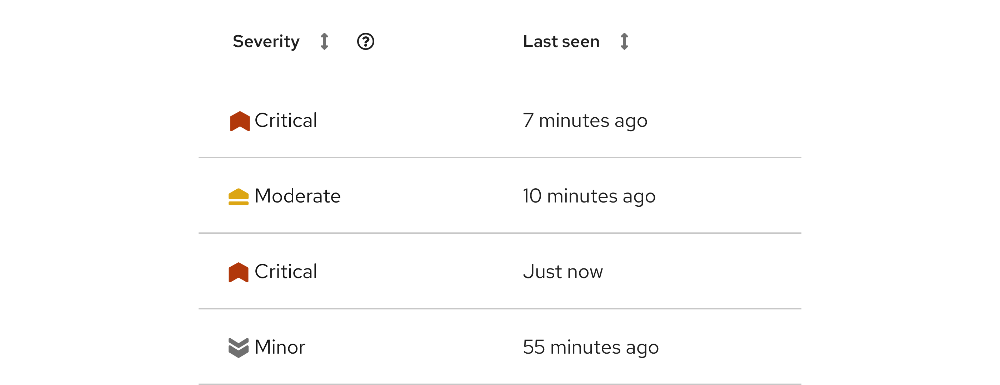
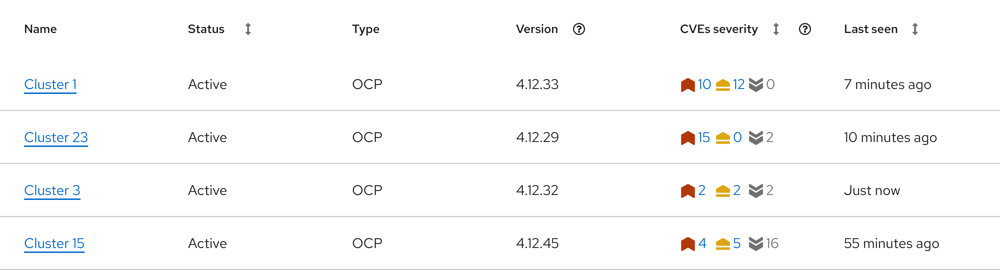

import { Button, Icon, Content, ContentVariants } from '@patternfly/react-core';
import './status-and-severity.css';
import SeverityCriticalIcon from '@patternfly/react-icons/dist/esm/icons/severity-critical-icon';
import SeverityImportantIcon from '@patternfly/react-icons/dist/esm/icons/severity-important-icon';
import SeverityMinorIcon from '@patternfly/react-icons/dist/esm/icons/severity-minor-icon';
import SeverityModerateIcon from '@patternfly/react-icons/dist/esm/icons/severity-moderate-icon';
import SeverityNoneIcon from '@patternfly/react-icons/dist/esm/icons/severity-none-icon';
import SeverityUndefinedIcon from '@patternfly/react-icons/dist/esm/icons/severity-undefined-icon';
import CheckCircleIcon from '@patternfly/react-icons/dist/esm/icons/check-circle-icon';
import ExclamationCircleIcon from '@patternfly/react-icons/dist/esm/icons/exclamation-circle-icon';
import ExclamationTriangleIcon from '@patternfly/react-icons/dist/esm/icons/exclamation-triangle-icon';
import InfoCircleIcon from '@patternfly/react-icons/dist/esm/icons/info-circle-icon';
import BellIcon from '@patternfly/react-icons/dist/esm/icons/bell-icon';
import StarIcon from '@patternfly/react-icons/dist/esm/icons/star-icon';
import ArrowRightIcon from '@patternfly/react-icons/dist/esm/icons/arrow-right-icon';

# Communicating status and severity 

It is often important to share easily accessible messages with users in your UIs to provide them with important context about their data streams and systems. Most often, the messages you share will be related to the status of systems and the severity of issues.

- [**Status:**](#status-icons) Refers to the current state of a connected data source, system, or similar object.

- [**Severity:**](#severity-icons) Refers to how critical an identified issue is.

Status and severity are most effectively communicated through a combination of text, color, and an icon.

## Content considerations 

Icons are often most meaningful when paired with text. If you're not certain that all users will recognize an icon on its own, add a descriptive text label or a tooltip. For guidance related to icon tooltips, refer to our [tooltips writing guide.](/ux-writing/tooltips)

## Status icons

Status icons convey the status of a data source, system, or similar object. They should not be used without a text label and/or additional context, like within [alerts,](/components/alert) [banners,](/components/banner#status) [empty states,](/components/empty-state#with-status) and more.

These icons are color coded to help users better understand what a message is trying to communicate.

| **Status** | **Icon** | **Color token** |
| --- | --- | :---: |
| Danger | <Icon status="danger" size="xl"> <ExclamationCircleIcon /> </Icon> |`--pf-t--global--icon--color--status--danger--default` | 
| Warning | <Icon status="warning" size="xl"><ExclamationTriangleIcon /></Icon> | `--pf-t--global--icon--color--status--warning--default` |
| Success | <Icon status="success" size="xl"><CheckCircleIcon /></Icon> | `--pf-t--global--icon--color--status--success--default` |
| Info | <Icon status="info" size="xl"><InfoCircleIcon /></Icon> | `--pf-t--global--icon--color--status--info--default` |
| Custom |  <Icon status="custom" size="xl"><BellIcon /></Icon> |`--pf-t--global--icon--color--status--custom--default` |

## Severity icons

When there is an issue or incident related to a source of data, it is important to communicate the severity of the situation to help users to measure and understand the impact that it may have on business. To facilitate effective communication, we offer a series of severity icons.

These icons combine color and visual weight, to reflect the sense of severity that the icon is communicating. As the icons progress from less severe to more severe, their visual weight increases and their color becomes more attention-grabbing.

| **Severity level** |  
**Icon**
 | **Color token** | **Usage** |
| --- | :---: | --- | --- |
| Critical | 
<Icon iconSize="lg" className="critical"><SeverityCriticalIcon /></Icon>
 | `--pf-t--global--icon--color--severity--critical--default`| Reserve for the highest severity issues. |
| Important | 
<Icon iconSize="lg" className="important"><SeverityImportantIcon /></Icon>
  | `--pf-t--global--icon--color--severity--important--default` | Use for high-threat issues. |
| Moderate | 
<Icon iconSize="lg" className="moderate"><SeverityModerateIcon /></Icon>
 | `--pf-t--global--icon--color--severity--moderate--default`| Use for moderate-threat issues. |
| Minor | 
<Icon iconSize="lg" className="minor"><SeverityMinorIcon /></Icon>
 | `--pf-t--global--icon--color--severity--minor--default`| Use for low-threat issues.  |
| None | 
<Icon iconSize="lg" className="none"><SeverityNoneIcon /></Icon>
 | `--pf-t--global--icon--color--severity--none--default` | Use when there is no security threat.  |
| Undefined | 
<Icon iconSize="lg"  className="undefined"><SeverityUndefinedIcon /></Icon>
 | `--pf-t--global--icon--color--severity--undefined--default` | Use if a severity level has not been determined yet, but is expected to change and be defined later. |

**Note:** Never use severity icons without applying color. The severity color palette was chosen carefully to communicate a clear range of urgency, while ensuring proper color accessibility ratios. 

### Single issue

When you're displaying severity information about a single, standalone issue, add the appropriate severity level text label:

### Aggregated issues

To provide users with an overview of a range of severity issues, you can combine multiple severity icons. You can display anywhere between 3 and 6 icons in a scale, depending on your use case. When displaying multiple severity icons in a scale, arrange them from most severe to least severe. 

| **Scale** | **Levels** | **Icons** |
| --- | --- | --- |
| 6-point scale | Critical, important, moderate, minor, none, undefined | <Icon iconSize="lg" className="critical"><SeverityCriticalIcon /></Icon> &nbsp;&nbsp; <Icon iconSize="lg" className="important"><SeverityImportantIcon /></Icon> &nbsp;&nbsp; <Icon iconSize="lg" className="moderate"><SeverityModerateIcon /></Icon>   &nbsp;&nbsp; <Icon iconSize="lg" className="minor"><SeverityMinorIcon /></Icon> &nbsp;&nbsp; <Icon iconSize="lg" className="none"><SeverityNoneIcon /></Icon> &nbsp;&nbsp; <Icon iconSize="lg" className="undefined"><SeverityUndefinedIcon /></Icon>  | 
| 5-point scale | Critical, important, moderate, minor, none or undefined (choose 1) | <Icon iconSize="lg" className="critical"><SeverityCriticalIcon /> </Icon> &nbsp;&nbsp; <Icon iconSize="lg" className="important"><SeverityImportantIcon /></Icon> &nbsp;&nbsp; <Icon iconSize="lg" className="moderate"><SeverityModerateIcon /></Icon>   &nbsp;&nbsp; <Icon iconSize="lg" className="minor"><SeverityMinorIcon /></Icon> &nbsp;&nbsp; <Icon iconSize="lg" className="none"><SeverityNoneIcon /></Icon>   or   <Icon iconSize="lg" className="critical"><SeverityCriticalIcon /> </Icon> &nbsp;&nbsp; <Icon iconSize="lg" className="important"><SeverityImportantIcon /></Icon> &nbsp;&nbsp; <Icon iconSize="lg" className="moderate"><SeverityModerateIcon /></Icon>   &nbsp;&nbsp; <Icon iconSize="lg" className="minor"><SeverityMinorIcon /></Icon> &nbsp;&nbsp; <Icon iconSize="lg" className="undefined"><SeverityUndefinedIcon /></Icon>   | 
| 4-point scale | Critical, important, moderate, minor |<Icon iconSize="lg" className="critical"><SeverityCriticalIcon /> </Icon> &nbsp;&nbsp; <Icon iconSize="lg" className="important"><SeverityImportantIcon /></Icon> &nbsp;&nbsp; <Icon iconSize="lg" className="moderate"><SeverityModerateIcon /></Icon>   &nbsp;&nbsp; <Icon iconSize="lg" className="minor"><SeverityMinorIcon /></Icon>  | 
| 3-point scale | Critical, moderate, minor | <Icon iconSize="lg" className="critical"><SeverityCriticalIcon /> </Icon> &nbsp;&nbsp; <Icon iconSize="lg" className="moderate"><SeverityModerateIcon /></Icon>   &nbsp;&nbsp; <Icon iconSize="lg" className="minor"><SeverityMinorIcon /></Icon>   | 

These groups of severity icons are especially useful in data displays, like tables and cards.

When you use multiple severity icons, include a count for each icon. To allow users to take action on issues, you can also link the counts to other resources. 

### Severity icons vs. status icons

Though they can both be used to warn users of issues, severity icons and status icons are not interchangeable, because status icons do not convey the level of impact that an issue may have. 