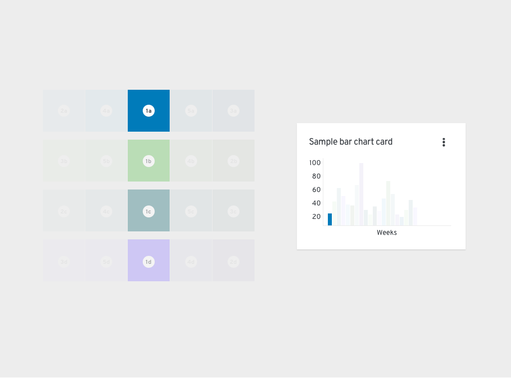
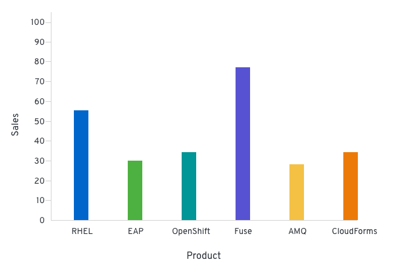
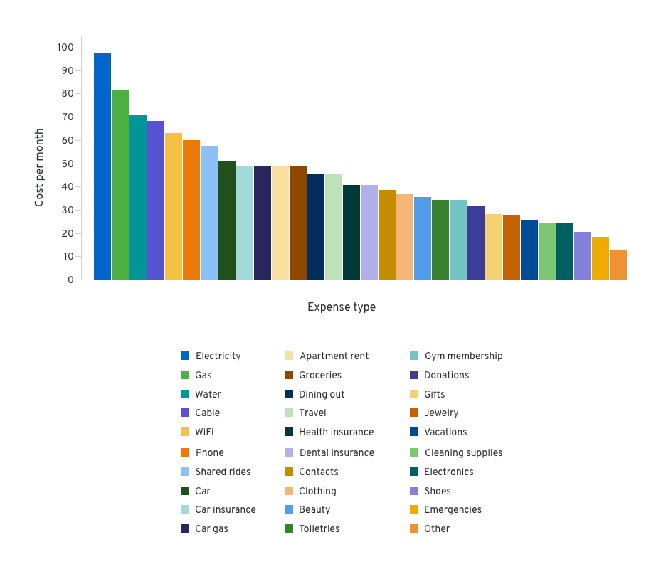
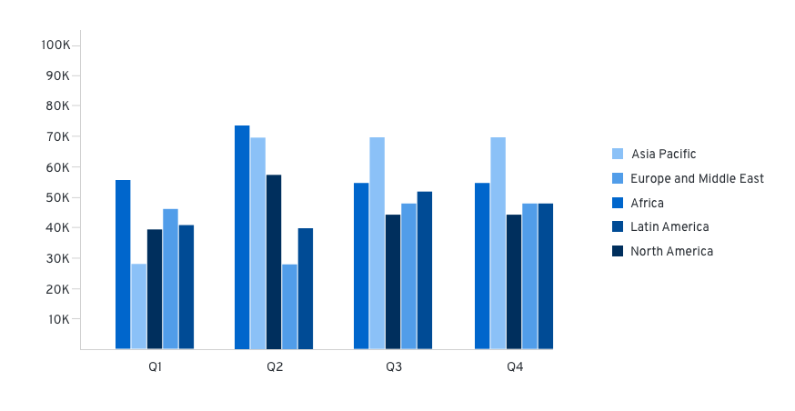
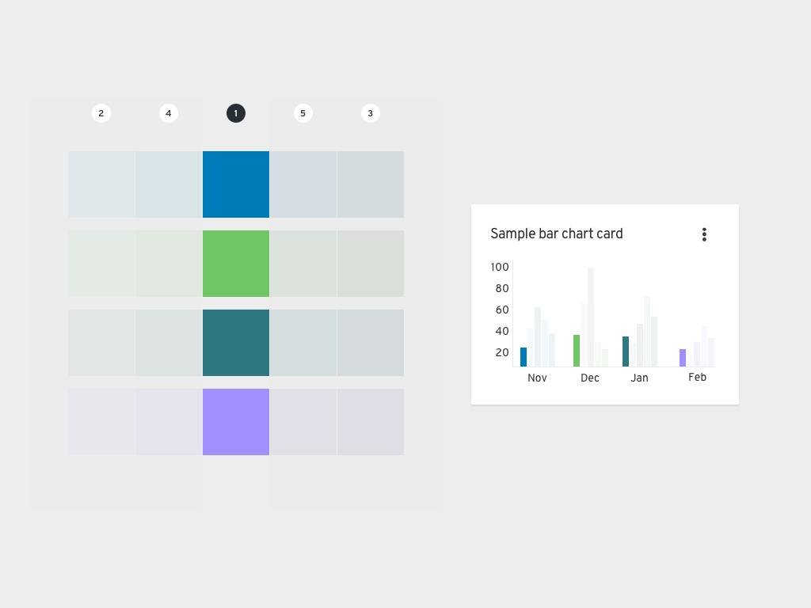

import theSystem from './thesystem.gif';
import oneFamily from './onefamily.gif';
import fewVariables from './fewvariables.png';
import manyVariables from './manyvariables.png';
import nestedVariables from './nestedvariables.png';
import { Alert, Grid, GridItem, Divider } from '@patternfly/react-core';
import ColorsGrid from './colors-grid.js';
import './colors-for-charts.css';

import '../../components/components.css';

## Color palettes

To create well-designed charts, you typically need to communicate your data by using multiple colors. Our chart colors are all pulled from [standard PatternFly color palettes](/design-foundations/charts). To ensure that your chart colors are distinct enough from each other, chart palettes are intentionally limited to a smaller range of hues within each color family.

Your data will determine the number of colors and the type of colors you will need. 

<ColorsGrid />

## Usage

Although the chart color system may seem complex, it is completely customizable. Once you choose your base colors and the total number of colors you need, the system will  sort them correctly. 

The system will first use each base color from the families you selected. Once all base colors have been used, the system alternates between choosing the lightest and darkest values of each family. The color picking system will continue to alternate between the remaining lightest and darkest colors of each family until it has reached the total number of colors you selected. 

No matter which base colors you select, this process will remain the same.

For example, if you select 4 base colors (and therefore their 4 respective color families):
1. #1a-d base colors
1. #2a-d [color]-100/[color]-500 alternating
1. #3a-d [color]-500/[color]-100 alternating
1. #4a-d [color]-200/[color]-400 alternating
1. #5a-d [color]-400/[color]-200 alternating

## Best practices

When selecting colors for your chart, adhere to the following general guidance: 

1. Within a color family, use the base color before the other, lighter or darker hues. 
1. Some families have predetermined uses:
    - **Green family:** Use to show success.
    - **Red orange family:** Use to show failure.
    - **Other color families:** Use for neutral purposes or categories.
1. **Patterns:** Use to deemphasize a section of a chart.
      - Only use for a single chart portion or type of portion to better highlight other sections that utilize solid colors. For example, you could use a pattern on your "success" portions to help "failure" portions stand out.
      - Do not use for every section of a chart.

1. When using red and green together in a single chart, note that they do not pass accessibility requirements, so you must also utilize patterns. To improve your chart's accessibility, add a pattern  to the section that you want to deemphasize.

  

  
  

## Examples

### Few chart variables 
When working with *7 or fewer variables*, align each variable to an available base color. 

For example, the following chart displays sales data per product over a period of time:

### Many chart variables 
If the set of data includes *more than 7 variables*, apply a multichromatic order system that includes all of the colors in the color system.

For example, the following chart displays the cost of living expenses over a period of time:

### Nested or grouped chart variables
If your dataset includes grouped variables, align each group to a color family. When you select multiple color families, your chart will automatically arrange the order of colors as follows: blue, green, teal, purple, yellow, orange, orange red, and then black. If there are more than 6 groups, this order would restart and continue to cycle.

For example, the following chart includes quarterly sales data that is broken down by geographical locations:

### Monochromatic charts

To create a monochromatic effect in your chart, you can also apply a color order system within 1 color family. This effect is particularly helpful for charts with nested variables. 

Within a family, the color order begins by going at the base color, then the lightest, darkest, second lightest, and second darkest colors. Regardless of color family, hues will always follow this order. 

As design tokens, this order looks like: 
1. `--pf-t-chart-color-[colorname]-300` (base color)
1. `--pf-t-chart-color-[colorname]-100` (lightest)
1. `--pf-t-chart-color-[colorname]-500` (darkest)
1. `--pf-t-chart-color-[colorname]-200` (second lightest)
1. `--pf-t-chart-color-[colorname]-400` (second darkest)

