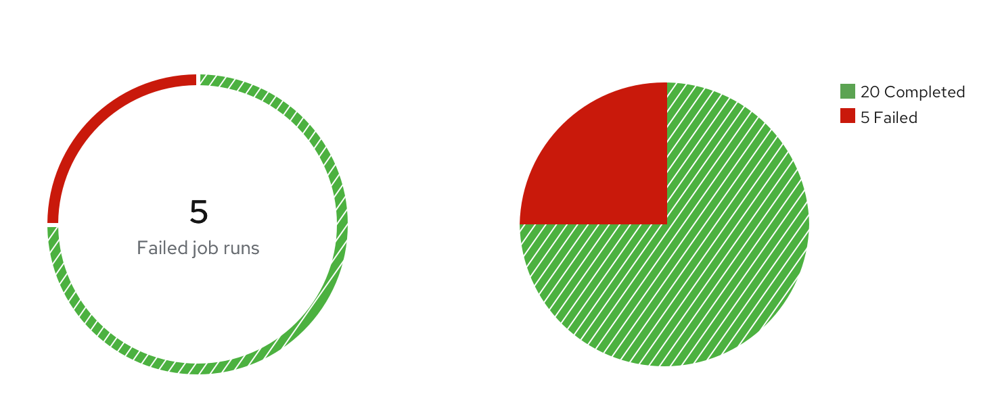

import theSystem from './thesystem.gif';
import oneFamily from './onefamily.gif';
import fewVariables from './fewvariables.png';
import manyVariables from './manyvariables.png';
import nestedVariables from './nestedvariables.png';
import { Alert, Grid, GridItem, Divider } from '@patternfly/react-core';
import ColorsGrid from './colors-grid.js';
import './colors-for-charts.css';

## Chart colors

PatternFly recommends colors to use with bar charts, donut charts and pie charts. There are six base colors (blue to orange) that the chart color system is built on. Each base color has its own monochromatic color family, which includes lighter and darker hues of the base color. Each family is ordered based on increasing color contrast. The variation of colors you use will depend on the type and amount of data you’re working with.

<ColorsGrid />

<Divider className="ws-chart-colors-divider" />

## The system

<Grid hasGutter>
  <GridItem xl={6} lg={12} className="ws-chart-colors-gridtext">
    ### How it works
    Although the system may seem complex, it is completely customizable. Once you choose the base colors you want to use and the total number of colors you will need, the system will still sort them correctly. 
     
    For example, if you select four base colors (and therefore their four respective color families) the system will first use each base color in your chart. Once all base colors have been used, the system will select additional colors from the families you selected. The system alternates between choosing the lightest and darkest values of each family (shown in the animation). The color picking system will continue to alternate between the remaining  lightest and darkest colors of each family. In variable-terms: #1a-d base colors, #2a-d [color]-100/[color]-500 alternating, #3a-d [color]-500/[color]-100 alternating, #4a-d [color]-200/[color]-400 alternating, and #5a-d [color]-400/[color]-200 alternating. No matter which base colors you select, this process will remain the same.
  </GridItem>
  <GridItem xl={6} lg={12}>
    
  </GridItem>
</Grid>

<Divider className="ws-chart-colors-divider" />

## Color and pattern usage

When selecting colors for your chart, there are a few important usage considerations to keep in mind. Within a color family, use the base color before the other, lighter or darker hues. Additionally, consider other basic guidelines: 

* **Green family:** Use to show success
* **Red family:** Use to show failure
* **Other color families:** Use for neutral purposes or categories
* **Patterns:** Use to deemphasize a section of a chart. Do not use patterns for every section of a chart. Instead, patterns should be used for a single chart portion or for one type of portion (such as for all successes) to deemphasize that section and highlight the other section, which utilizes a solid color.

  
**Note:** When showing success and failure together in a chart, the base color red and green do not pass accessibility requirements. When using both red and green base colors in a single chart, add a pattern to the section that you want to deemphasize to improve the chart’s accessibility.

<Divider className="ws-chart-colors-divider" />

## Use cases

<Grid hasGutter>
  <GridItem xl={6} lg={12} className="ws-chart-colors-gridtext">
    ### Chart with few variables (1-7)
    When working with  data that includes fewer than 7 variables, we recommend corresponding each with one of the available base colors. For example, if you collected data on how many sales were made per product at your organization during a period of time, a bar chart of your data may look similar to the following image.
  </GridItem>
  <GridItem xl={6} lg={12}>
    
  </GridItem>
</Grid>

<Grid hasGutter>
  <GridItem xl={6} lg={12} className="ws-chart-colors-gridtext">
    ### Chart with nested (grouped) variables
    If your dataset includes grouped variables, we recommend aligning each group to a color family. When you select more than one color family, your chart will arrange the order of colors as follows: blue, green, cyan, purple, gold, orange, red, and then gray. The colors would start over if there are more than 6 groups, returning back to the blue family. 
     
    Shown in the following image is an example of this type of chart, which includes quarterly sales data broken down by geographical locations.
  </GridItem>
  <GridItem xl={6} lg={12}>
    
  </GridItem>
</Grid>

<Grid hasGutter>
  <GridItem xl={6} lg={12} className="ws-chart-colors-gridtext">
    ### Chart with many variables (>7)
    If the set of data includes more than 7 variables, we recommend applying a multichromatic order system, which includes all of the colors in the color system.
     
    Shown in the following image is an example of this type of chart, which displays the cost of living expenses during a period of time.
  </GridItem>
  <GridItem xl={6} lg={12}>
    
  </GridItem>
</Grid>

<Divider className="ws-chart-colors-divider" />

## Using the system with one color family

<Grid hasGutter>
  <GridItem xl={6} lg={12} className="ws-chart-colors-gridtext">
    You can also use the color order system with one color family to create a monochromatic effect. We recommend using this approach for charts with nested variables. The order begins by going through each base color, then the lightest, darkest, second lightest, and second darkest colors in a family. In variable-terms, this order looks like: #1 [color]-300 (base color), #2 [color]-100, #3 [color]-500, #4 [color]-200, #5 [color]-400. Regardless of color family, hues will always follow this order.
  </GridItem>
  <GridItem xl={6} lg={12}>
    
  </GridItem>
</Grid>
