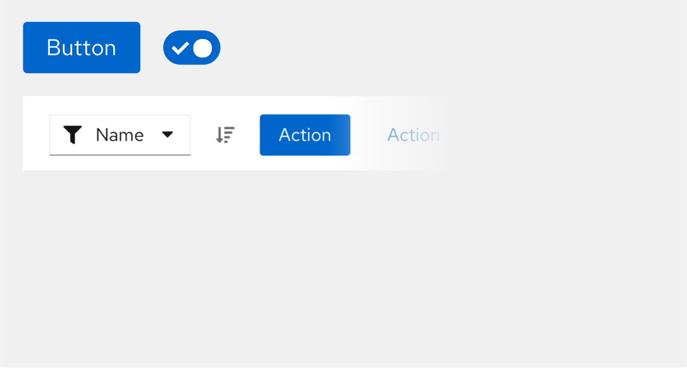
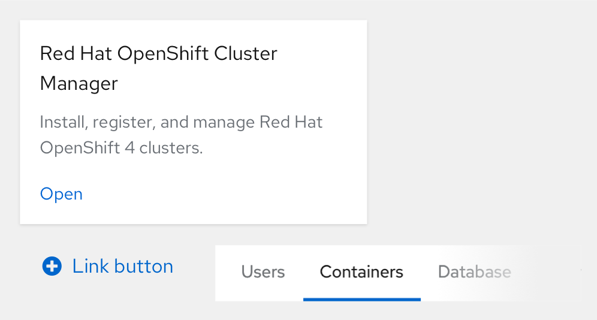
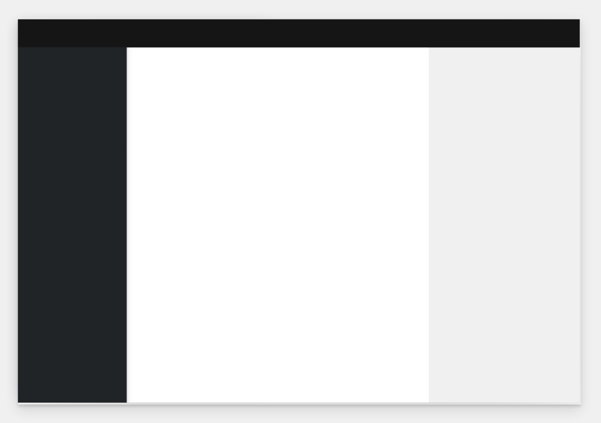
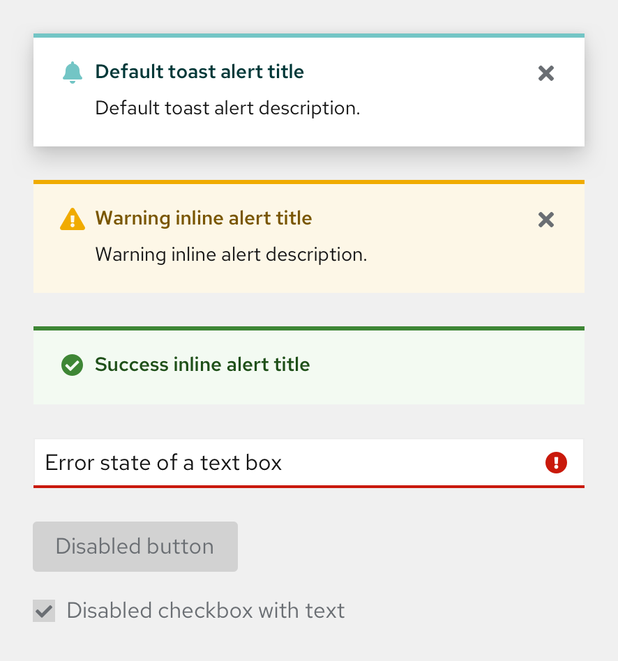
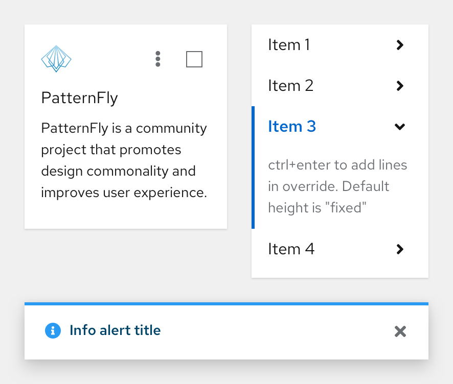

import { Alert, Grid, GridItem, Divider } from '@patternfly/react-core';
import { ColorSwatch } from './ColorSwatch';
import { ColorFamily } from './ColorFamily';
import './colors.css';

# PatternFly colors 
This guide outlines the PatternFly color palette, as well as guidance for color use in different scenarios. Note that the color swatches and palettes automatically change to accommodate light or dark themes. To learn more about PatternFly’s dark theme, refer to our [dark theme handbook](/developer-resources/dark-theme-handbook).

In this guide, you can select each color swatch to learn more details, such as hex values and usage guidance.

Refer to our developer resources to see a list of all [global CSS color variables.](https://patternfly-org-pr-3678-site.surge.sh/developer-resources/global-css-variables/#global-css-variables)

<Grid hasGutter>
  <GridItem xl={6} lg={12} className="ws-colors-gridtext">
    ## Primary colors
    

      Primary colors are those displayed most frequently across your application screens and components. Our primary color is called **"PatternFly blue"**, which is used across PatternFly's components. PatternFly blue should change upon hover.
    

    <ColorSwatch label="Default" color="--pf-v5-global--primary-color--100">
      This color indicates a default or active state for many components.
    </ColorSwatch>
    <ColorSwatch label="Hover" color="--pf-v5-global--primary-color--200">
      This color is used as the hover or focus state for components that use the default primary color.
    </ColorSwatch>
  </GridItem>
  <GridItem xl={6} lg={12}>
    
  </GridItem>
</Grid>

<Divider className="ws-colors-divider" />

## Typography and iconography colors
<Grid hasGutter>
  <GridItem xl={6} lg={12} className="ws-colors-gridtext">
    

      Text and icon colors are extremely similar because they can often be used in the same context, such as for a link button. We support multiple shades of text colors so that you can emphasize hierarchy on both light and dark backgrounds.
    

    <ColorSwatch color="--pf-v5-global--Color--100">
      This color is used for standard text and icons, and also as a hover state color for icon buttons. It is most commonly used as a text color for many components and application screens.
    </ColorSwatch>
    <ColorSwatch color="--pf-v5-global--Color--200">
      This color is used as a secondary text color and as a default color for icon buttons. It is most commonly used for many components, such as the app launcher and empty states.
    </ColorSwatch>
    <ColorSwatch color="--pf-v5-global--link--Color">
      This color is most commonly used for link text and icons across many components, such as navigation and accordions.
    </ColorSwatch>
  </GridItem>
  <GridItem xl={6} lg={12}>
    
  </GridItem>
</Grid>

<Divider className="ws-colors-divider" />

## Background colors
<Grid hasGutter>
  <GridItem xl={6} lg={12} className="ws-colors-gridtext">
    

      Background colors are used throughout components and, occasionally, for certain screens. Light colors can be used interchangeably with full-screen backgrounds, while dark colors are strictly used as backgrounds within components.
    

    <h3>Light backgrounds</h3>
    <ColorSwatch color="--pf-v5-global--BackgroundColor--200">
      This color is most commonly used as a secondary background color for full-screen applications and hover backgrounds.
    </ColorSwatch>
    <ColorSwatch color="--pf-v5-global--BackgroundColor--100">
      This color is most commonly used as a primary background color for full-screen applications and many components, such as cards and tables/data lists.
    </ColorSwatch>
    <h3>Dark backgrounds</h3>
    <ColorSwatch color="--pf-v5-global--BackgroundColor--dark-100">
      This color is most commonly used as a background color for many components, such as tooltips and wizards.
    </ColorSwatch>
    <ColorSwatch color="--pf-v5-global--BackgroundColor--dark-200">
      This color is used as a background color for navigation.
    </ColorSwatch>
    <ColorSwatch color="--pf-v5-global--BackgroundColor--dark-300">
      This color is most commonly used as a background color for many components, such as navigation.
    </ColorSwatch>
    <ColorSwatch color="--pf-v5-global--BackgroundColor--dark-400">
      This color is used as a background color for navigation.
    </ColorSwatch>
  </GridItem>
  <GridItem xl={6} lg={12}>
    
  </GridItem>
</Grid>

<Divider className="ws-colors-divider" />

## Status and state colors
<Grid hasGutter>
  <GridItem xl={6} lg={12} className="ws-colors-gridtext">
      Status and state colors are indicators that communicate data and actions to users through the UI. PatternFly's status colors cover default, danger, success, information, and warning statuses, as well as disabled states.
  </GridItem>
  <GridItem xl={6} lg={12} rowSpan={6}>
    
  </GridItem>
  <GridItem xl={6} lg={12}>
    <h3>Default</h3>
    <ColorSwatch color="--pf-v5-global--default-color--300" caption="alert title">
      This color is used as the title color for the default alert component.
    </ColorSwatch>
    <ColorSwatch color="--pf-v5-global--default-color--200" caption="alert icon">
      This color is used as the icon color for the default alert component.
    </ColorSwatch>
    <ColorSwatch color="--pf-v5-global--palette--cyan-50" caption="inline alert background">
      This color is used as the background color for the default inline alert component.
    </ColorSwatch>
  </GridItem>
  <GridItem xl={6} lg={12}>
  <h3>Danger</h3>
    <ColorSwatch color="--pf-v5-global--danger-color--200" caption="alert title">
      This color is used as the title color for the danger alert component.
    </ColorSwatch>
    <ColorSwatch color="--pf-v5-global--danger-color--100" caption="alert icon">
      This color is used as the icon color for the danger alert component.
    </ColorSwatch> 
    <ColorSwatch color="--pf-v5-global--palette--red-50" caption="inline alert background">
      This color is used as the background color for danger inline alert component.
    </ColorSwatch>
  </GridItem>
  <GridItem xl={6} lg={12}>
    <h3>Success</h3>
    <ColorSwatch color="--pf-v5-global--success-color--200" caption="alert title">
      This color is used as the title color for the success alert component.
    </ColorSwatch>
    <ColorSwatch color="--pf-v5-global--success-color--100" caption="alert icon">
      This color is used as the icon color for the success alert component.
    </ColorSwatch>
    <ColorSwatch color="--pf-v5-global--palette--green-50" caption="inline alert background">
      This color is used as the background color for the success inline alert component.
    </ColorSwatch>
  </GridItem>
  <GridItem xl={6} lg={12}>
    <h3>Info</h3>
    <ColorSwatch color="--pf-v5-global--info-color--200" caption="alert title">
      This color is used as the title color for the info alert component.
    </ColorSwatch>
    <ColorSwatch color="--pf-v5-global--info-color--100" caption="alert icon">
      This color is used as the icon color for the default alert component.
    </ColorSwatch>
    <ColorSwatch color="--pf-v5-global--palette--blue-50" caption="alert background">
      This color is used as the background color for the info inline alert component.
    </ColorSwatch>
  </GridItem>
  <GridItem xl={6} lg={12}>
    <h3>Warning</h3>
    <ColorSwatch color="--pf-v5-global--warning-color--200" caption="alert title">
      This color is used as the title color for the warning alert component.
    </ColorSwatch>
    <ColorSwatch color="--pf-v5-global--warning-color--100" caption="alert icon">
      This color is used as the icon color for the warning alert component.
    </ColorSwatch>
    <ColorSwatch color="--pf-v5-global--palette--gold-50" caption="inline alert background">
      This color is used as the background color for the warning inline alert component.
    </ColorSwatch>
  </GridItem>
   <GridItem xl={6} lg={12}>
    <h3>Disabled</h3>
    <ColorSwatch color="--pf-v5-global--disabled-color--100" caption="disabled text">
      This color is used as the text color when components are disabled.
    </ColorSwatch>
    <ColorSwatch color="--pf-v5-global--disabled-color--200" caption="disabled background">
      This color is used as the background color for many components when they are disabled, such as buttons and the application launcher.
    </ColorSwatch>
    <ColorSwatch color="--pf-v5-global--disabled-color--300" caption="alternate disabled background">
      This color is used as an alternate background color for components when they are disabled, such as dropdowns and options menus.
    </ColorSwatch>
  </GridItem>
</Grid>

<Divider className="ws-colors-divider" />

## Shadows
<Grid hasGutter>
  <GridItem xl={6} lg={12} className="ws-colors-gridtext">
    

      Shadows can be used to create contrast between UI elements. PatternFly supports different shadow sizes, which enable you to increase the visual depth of a UI element and distinguish it from other elements on the screen. 
    

    <ColorSwatch label="Large" color="--pf-v5-global--BoxShadow--lg">
      Large shadows create the most contrast and depth for a UI element. These are commonly used for alerts and modals.
    </ColorSwatch>
    <ColorSwatch label="Medium" color="--pf-v5-global--BoxShadow--md">
      Medium shadows fall between small and large shadows, creating moderate contrast and depth for a UI element. These are commonly used for accordions and dropdowns. 
    </ColorSwatch>
    <ColorSwatch label="Small" color="--pf-v5-global--BoxShadow--sm">
      Small shadows offer minimal, but visible shadows that slightly increase the contrast and depth of a UI element. These are most commonly used for cards. 
    </ColorSwatch>
  </GridItem>
  <GridItem xl={6} lg={12}>
    
  </GridItem>
</Grid>

<Divider className="ws-colors-divider" />

## Contrast ratios

[PatternFly's goal](/accessibility/patternflys-accessibility/) is to meet [level AA in the Web Content Accessibility Guidelines 2.1](https://www.w3.org/WAI/standards-guidelines/wcag/new-in-21/). To meet level AA requirements, your UI contrast ratios must be at or above 4.5:1 for normal text, 3:1 for large text, and 3:1 for graphics and other UI components. Additionally, on hover, link text color should have ample contrast from both the background color and the default state link color.

To check the contrast between background and text colors, use a <a href="https://color.a11y.com/?wc3" target="_blank" className="pf-m-link">WCAG AA-compliance tool.</a>

<Divider className="ws-colors-divider" />

## PatternFly palettes
Our color palettes are created as a system, designed to reinforce content and workflows. Our palettes are carefully chosen to support effective communication and adapt to the needs of your UI.

Note that bright colors are used sparingly and are reserved for specific interactions, such as communicating status.

Our color palettes are organized into "families" that contain different shades of the same hue. In the following palettes, you can expand each value color or shadow in a family to see more details.

<Grid hasGutter>
  <GridItem xl2RowSpan={1} xl2={4} xl={6} xlRowSpan={2} sm={12}>
    <ColorFamily title="Gray family" family="black" />
  </GridItem>
  <GridItem xl2={4} xl={6} sm={12}>
    <ColorFamily title="Blue family" family="blue" />
  </GridItem>
  <GridItem xl2={4} xl={6} sm={12}>
    <ColorFamily title="Shadows" family="shadows" />
  </GridItem>
  <GridItem xl2={4} xl={6} sm={12}>
    <ColorFamily title="Green family" family="green" />
  </GridItem>
  <GridItem xl2={4} xl={6} sm={12}>
    <ColorFamily title="Cyan family" family="cyan" />
  </GridItem>
  <GridItem xl2={4} xl={6} sm={12}>
    <ColorFamily title="Purple family" family="purple" />
  </GridItem>
  <GridItem xl2={4} xl={6} sm={12}>
    <ColorFamily title="Light blue family" family="light-blue" />
  </GridItem>
  <GridItem xl2={4} xl={6} sm={12}>
    <ColorFamily title="Gold family" family="gold" />
  </GridItem>
  <GridItem xl2={4} xl={6} sm={12}>
    <ColorFamily title="Light green family" family="light-green" />
  </GridItem>
  <GridItem xl2={4} xl={6} sm={12}>
    <ColorFamily title="Orange family" family="orange" />
  </GridItem>
  <GridItem xl2={4} xl={6} sm={12}>
    <ColorFamily title="Red family" family="red" />
  </GridItem>
</Grid>
