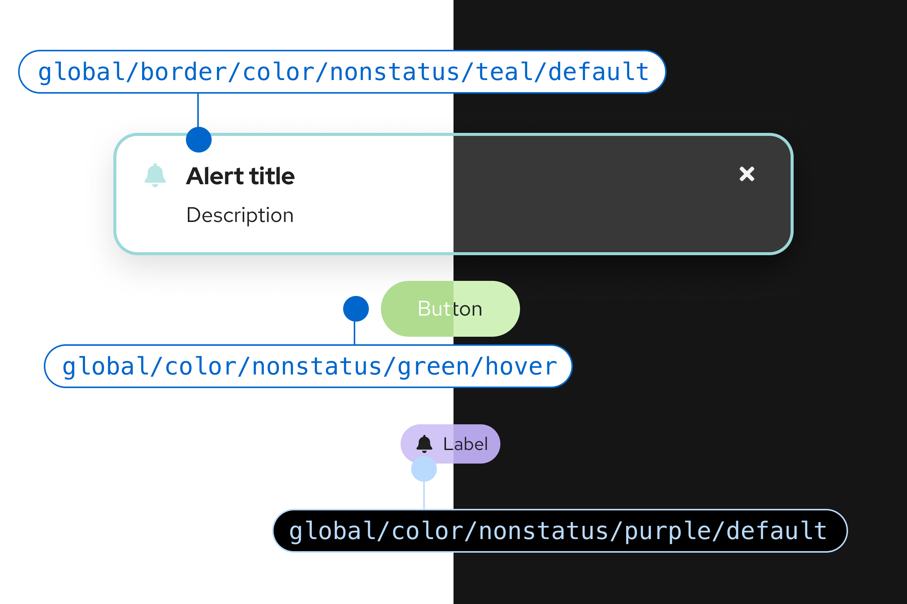

import { Alert, Grid, GridItem, Banner, Button, Stack } from '@patternfly/react-core';
import { Table, Caption, Thead, Tr, Th, Tbody, Td } from '@patternfly/react-table';
import ArrowRightIcon from '@patternfly/react-icons/dist/esm/icons/arrow-right-icon';
import { ColorSwatch } from './ColorSwatch';
import { ColorFamily } from './ColorFamily';

# PatternFly's palette

Our color palettes align with <a href="https://www.redhat.com/en/about/brand/standards/color" target="_blank" alt="Red Hat brand colors"> Red Hat's brand colors </a> and are designed to reinforce content and support effective communication across different UI needs. Colors are applied to PatternFly elements using [semantic design tokens.](/tokens/about-tokens) This guide offers guidance for color use in some of the most common scenarios, but it does not cover all tokens. Additional color usage information is included in our tokens documentation.

<Button component="a" href="/tokens/all-patternfly-tokens" variant="link" isInline> View all PatternFly tokens <ArrowRightIcon />
</Button>

Each example contains a descriptive label, a semantic token, and a color swatch circle. If you select a color swatch circle, you can see more details, including a hex code and usage information. Color swatches will automatically update to match light or dark theme colors, based on your browser settings.

## Brand colors

Brand colors are used to identify your brand, and are the colors most frequently used across your UI. Our brand color, "PatternFly blue", is used across all components. There are different brand tokens depending on the use case, like icon tokens, text tokens, global color tokens, and so on.

<Grid hasGutter>
  <GridItem span={5}>
    <Stack hasGutter>
      <ColorSwatch label="Default" color="--pf-t--global--color--brand--default">
        Use to reinforce your brand. Often indicates a default or active state.
      </ColorSwatch>
      <ColorSwatch label="Hover" color="--pf-t--global--color--brand--hover">
        Use for branded elements that are in a hover/focus state.
      </ColorSwatch>
      <ColorSwatch label="Text" color="--pf-t--global--text--color--brand--default">
        Use for branded text elements.
      </ColorSwatch>
    </Stack>
  </GridItem>
  <GridItem span={7}>
    
  </GridItem>
</Grid>

## Background colors

Background colors are used throughout components and, occasionally, for certain screens.

<Grid hasGutter>
  <GridItem span={5}>
    <Stack hasGutter>
      <ColorSwatch label="Primary" color="--pf-t--global--background--color--primary--default">
        Use as the primary background color for UI content such as cards, page sections, and other content areas. 
      </ColorSwatch>
      <ColorSwatch label="Primary hover" color="--pf-t--global--background--color--primary--hover">
        Use as the hover color for primary-colored backgrounds.
      </ColorSwatch>
      <ColorSwatch label="Secondary" color="--pf-t--global--background--color--secondary--default">
        Use as the secondary color for UI content. Also use for UI shell backgrounds, like navigation and mastheads.
      </ColorSwatch>
      <ColorSwatch label="Secondary hover" color="--pf-t--global--background--color--secondary--hover">
        Use as the hover color for secondary-colored backgrounds.
      </ColorSwatch>
    </Stack>
  </GridItem>
  <GridItem span={7}>
    
  </GridItem>
</Grid>

## Text and icon colors

Text and icon colors overlap, because they can be used inline with each other. Note that there are different tokens for standalone icons, inline icons, and standalone text. For more details view our [icons](/design-foundations/icons) and [typography](/design-foundations/typography) guidelines.

Text and icons can also display status information, which is covered in the [status and state colors section.](#status-and-state-colors)

<Grid hasGutter>
  <GridItem span={5}>
    <Stack hasGutter>
      <ColorSwatch label="Regular text" color="--pf-t--global--text--color--regular">
        Use as the primary color for standard text, like heading/body copy. Icons paired with regular text should inherit this color or should use --global--icon--color--regular.
      </ColorSwatch>
      <ColorSwatch label="Subtle text" color="--pf-t--global--text--color--subtle">
        Use as a secondary text color for text in an element that requires less emphasis, like descriptions or inactive tab labels.
      </ColorSwatch>
      <ColorSwatch label="Regular icons" color="--pf-t--global--icon--color--regular">
        Use as the default color for icons in icon buttons and/or when paired with regular-colored text.
      </ColorSwatch>
      <ColorSwatch label="Links" color="--pf-t--global--text--color--link--default">
        Use as the default text color for links.
      </ColorSwatch>
    </Stack>
  </GridItem>
  <GridItem span={7}>
    
  </GridItem>
</Grid>

## Status and state colors

Status and state colors are indicators that communicate data and actions to users through the UI. PatternFly's status colors cover default, danger, success, information, and warning statuses, as well as disabled states.

### Danger

<Grid hasGutter>
  <GridItem span={5}>
    <Stack hasGutter>
      <ColorSwatch color="--pf-t--global--icon--color--status--danger--default" label="Default icons">
        Use as the default color for icons that convey danger, like in alerts or banners.
      </ColorSwatch>
      <ColorSwatch color="--pf-t--global--text--color--status--danger--default" label="Default text">
        Use as the default color for text that communicates a danger status.
      </ColorSwatch> 
      <ColorSwatch color="--pf-t--global--color--status--danger--hover" label="Hover">
        Use as the hover color for any element that conveys a danger status.
      </ColorSwatch>
    </Stack>
  </GridItem>
  <GridItem span={7}>
    
  </GridItem>
</Grid>

### Warning

<Grid hasGutter>
  <GridItem span={5}>
    <Stack hasGutter>
      <ColorSwatch color="--pf-t--global--icon--color--status--warning--default" label="Default icons">
        Use as the default color for icons that convey a warning status, like in alerts or banners.
      </ColorSwatch>
      <ColorSwatch color="--pf-t--global--text--color--status--warning--default" label="Default text">
        Use as the default color for text that communicates a warning status.
      </ColorSwatch>
      <ColorSwatch color="--pf-t--global--color--status--warning--hover" label="Hover">
        Use as the hover color for any element that conveys a warning status.
      </ColorSwatch>
    </Stack>
  </GridItem>
  <GridItem span={7}>
    
  </GridItem>
</Grid>

### Disabled
<Grid hasGutter>
   <GridItem span={5}>
    <Stack hasGutter>
      <ColorSwatch color="--pf-t--global--icon--color--disabled" label="Icons">
        Use as the color for icons that show in disabled icon buttons and/or when paired with disabled-color text
      </ColorSwatch>
      <ColorSwatch color="--pf-t--global--text--color--disabled" label="Text">
        Use as the color of text on disabled elements, like disabled menu items.
      </ColorSwatch>
      <ColorSwatch color="--pf-t--global--background--color--disabled--default" label="Backgrounds">
        Use as the background color for disabled components.
      </ColorSwatch>
    </Stack>
  </GridItem>
  <GridItem span={7}>
    
  </GridItem>
</Grid>

## Nonstatus colors 

<Grid hasGutter>
  <GridItem span={5}>
    <Stack hasGutter>
      <ColorSwatch color="--pf-t--global--border--color--nonstatus--teal--default" label="Borders">
        Use as the default border color for any element that does not convey status and that you always want to be teal, like color-coded labels.
      </ColorSwatch>
      <ColorSwatch color="--pf-t--global--color--nonstatus--purple--default" label="Backgrounds">
        Use as the default background color for any element that does not convey status and that you always will want to be purple, like color-coded labels and banners.
      </ColorSwatch> 
      <ColorSwatch color="--pf-t--global--color--nonstatus--green--hover" label="Hover">
        Use as the hover state color for any element that uses the nonstatus green background color.
      </ColorSwatch>
    </Stack>
  </GridItem>
  <GridItem span={7}>
    
  </GridItem>
</Grid>

## Contrast ratios

[Our accessibility standards](/accessibility/patternflys-accessibility#accessibility-standards) are [level AA in the Web Content Accessibility Guidelines 2.2](https://www.w3.org/WAI/WCAG22/quickref/?versions=2.2&currentsidebar=%23col_customize&levels=aaa). To achieve level AA accessibility, your UI contrast ratios must be at or above 4.5:1 for normal text, 3:1 for large text, and 3:1 for graphics and other UI components. Additionally, on hover, link text color should have ample contrast from both the background color and the default state link color.

To check the contrast between background and text colors, use a <a href="https://color.a11y.com/?wc3" target="_blank" className="pf-m-link">WCAG AA-compliance tool.</a>

## Color families 
Our color palettes are organized into "families" that contain different shades of the same hue. In the following families, you can expand each color to see related tokens.

<Grid hasGutter>
  <GridItem xl2RowSpan={1} xl2={4} xl={6} xlRowSpan={2} sm={12}>
    <ColorFamily title="Gray family" family="gray" />
  </GridItem>
  <GridItem xl2={4} xl={6} sm={12}>
    <ColorFamily title="Blue family" family="blue" />
  </GridItem>
  <GridItem xl2={4} xl={6} sm={12}>
    <ColorFamily title="Green family" family="green" />
  </GridItem>
  <GridItem xl2={4} xl={6} sm={12}>
    <ColorFamily title="Teal family" family="teal" />
  </GridItem>
  <GridItem xl2={4} xl={6} sm={12}>
    <ColorFamily title="Purple family" family="purple" />
  </GridItem>
  <GridItem xl2={4} xl={6} sm={12}>
    <ColorFamily title="Yellow family" family="yellow" />
  </GridItem>
  <GridItem xl2={4} xl={6} sm={12}>
    <ColorFamily title="Orange family" family="orange" />
  </GridItem>
  <GridItem xl2={4} xl={6} sm={12}>
    <ColorFamily title="Red family" family="red" />
  </GridItem>
<GridItem xl2={4} xl={6} sm={12}>
    <ColorFamily title="Red orange family" family="red-orange" />
  </GridItem>
</Grid>
