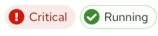
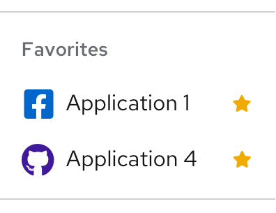
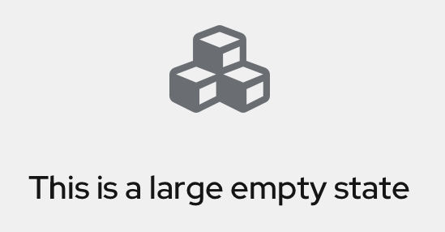
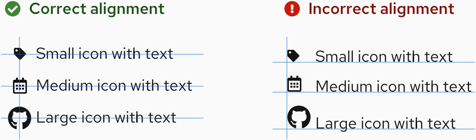

import { Card, CardBody, Divider, Flex, FlexItem, Grid, GridItem } from '@patternfly/react-core';
import CaretDownIcon from '@patternfly/react-icons/dist/esm/icons/caret-down-icon';
import CheckCircleIcon from '@patternfly/react-icons/dist/esm/icons/check-circle-icon';
import ExclamationCircleIcon from '@patternfly/react-icons/dist/esm/icons/exclamation-circle-icon';
import GithubIcon from '@patternfly/react-icons/dist/esm/icons/github-icon';
import OutlinedCalendarAltIcon from '@patternfly/react-icons/dist/esm/icons/outlined-calendar-alt-icon';
import StarIcon from '@patternfly/react-icons/dist/esm/icons/star-icon';
import TagIcon from '@patternfly/react-icons/dist/esm/icons/tag-icon';
import TimesCircleIcon from '@patternfly/react-icons/dist/esm/icons/times-circle-icon';
import { IconRecommendations } from './IconRecommendations';
import { IconsTable } from './IconsTable';
import './icons.css';

If you're a developer, check out our [getting started](/get-started/develop#using-styles) page to learn more about how to get and use our icon set.

## Icon colors
Visit our [colors page](/design-foundations/colors) to learn more about icon colors.

## Icon sizes
<Grid gutter="md">
  <GridItem xl={6} lg={12} className="ws-icons-gridtext">
    

      PatternFly supports a range of icon sizes so that all icons can be adapted to different use cases. This range includes small, medium, large, and x-large icons, which correspond to the following font sizes and CSS variables:
    

    <Flex className="ws-icon-sizes ws-icon-sizes-sm" alignItems={{ default: 'alignItemsFlexStart' }}>
      <FlexItem className="ws-icon-size">
        <CheckCircleIcon size="sm" />
      </FlexItem>
      <FlexItem>
        
Small (10px)

        <code className="ws-code ws-icon-code">--pf-v5-global--icon--FontSize--sm</code>
      </FlexItem>
    </Flex>
    <Flex className="ws-icon-sizes ws-icon-sizes-md" alignItems={{ default: 'alignItemsFlexStart' }}>
      <FlexItem className="ws-icon-size">
        <CheckCircleIcon size="md" />
      </FlexItem>
      <FlexItem>
        
Medium (18px)

        <code className="ws-code ws-icon-code">--pf-v5-global--icon--FontSize--md</code>
      </FlexItem>
    </Flex>
    <Flex className="ws-icon-sizes ws-icon-sizes-lg" alignItems={{ default: 'alignItemsFlexStart' }}>
      <FlexItem className="ws-icon-size">
        <CheckCircleIcon size="lg" />
      </FlexItem>
      <FlexItem>
        
Large (24px)

        <code className="ws-code ws-icon-code">--pf-v5-global--icon--FontSize--lg</code>
      </FlexItem>
    </Flex>
    <Flex className="ws-icon-sizes ws-icon-sizes-xl" alignItems={{ default: 'alignItemsFlexStart' }}>
      <FlexItem className="ws-icon-size">
        <CheckCircleIcon size="xl" />
      </FlexItem>
      <FlexItem>
        
X-large (54px)

        <code className="ws-code ws-icon-code">--pf-v5-global--icon--FontSize--xl</code>
      </FlexItem>
    </Flex>
  </GridItem>
  <GridItem xl={5} xlOffset={7} lg={12} xlRowSpan={2} >
    <Card className="ws-icon-size-examples">
      <CardBody>
        
<b>Small icons</b>

        <Flex alignItems={{ default: 'alignItemsFlexStart' }}>
          <FlexItem>
            
          </FlexItem>
          <FlexItem grow={{ default: 'grow' }}>
            
          </FlexItem>
        </Flex>
        
<b>Medium icons</b>

        
        
<b>Large icons</b>

        
        
<b>X-large icons</b>

        
      </CardBody>
    </Card>
    

      Medium icons are typically the most versatile size to use across UIs. PatternFly uses medium icons in most applications. Small, large and x-large icons are used sparingly across PatternFly components. 
    

  </GridItem>
  <GridItem xl={6} lg={12} className="ws-icons-gridtext ws-icons-alignment-section">
    No matter the size of an icon, when it is placed next to text, it should be center-aligned horizontally, as shown in our [link button example.](/components/button/design-guidelines#link-buttons) Stacked icons should also be center-aligned vertically.
    

  </GridItem>
</Grid>

## PatternFly icons
PatternFly uses custom icons and selections from <a href="https://fontawesome.com/icons?d=gallery&m=free">Font Awesome Free</a>. If PatternFly doesn't offer an icon for your use case, you can download SVGs of additional ‘fa’ icons from Font Awesome's free set. Be sure to properly attribute these additional icons as outlined on the Font Awesome site.

These icons are the same as those in the [PatternFly Sketch design kit](/get-started/design#whats-in-the-design-kit), but you can use any Font Awesome icon so long it aligns with our icon guidelines.

### HTML icons 
When using HTML, use the following syntax:

- For 'pficon' icons: `<i class="pf-icon [insert-icon-name]"></i>` 
- For 'fa' solid icons: `<i class="fas [insert-icon-name]"></i>` 
- For 'fa' regular icons: `<i class="far [insert-icon-name]"></i>` 

**Note:** Be sure to read [how to get started with icons](/get-started/develop#using-styles) when using 'fa' regular icons.

### React icons
When using React, include the following import line for 'pficon' icons: `import { [insert-icon-name] } from '@patternfly/react-icons'`

### Font Awesome solid (FAS) vs Font Awesome regular (FAR)
The Font Awesome icons included with PatternFly are FAS (Font Awesome solid) webfont icons. If you're using icons via `<i class="[fa, far, fas] [insert-icon-name]"></i>`, you can use any FAS icon. If you need to use a FAR icon, you must include the FAR icon(s) yourself by doing one of the following:

1. [Hosting it yourself](https://fontawesome.com/how-to-use/on-the-web/setup/hosting-font-awesome-yourself)
2. [Including the icon(s) via a package manager](https://fontawesome.com/how-to-use/on-the-web/setup/using-package-managers)
3. [Linking to a CDN](https://cdnjs.com/libraries/font-awesome)
4. Using the SVG code directly from [fontawesome.com](https://fontawesome.com) (proper attribution is required)

## All icons 

The following table outlines details for all icons supported by PatternFly, as well as guidance for using each icon.

Select any single icon in the table to download it as an SVG. You can also download all icon SVGs <a href="https://github.com/patternfly/patternfly-design/raw/master/resources/patternfly-icon-svgs/patternfly-icons.zip">on GitHub</a>.

<IconsTable />

<Divider className="ws-icons-divider" />

## Current icon recommendations
We’ve recently updated some of our PatternFly icons as well as icon usage guidelines. If you are using an outdated icon, we suggest you migrate over to the newest recommendations, outlined in the following table.

<IconRecommendations />
