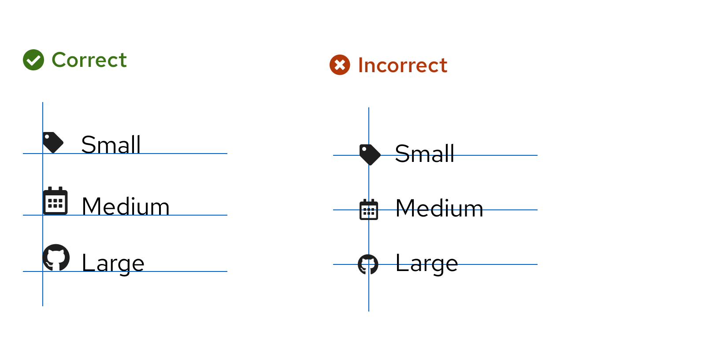

import { Icon, Content, ContentVariants } from '@patternfly/react-core';
import CheckCircleIcon from '@patternfly/react-icons/dist/esm/icons/check-circle-icon';
import ExclamationCircleIcon from '@patternfly/react-icons/dist/esm/icons/exclamation-circle-icon';
import ExclamationTriangleIcon from '@patternfly/react-icons/dist/esm/icons/exclamation-triangle-icon';
import InfoCircleIcon from '@patternfly/react-icons/dist/esm/icons/info-circle-icon';
import BellIcon from '@patternfly/react-icons/dist/esm/icons/bell-icon';
import StarIcon from '@patternfly/react-icons/dist/esm/icons/star-icon';
import { IconsTable } from './IconsTable';
import './icons.css';

If you're a developer, check out our [development onboarding guide](/get-started//develop#using-icons) to learn how to install and use our icon set.

For additional usage instruction, [refer to the icon component pages.](/components/icon)

## Icon sizes

Icon size tokens use rems, rather than pixels. Rems are relative units that adjust font size based on a webpage's HTML document root element size. For example, if the root size is 10px, a rem size of 1.5 would be 15px.

PatternFly's default root element size is 16px. If you change this default size, note that the following tables will no longer show accurate pixel measurements (though the rem values will stay the same). 

## Inline icons

[Inline icons](/components/icon#inline) must be center-aligned horizontally when placed next to text and center-aligned vertically when stacked.

</img>

Use the following semantic tokens to ensure that icons are properly aligned and match the correct font size:

### Headings 

| **Size** | **Token** | **Example** |
| --- | --- | :---: |
|  1.375rem (22px)   | `pf-t--global--icon--size--font--heading--h1` | <Content component="h1"> <Icon isInline> <StarIcon /> </Icon> Heading <Icon isInline> <StarIcon /> </Icon></Content>  | 
| 1.25rem (20px)    | `pf-t--global--icon--size--font--heading--h2` | <Content component="h2"> <Icon isInline> <StarIcon /> </Icon> Heading <Icon isInline> <StarIcon /> </Icon></Content>  |
| 1.125rem (18px) | `pf-t--global--icon--size--font--heading--h3` | <Content component="h3"> <Icon isInline> <StarIcon /> </Icon> Heading <Icon isInline> <StarIcon /> </Icon></Content>  |
| 1rem (16px) | `pf-t--global--icon--size--font--heading--h4` | <Content component="h4"> <Icon isInline> <StarIcon /> </Icon> Heading <Icon isInline> <StarIcon /> </Icon></Content>  |
| 1rem (16px) | `pf-t--global--icon--size--font--heading--h5` | <Content component="h5"> <Icon isInline> <StarIcon /> </Icon> Heading <Icon isInline> <StarIcon /> </Icon></Content>  |
| 1rem (16px) | `pf-t--global--icon--size--font--heading--h6` | <Content component="h6"> <Icon isInline> <StarIcon /> </Icon> Heading <Icon isInline> <StarIcon /> </Icon></Content>  |

### Body text

| **Size** | **Token** | **Example** |
| --- | --- | :---: |
| 0.75rem (12px)  | `pf-t--global--icon--size--font--body--sm`  | <Content component={ContentVariants.small}> <Icon isInline><StarIcon /></Icon> Small body <Icon isInline><StarIcon /></Icon></Content> |
| 0.875rem (14px) | `pf-t--global--icon--size--font--body--default`  | <Content component={ContentVariants.p}> <Icon isInline><StarIcon /></Icon> Default body <Icon isInline><StarIcon /></Icon></Content> 
| 1rem (16px)  | `pf-t--global--icon--size--font--body--lg`  | <Content component={ContentVariants.p} style="font-size: 16px"> <Icon isInline><StarIcon /></Icon> Large body <Icon isInline><StarIcon /></Icon></Content> 

## Standalone icons 

Occasionally, you may need to use a standalone icon that isn't aligned with any kind of text. PatternFly supports a range of icon sizes that can adapt to these use cases, including small, medium, large, x-large, 2xl, and 3xl icons. These sizes correspond to the following font sizes and tokens:

| **Size** | **Token** | **Example** |
| --- | --- | :---: |
| Small (0.75rem, 12px) |  `--pf-t--global--icon--size--sm` |<Icon size ="sm"><StarIcon /></Icon> |
| Medium (0.875rem, 14px) |  `--pf-t--global--icon--size--md` |<Icon size ="md"><StarIcon /></Icon> |
| Large (1rem, 16px) |  `--pf-t--global--icon--size--lg` |<Icon size ="lg"><StarIcon /></Icon> |
| X-large (1.375rem, 22px) | `--pf-t--global--icon--size--xl` | <Icon size ="xl"> <StarIcon /></Icon> |
| 2xl (3.5rem, 56px) | `--pf-t--global--icon--size--2xl` |  <Icon size ="2xl"><StarIcon /></Icon> |
| 3xl (6rem, 96px) | `--pf-t--global--icon--size--3xl` | <Icon size ="3xl"><StarIcon /></Icon> |

Medium icons are typically the most versatile size to use in a UI. Most icons in PatternFly components are medium; other sizes are used sparingly.

## Icon colors
All icon colors that you use should align with the proper [semantic design token.](/tokens/all-patternfly-tokens) For example, a warning icon should use our approved warning color, a danger icon should use our approved danger color, and so on. 

| **Icon state** | **Color token** | **Example** |
| --- | --- | :---: |
| Danger | `--pf-t--global--icon--color--status--danger--default` | <Icon status="danger" size="xl"> <ExclamationCircleIcon /> </Icon> |
| Warning  | `--pf-t--global--icon--color--status--warning--default` | <Icon status="warning" size="xl"><ExclamationTriangleIcon /></Icon> |
| Success | `--pf-t--global--icon--color--status--success--default` | <Icon status="success" size="xl"><CheckCircleIcon /></Icon> |
| Info | `--pf-t--global--icon--color--status--info--default` | <Icon status="info" size="xl"><InfoCircleIcon /></Icon> |
| Custom | `--pf-t--global--icon--color--status--custom--default` | <Icon status="custom" size="xl"><BellIcon /></Icon> |

To learn more about icon colors and color tokens, visit our [colors page.](/design-foundations/colors) 

## PatternFly icons
PatternFly uses custom icons and selections from <a href="https://fontawesome.com/icons?d=gallery&m=free">Font Awesome Free</a>, as shown in [this table](#all-icons). If PatternFly doesn't offer an icon for your use case, you can download SVGs of additional 'fa' icons from Font Awesome's free set. Be sure to properly attribute these additional icons as outlined on the Font Awesome site.

### HTML icons 
When using HTML, use the following syntax:

- For 'pficon' icons: `<i class="pf-icon [insert-icon-name]"></i>`
- For 'fa' solid icons: `<i class="fas [insert-icon-name]"></i>`
- For 'fa' regular icons: `<i class="far [insert-icon-name]"></i>`

**Note:** Be sure to reference our [development onboarding guide](/get-started/develop#using-icons) when using 'fa' regular icons.

### React icons
When using React, you can import 'pficon' icons from our [react-icons package](https://www.npmjs.com/package/@patternfly/react-icons) by including the following line: `import { [insert-icon-name] } from '@patternfly/react-icons/dist/esm/icons/[insert-hyphenated-icon-name]';`

For example: 
`import StarIcon from '@patternfly/react-icons/dist/esm/icons/star-icon';`

### Font Awesome solid (FAS) vs Font Awesome regular (FAR)
The Font Awesome icons included with PatternFly are Font Awesome solid (FAS) webfont icons. If you're using icons via `<i class="[fa, far, fas] [insert-icon-name]"></i>`, you can use any FAS icon. If you need to use a Font Awesome regular (FAR) icon, you must include the FAR icons yourself by doing one of the following:

1. [Host it yourself](https://fontawesome.com/how-to-use/on-the-web/setup/hosting-font-awesome-yourself)
2. [Include the icons via a package manager](https://fontawesome.com/how-to-use/on-the-web/setup/using-package-managers)
3. [Link to a CDN](https://cdnjs.com/libraries/font-awesome)
4. Use the SVG code directly from [fontawesome.com](https://fontawesome.com) (proper attribution is required)

## All icons 

The following table provides details and usage information for all icons that PatternFly supports.

For guidance related to icon tooltips, [refer to our tooltips writing guide.](/ux-writing/tooltips#icon-tooltips)

Select any single icon in the table to download it as an SVG. You can also download all icon SVGs <a href="https://github.com/patternfly/patternfly-design/raw/master/resources/patternfly-icon-svgs" target="_blank">on GitHub (via patternfly-icons.zip.)</a>

<IconsTable />
