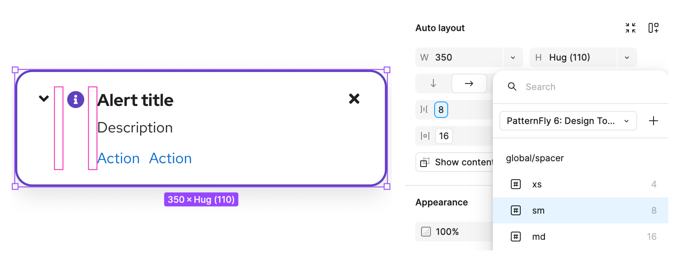
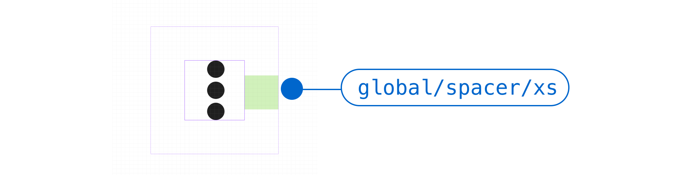
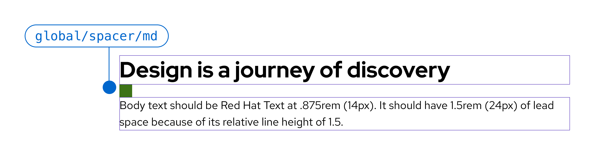
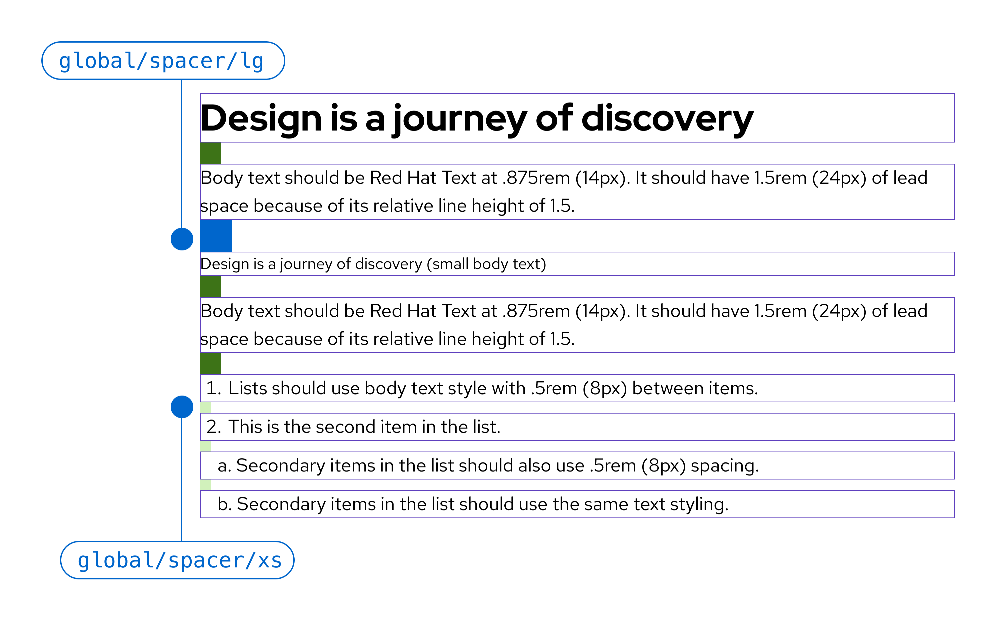

import './spacers.css';

PatternFly designs use **spacers** to define fixed amounts of space between UI elements. They help you create designs that are visually balanced and consistent. Spacers are built into PatternFly components, and are also available as tokens for you to use within Figma's auto layout system:

## Spacer sizing 

Like the rest of our dimension tokens, spacers use rem sizing, rather than pixels. Rems are relative units that adjust size based on a webpage's HTML document root element size. For example, if the root size is 10px, a rem size of 1.5 would be 15px.

PatternFly's default root element size is 16px. If you change this default size, note that the following table will no longer show accurate pixel measurements (though the rem values will stay the same).
## PatternFly spacers 

Our spacers include the following sizes:

| **Spacer** | **Token** | **Size** | **Example** | 
| :-:| :-: | :-: | :-: |
| xs | `--pf-t--global--spacer--xs` | .25rem (4px) | 

 | 
|  sm | `--pf-t--global--spacer--sm` | .5rem (8px) |

 |
|  md | `--pf-t--global--spacer--md` | 1rem (16px) |

 | 
|  lg | `--pf-t--global--spacer--lg` | 1.5rem (244px) |

 |
|  xl | `--pf-t--global--spacer--xl` | 2rem (32px) |

 |
|  2xl | `--pf-t--global--spacer--2xl` | 3rem (48px) | 

 |
|  3xl | `--pf-t--global--spacer--3xl` | 4rem (64px) | 

 |
 | 4xl | `--pf-t--global--spacer--4xl` | 5rem (80px) | 

### Spacer tokens 

Our spacer tokens are based on the values in the previous table, but there are certain use cases that align with more specific tokens. When using spacers in these scenarios, always use these more specific semantic tokens, rather than a global spacer token. 
- **Action spacers:** Used to set horizontal and vertical padding within actions, like buttons. 
  - Action spacer tokens begin with `--pf-t--global--spacer--action--`
- **Control spacers:** Used to set horizontal and vertical padding within controls, like menu toggles and text inputs. 
  - Control spacer tokens begin with `--pf-t--global--spacer--control--`
- **Gap spacers:** Used to set space between elements or groups of elements, like gaps between multiple actions, gaps between items in a group, gaps between controls, and so on. 
  - Gap spacer tokens begin with `--pf-t--global--spacer--gap`

You can search for spacer tokens in [our list of all tokens.](/tokens/all-patternfly-tokens)
## Considering line height and padding

There are additional considerations to keep in mind when adapting spacers to different line heights and padding, which are common with PatternFly components and text content.

### Using spacers with components

Some components like icons, buttons, and input fields, have a fixed amount of padding built in. Remember to account for this extra space when laying the content out on your page. You may not have as much horizontal or vertical room as you think.

For example, padding around this vertical ellipsis (or "kebab") icon increases the amount of space that it takes up in a component:

When laying out your design, make sure to account for this extra padding.
### Using spacers with text 

When spacing out text-based content, use the standard [global spacer tokens.](/design-foundations/spacers#patternfly-spacers)

You should consider line height to ensure that you’re leaving the right amount of vertical space between each line of text:

You also need to use different spacer sizes depending on the type of text you’re using. For example, you’ll need to provide a 16px spacer between a title and body copy, but only an 8px spacer between items in a bulleted or numbered list.

For more information about line height and text spacing, read our [typography guidelines.](/design-foundations/typography)

