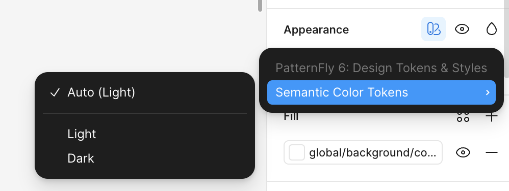

import '../../components/components.css'
import { Alert, AlertActionLink} from '@patternfly/react-core';
import ExternalLinkAltIcon from '@patternfly/react-icons/dist/esm/icons/external-link-alt-icon';

A theme applies a specific visual style to all UI components in order to create a unique, cohesive, and purposeful look.

Theming is supported by [our design token system](/tokens/about-tokens), which was intentionally structured to support adaptable themes. A single theme can be created by adjusting the values across a set of design tokens. Supporting a theme may require customizing the values of both color and dimension tokens, to change font, spacing, shadows, and borders in a UI. 

Themes are valuable because they provide more flexibility for user preferences, as well as different options for accessibility needs. 

## PatternFly themes

The following themes are currently supported across PatternFly components. To explore a different theme, toggle your display preferences in our site's masthead dropdown. 

### Light mode

Generally, light mode is the default appearance of PatternFly. In light mode, backgrounds are white, text is black, and brand colors are our traditional dark blue. Some users might find it easier to read text on screens using light mode. Others might simply prefer the appearance. 

### Dark mode

In dark mode, backgrounds are black, text is white, and brand colors are a lighter blue that maintains better contrast with the darker background. Some users might prefer dark mode for aesthetics, or because it is easier on the eyes and less straining for light sensitivities. Learn more in [NN/g's article about dark mode perceptions](https://www.nngroup.com/articles/dark-mode-users-issues/).

Our color tokens adapt dynamically to dark mode and maintain necessary contrast ratios in alignment with [our accessibility standards](/accessibility/patternflys-accessibility). 

Dark mode is also available within our Figma libraries. You only need a single design, which you can then toggle between light and dark modes within the "Appearance" properties.

### High contrast mode (beta)

<Alert 
variant="info" 
title="Beta feature"
actionLinks={
<Fragment>
<AlertActionLink component="a" href="MEDIUM ARTICLE">
Learn more
</AlertActionLink>
</Fragment>}
>

 High contrast mode is still under development and will continue to evolve. This beta allows you to preview our progress. 

</Alert>

High contrast mode adjusts the default light and dark modes to be more suitable for users who require higher contrast between UI elements. The default, hover, and selected states for many components are visibly different in high contrast mode. By using wider strokes, bolder text, fill colors, and adding borders, high contrast mode allows for more visual distinction and clarity between interactive elements.

#### Colors 

Add: What did we change and how does it help?

[before / after image]

#### Borders

Add: What did we change and how does it help?

In high contrast mode, distinct borders are added to components to ensure that their boundaries are clearly defined without requiring users to rely on subtle background colors as a visual cue. In some cases, existing borders simply have a wider stroke, while in others they replace drop shadows.

[before / after image]

## Custom themes 

To branch off of our themes and create your own, you can alter design token values to specify new styles. Use care when creating your own custom theme and make sure that your changes still respect our accessibility guidelines.

Our layered design tokens allow you to create new themes simply by changing base token values in a single file. The adjustments will apply appropriately to semantic tokens that you've already used in your code. 

### When to create a custom theme 

| **Don't** | **Do** |
| --- | --- |
| Create a theme just for one-off adjustments, like changing a single button color. Instead, modify small design changes using component props or utility classes. | Create a theme to adjust the overall brand identity of your application. |

### How to create a custom theme 

Add: Technical details and guidance (consider separate tab if this gets long)
- In which files must you override default values?
- Code example snippet. 
- Tips or best practices?

[before and after image]