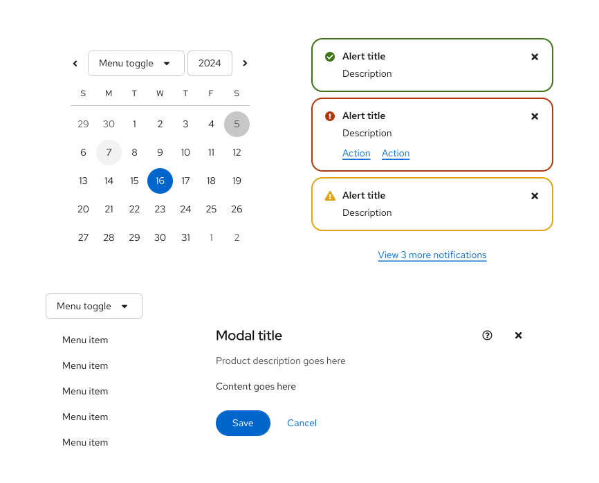
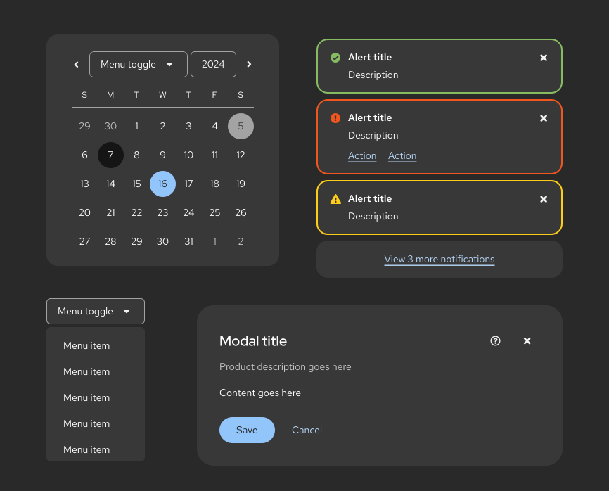

import '../../components/components.css'
import { Alert, AlertActionLink} from '@patternfly/react-core';
import ExternalLinkAltIcon from '@patternfly/react-icons/dist/esm/icons/external-link-alt-icon';

A **theme** applies a specific visual style to all UI components in order to create a unique, cohesive, and purposeful look. The use of theming can provide more flexibility for user preferences, as well as different options for accessibility needs. 

Theming is supported in PatternFly through [our design token system](/tokens/about-tokens), which was intentionally structured so that sets of tokens can be adjusted together to create alternate UI styles. By reassigning color and dimension token values, the fonts, spacing, shadows, and borders in a UI can be changed together to create a theme. This system has enabled us to create multiple PatternFly themes, while also supporting the ability for you to create custom themes. 

## PatternFly themes

The following themes are currently supported across PatternFly components and are designed to meet specific [WCAG accessibility standards](https://www.w3.org/WAI/standards-guidelines/wcag/). You can explore our different themes on our website by toggling your display preferences in our site's masthead dropdown. 

### Light mode

Generally, light mode is the default appearance of PatternFly. In this mode, dark text is presented on light backgrounds to meet a [text contrast ratio of at least 4.5:1](https://www.w3.org/WAI/WCAG22/quickref/?versions=2.1#contrast-minimum), while colors for other UI elements meet a [non-text contrast ratio of at least 3:1](https://www.w3.org/WAI/WCAG22/quickref/?versions=2.1#non-text-contrast). Some users might find it easier to read text on light screens, while others might simply prefer the appearance.

### Dark mode

In dark mode, light text is presented on dark backgrounds backgrounds, and our color palette adapts to maintain a [text contrast ratio of at least 4.5:1](https://www.w3.org/WAI/WCAG22/quickref/?versions=2.1#contrast-minimum) and [non-text contrast ratio of at least 3:1](https://www.w3.org/WAI/WCAG22/quickref/?versions=2.1#non-text-contrast). Some users might prefer dark mode for aesthetics, while others find it to be easier on the eyes and less straining for those with light sensitivities. 

For development guidance, refer to the [dark theme handbook](/design-foundations/theming/dark-theme-handbook).

### High contrast mode

<Alert 
variant="info" 
title="Beta feature"
actionLinks={
<AlertActionLink component="a" href="MEDIUM ARTICLE">
Learn more
</AlertActionLink>
}
>

 High contrast mode is still under development and will continue to evolve and be enabled for charts and extensions. This beta allows you to preview our progress. 

</Alert>

High contrast mode adjusts our default colors to meet an [enhanced contrast ratio of at least 7:1](https://www.w3.org/WAI/WCAG21/Understanding/contrast-enhanced.html), making it more suitable for users who require higher contrast between UI elements. By using wider border strokes and adjusted fill colors, high contrast mode creates more visual distinction and clarity between interactive elements.

In high contrast mode, distinct borders are also added to components to ensure that their boundaries are clearly defined without requiring users to rely on subtle background colors as a visual cue. 

## Using themes in Figma

Our Figma libraries fully support theming. Designers can create a single layout and then use Figma's appearance feature to swap a wireframe to light, dark, or high contrast mode. This makes it easy to visually test and validate designs across all supported themes.

## Custom themes 

To branch off of our themes and create your own, you can alter design token values to specify new styles. 

Our layered design tokens allow you to customize existing themes simply by changing base token values in a single file. These adjustments will then apply appropriately to all semantic tokens across your codebase. 

### When to customize a theme

There are a couple of instances when you might want to adjust an existing PatternFly theme: 
- One-off adjustments, like changing a single button color, spacer, or font size, when intentional deviation is needed across your product. 
- Application-wide adjustments, like changing all button colors and font sizes to adjust the overall brand identity of your product. 

### How to create a custom theme 

When creating a custom theme, it is your responsibility to ensure that your new color combinations and styles continue to meet accessibility standards, such as a minimum text contrast ratio of 4.5:1.

Add: Technical details and guidance (consider separate tab if this gets long)
- In which files must you override default values?
- Code example snippet. 
- Tips or best practices? 