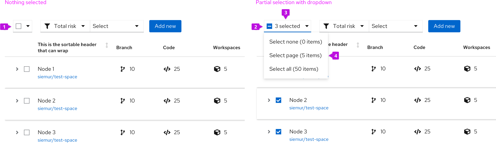
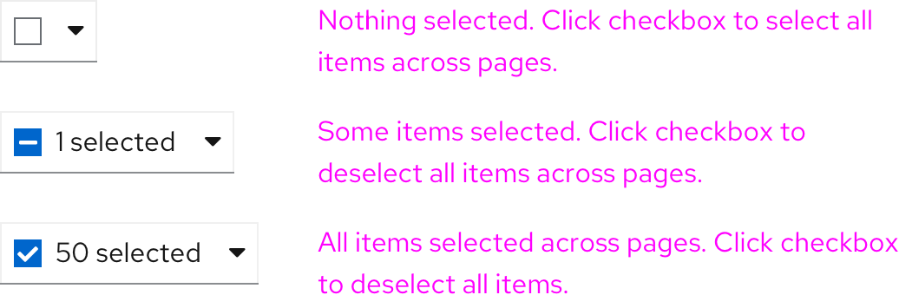
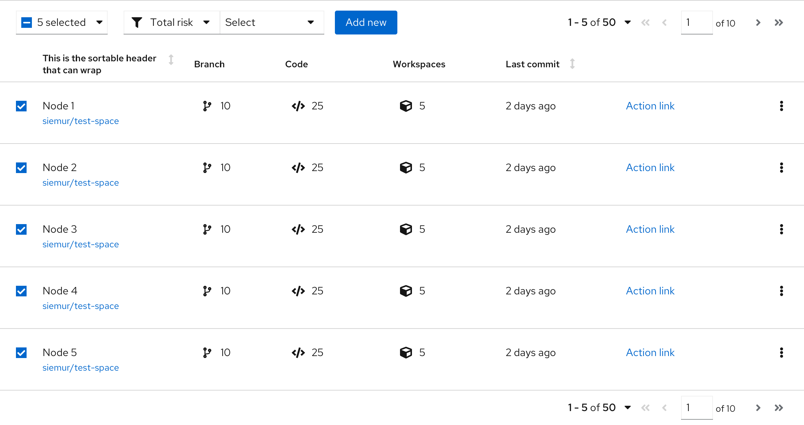
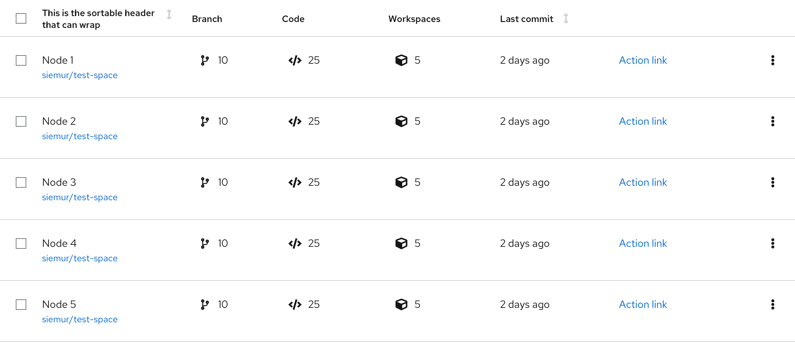

## Bulk selection
Use a bulk selection pattern when you want to select or deselect multiple items in a content view (list, table, or card grid). The bulk selector uses a [Split button](/components/menus/menu-toggle#split-button-toggle-with-checkbox) component to control selection from the [Toolbar](/components/toolbar). Besides controlling selection, the bulk selector reflects the selection status of the related component (partially selected, all items selected, or no items selected).

## Bulk selector
The bulk selector is created using a Split button and is always located as the leftmost item in a toolbar.

**1. Bulk selector:** The bulk selector uses a split button to combine a selection checkbox with a dropdown menu.

**2. Checkbox:** The state of the checkbox reflects the current selection state of the list, table, or card grid.

**3. Items selected:** This text always reflects the total number of items selected. If pagination is in use, it will reflect the items selected across all pages.

**4. Menu:** at a minimum the menu will include:
* Select none - to clear selections across all pages.
* Select page - to select all items on the current page (when pagination is in use).
* Select all - to select all items across pages.

Additional menu items can be added to select items that match some predetermined filter criteria, such as “Red Cars or Blue Cars” / “Running VMs”, etc.

## Usage
### Bulk selection from the toolbar
The example below shows a bulk selector placed in a toolbar above a table using pagination.

There are 50 total items in this dataset spread across 10 pages (5 items per page), but only the first page has been selected and therefore partial selection is reflected in the checkbox. The user may select (or deselect) additional items either through the use of the bulk selection checkbox, the bulk selection menu, or by clicking on the checkbox at the front of a row. The selected items count will update whenever selection is changed.

### Bulk selection and global actions
Bulk selection is often used to select multiple items and perform an action on them. Note that after an action is completed, the selection state remains as is until the user changes the selection.

### Integrated bulk selection for tables
Tables are unique to other view in that they include integrated bulk selection by default. Below is an example of a PatternFly table component with integrated bulk selection in the header row.

**1. Bulk selection checkbox:** A checkbox in the header row of a table will select (or deselect) all items in the table or all items on the current page if pagination is in use.

In PatternFly we recommend that integrated bulk selection only be used in cases where a table is placed in a page without a toolbar. Whenever a toolbar is present, we recommend using the toolbar to control bulk selection. This will provide for better visibility on the count of selected items, lead to better consistency between view types, and allow for more variety of selection options.

Note: To hide integrated bulk selection and enable selection control from the toolbar in the PatternFly React Table component, set the canSelectAll prop to ‘false’.
