import "../../components/components.css"

**Filters** allow users to narrow down content from data in tables, data lists or card views, among many others. 

## Filter types

Filters can contain 1 attribute or multiple attributes. PatternFly components can be combined in different ways to create more complex filtering experiences. These different filter types can be used in a toolbar or on their own.

Filters consisting of single attributes include:
* [Text entry](#text-entry-filters)
* [Single select](#single-select)
* [Checkbox select](#checkbox-select)

Filters consisting of multiple attributes include: 
* [Attribute-value](#attribute-value-filter) 
* [Filter group](#filter-group)
* [Toggle group](#toggle-group)
* [Faceted filter](#faceted-filter)

## Filter features

All types of filters can include any of the following attributes:
* [Filter labels](#filter-labels): A way for users to see their selections when the menu is closed.
* [Typeahead](#typeahead): A way for users to narrow down the list of options when looking for the value they want to select.
* [Badge count](#badge-count): Indication of how many selections were made within the menu.

The following table outlines which features are supported for each filter type. Just because a feature is supported, does not mean it must be used in your filters. 

|  **Filter type** | **Filter labels** | **Typeahead** | **Badge count**
| ----------------- | ------- | ------ | ------- | 
| Text entry| Yes (only for attribute filters) | Yes | No |
| Single select | Yes (only for attribute filters) | Yes | No |
| Checkbox select | Yes | No (but you can have a search inside the menu) | Yes |
|  Attribute-value | Yes | Yes (except for checkbox selects) | Yes (only for checkbox select)
|  Filter group | Yes | Yes (only for single selects) | Yes (only for checkbox selects) |
|  Toggle group | No | No | No|
|  Faceted filter | Yes | Yes | Yes|

### Filter labels

When filters are applied, filter labels can be used to provide feedback to the user on what they are filtering on.

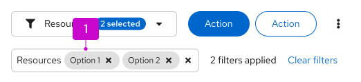

1. **Filter label:** Shows users what conditions they are filtering on. Can show boolean relationships between different attribute-value pairs. Individual filter labels can be removed by clicking the ‘x’ in each label, and entire filter groups can be removed using the group ‘x’.

Follow these best practices for using filter labels:
* Filters between attribute categories should be combined with a boolean “AND” operator.
* Filters within a category are shown grouped together and should be combined with a boolean “OR” operator.
  * **Example:** An item must be Stopped “OR” Down “AND” have Samsung “OR” Hewlett-Packard as a vendor.
* If the list is not otherwise sorted, items that satisfy a higher number of filters should be shown higher up the page.
  * **Example:** Items that have both Samsung and Hewlett-Packard as vendors are listed before items that only have Samsung or Hewlett-Packard.
In this example, the result will be to show all items that have a status of stopped “OR” down “AND” are from vendor Samsung “OR” Hewlett-Packard “AND” match the keyword.

#### When to use
Use filter labels when:
* The value of the applied filter is not shown on the control itself.
* There is more than 1 value for a given facet.
* There are boolean filter rules being applied.

**Don’t use** filter labels when the current settings of the controls are sufficient to convey applied filters.

### Typeahead
Adding typeahead capabilities to your filters is useful when there is a large number of items to select from the filter dropdown. Users can quickly find the value they would like to filter by typing in the field. 

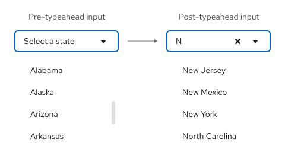

Typeahead is supported in single selects, faceted filters that can handle 1 input. Users can scroll through the dropdown list or type in the box to find the desired option.

#### When to use
Use a typeahead filter when:
* A dropdown list has a large number of options. In these cases, typeahead can help a user find their desired option in less time.
* Typeahead filters can be used in place of a textbox filter, in certain cases. For example, when filtering by name, using a typeahead filter will ensure that only valid filters surface. This will avoid the need to present an empty state when invalid values are entered.

#### Behavior
A filter query is triggered whenever a new value is set by the user. The following are triggers applicable to the variations of the typeahead filter shown in the previous example.

| Value selector &nbsp; &nbsp; &nbsp; &nbsp; &nbsp; &nbsp; &nbsp; &nbsp; &nbsp; &nbsp; &nbsp; | Trigger |
| -------------------------------------------| ------ |
| Search field &nbsp; &nbsp; &nbsp; &nbsp; &nbsp; &nbsp; &nbsp; &nbsp; &nbsp; &nbsp; &nbsp; &nbsp; | The user types in an input and/or presses the Enter key after typing in the input field. This action will create a filter for the first value shown in the filtered list. |
| Select lists &nbsp; &nbsp; &nbsp; &nbsp; &nbsp; &nbsp; &nbsp; &nbsp; &nbsp; &nbsp; | The user selects or deselects an item in the list. |

### Badge count
Badges are used to indicate a count. In filters, badges can be used in the following ways:

#### Badge in checkbox select
You can opt to use a badge in a checkbox select to indicate to the user how many items they have selected when the toggle is collapsed.

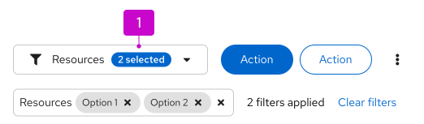

## Variations for 1 attribute
There are various ways to allow users to filter down content. Single filtering methods include [text entry filters](#text-entry-filters), [single selects](#single-select) and [checkbox selects](#checkbox-select).

### Text entry filters
A text entry filter provides the user with an input field to type in values that filter the view, whether or not their input is an exact match. The text entry filter uses the [search input](/components/search-input) component which can be used with or without a button. 

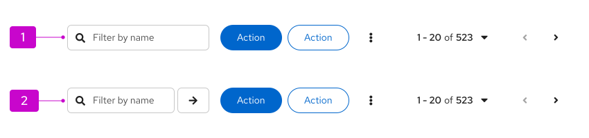

1. **Basic search input:** Filters automatically, as soon as the user starts typing.
2. **Search input with button:** Filters on enter, or clicks of the arrow button.

Note, the placeholder text in your text entry filter should indicate what the user can filter on. If the inputted string is constrained to filter a **single column**, the placeholder text of the input field should read “Filter by _attribute name_”. If the inputted string filters **all columns**, the placeholder text of the input field should read “Filter” instead.

#### Behavior
Although both basic filter components have the same end result, they differ in when the search is triggered. With search inputs, the data in the table automatically filters as the user types. With input groups, the user must press enter to apply the search, and start filtering data in the table.

**Note:** With both basic filter components, the user can only filter by 1 input at a time. 

#### When to use
Use a text entry filter when you’d like to give users the ability to search values in unbound data. Using the _search input_ component is preferred, however, use the _input group_ component when you are worried about performance issues with querying a large data set after every stroke.

#### Supported features
Text entry filters support [filter labels](#filter-labels), but do not support [typeahead](#typeahead) or [badges](#badge-count).

Filter labels are supported for text entry filters, but in general, we recommend not showing a label to avoid redundancy, except for cases when text entry filters are used inside of [attribute-value filters](#attribute-value-filter). 

Since you can only search by 1 value at a time, the value will already be shown in the input field, as shown in the following image.

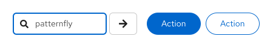

### Single select
A single select provides the user with a fixed set of values from which they can only select 1 value. This filter type uses the [single select component](/components/select/react#single). 

If the single select filter is the only filter in the toolbar, it should have an “All options” menu item that's selected by default, acting as an equivalent of no filter selected. 

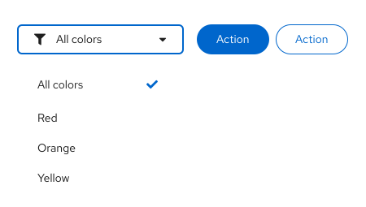

When a different menu item is selected, it should be displayed in the toggle. Selecting "All options" will reset any selected options. 

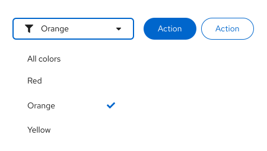

#### Behavior
The user is presented with a list of values to choose from. A selected value is indicated with a blue checkmark to the right of the value. When a value is selected, the selection appears in the toggle.
When a user selects a different value, the initial selected value becomes unselected. The new value inherits the blue checkmark and is reflected in the toggle.

#### When to use
Use a single select list when you’d like users to only select 1 option from a **predefined list** of options.

#### Supported features
Typeahead functionality can be added to single selects, allowing users to input a search inside the toggle, filtering down from the list of menu options shown. This is especially useful for very long lists that would be inconvenient for the user to scroll through. typeahead is recommended for lists that are more than 10 items long. 

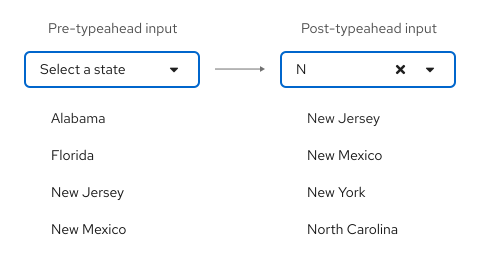

Stand alone single selects in a toolbar do not use badge counts or filter labels since only 1 selection can be made, and the selection will already be apparent in the toggle. 

### Checkbox select
A checkbox select provides the user with a fixed set of values from which they can select multiple values. This filter type uses the [checkbox select component](/components/menus/select#checkbox-select).

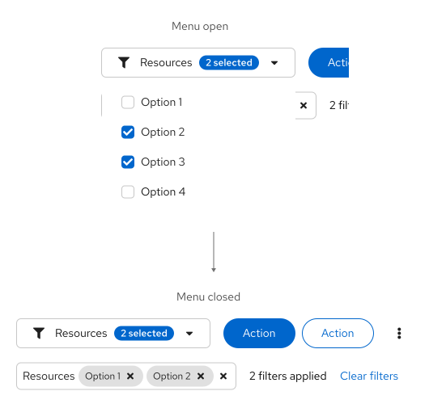

#### Behavior
The user is presented with a list of values to choose from. From this list, users can select or deselect 1 or more values at a time, with selections indicated by a blue checkbox preceding the value. The dropdown should remain open as the user makes selections until they click away or manually close it. Selected values will appear as filter labels underneath the filter, allowing the user to see their selections even when the toggle is collapsed.

#### When to use
Use a checkbox select for selecting multiple values from a predefined list. Multiple values will be combined using a logical “OR” operation.

#### Supported features
Checkbox select supported features include [filter labels](#filter-labels), and optionally, [badges](#badge-count). 

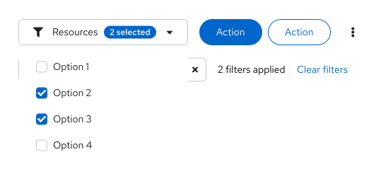

**Filter labels** are used as a way for users to view all their selections when the menu of selections is collapsed.

**Badges** can be used in the checkbox select toggle to indicate how many selections have been made, although they are not required. 

Although **typeahead** is not supported for checkbox selects, you can add a search input inside the menu, right above the items the user can select from. This will allow the user to filter down the list of options.

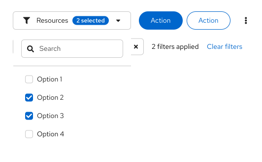

## Variations for multiple attributes
There are multiple ways of combining variations for single attribute filters into multiple attribute filters, including [attribute-value filters](#attribute-value-filter), [filter groups](#filter-group), [toggle groups](#toggle-group) and [faceted filters](#faceted-filter).

### Attribute-value filter
The attribute-value filter gives users the ability to specify an attribute-value pair for filtering a data set.

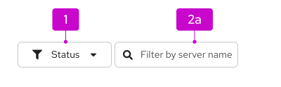

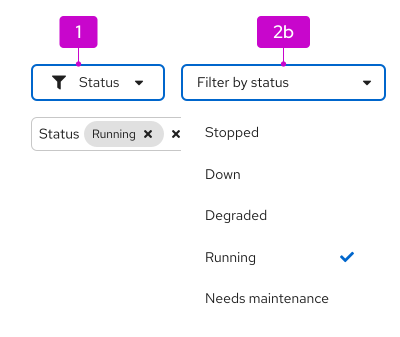

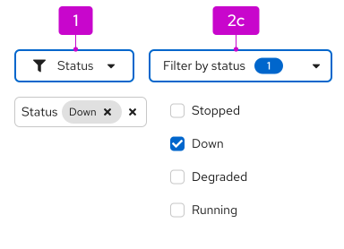

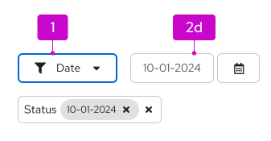

The following elements make up an attribute-value (textbox) filter.
1. **Attribute selector:** A select list that allows the user to select the attribute that they want to filter against.
2. **Value selector:** A value selector that is used to pass a value to the filter. The value selector can be any data input component. Common components used for value selection include:
  
    a. A **text entry field** for entering a value from the keyboard. Use when you will enter the value as unbounded data (e.g. a name). When the text entry field is a basic search input, the value will appear as a label automatically, and the search will start being validated. When the text entry field is a search input with a button, the value will appear as a label and the search will be validated when the user presses the Enter key on their keyboard or the arrow button. 
   
    b. A **single select** for selecting a value from a predefined list. This will work the same as a stand alone single select, however since any selection in an attribute filter will result in a label, there is no need to have an “All” option as part of your menu, as users can reset their filters via the filter labels.
    
    c. A **checkbox select** for selecting multiple values from a predefined list. Multiple values will be combined using a logical "OR" operation.
    
    d. A **date picker** for selecting a date range. Use when the value you want to filter on is expressed as a date and/or time stamp.

#### Behavior
To use an attribute-filter, the user must first select an _attribute_ to filter on using the left toggle, followed by choosing the specific _values_ to filter on using the right toggle. Whatever is selected in the attribute toggle will determine what is shown in the value toggle.

The value toggles behave as described in the [variations for 1 attribute](#variations-for-1-attribute) section. The only difference for multiple attributes is that as users make filter selections using the attribute filter, each selection will **always** show up as a label underneath the filters.

When using the attribute filter, a filter query is triggered whenever the user sets a new value. The following are triggers applicable to the variations of the attribute-value filter shown above.

| Value selector | Trigger |
| ---------------| ------ |
| Search field | The user starts typing (for search input), presses the Enter key, or clicks the Search button (for input groups). |
| Select lists | The user selects or deselects an item in the list. |
| Date picker | The user selects a new date and/or time. |

#### When to use
Use an attribute-value filter when users have multiple attributes to filter on. This filter should be used over a faceted filter when the attributes use different selection formats (for example, attribute A uses a single select, but attribute B uses a checkbox select).

#### Supported features
Attribute-value filter features include [filter labels](#filter-labels), [badges](#badge-count), and [typeahead](#typeahead). 

**Filter labels** are strongly recommended for attribute filters as a way for users to view all their selections when the user switches between attribute filters and when the menu of selections is collapsed.

**Badges** can be used in a checkbox select value selector toggle to indicate how many selections have been made. 

**typeahead** allows the user to narrow down their search and is supported for all value selection types except checkbox selects. Although typeahead is **not supported** for checkbox selects, you can add a search input inside the menu, above the items the user can select from.

### Filter group
A filter group is a set of filters that appear side by side in a toolbar. This filter type uses the [select list](/components/menus/select) component.

**Filter group with only single selects** 

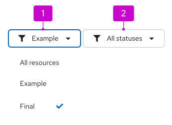

1. When an option is selected, it is reflected in the toggle. 
1. The default selection should be “All _attribute-name_” to indicate that no filter has been applied. This option also allows users to clear whatever filter they can have applied.

**Filter group with multiple selection types**

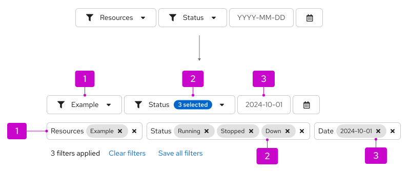

Filter group with single select, checkbox select, and date picker. When there are no selections, the toggle should contain the attribute name. 

When selections are made, the behavior will depend on the selection type:
1. **Single select:** The selection will appear in the toggle. 
1. **Checkbox selects:** The attribute name will remain in the toggle, with the addition of a badge containing the number of filters selected.
1. **Date pickers:** The selection will appear in the toggle. 

In all cases, selections should appear as filter labels underneath the filters.

#### When to use
Use a filter group when you only have a handful of attributes that you want to show. Only use this filter when space allows; otherwise consider using an attribute-value or faceted filter instead.

#### Behavior
Filter queries are applied when the user selects or deselects an item in the list or selects a date/time range. If the filter group is only made up of single selects, the selected filters will be shown inside each filter’s toggle. If the filter group contains multiple selects, the selected filters will be shown as filter labels underneath the filters. Additionally, you can also choose to display the selected number of items in each filter as a badge in their toggle. A clear filter action to the right of the filters will remove all applied filters.

#### Supported features
Filter groups support [filter labels](#filter-labels), [badges](#badge-count), and [typeahead](#typeahead). 

**Filter labels** are recommended for filter groups that have 1 or more checkbox selects. If the filter group only consists of single selects, there is no need to add filter labels as the count will always be one.

**Badges** can be used in a checkbox select toggle to indicate how many selections have been made for that attribute filter.

**typeahead** allows the user to narrow down their search and is supported for all value selection types except checkbox selects. Although typeahead is **not supported** for checkbox selects, you can add a search input inside the menu, above the items the user can select from.

### Toggle group
A toggle group filter allows users to select from a set of predefined different elements to filter something on. This filter uses the [toggle group component](/components/toggle-group).

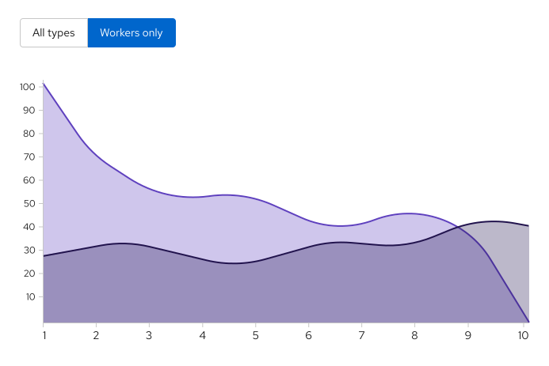

#### When to use
Use a toggle group filter when you have few filter options that you want users to filter from, without hiding the options in a select list. A common usage for toggle groups is for filtering a chart view, to include or remove a data point from view.

#### Behavior
Information will be shown to the user based on the toggles they select. If something is selected, it means the information is being filtered on.

#### Supported features
Toggle groups do not use or support filter labels, badges, or typeahead.

### Faceted filter
Faceted filtering is useful when items can be described by categories according to multiple dimensions or facets. This filter usually uses the [grouped checkbox select list](/components/menus/select#grouped-checkbox-input) component.

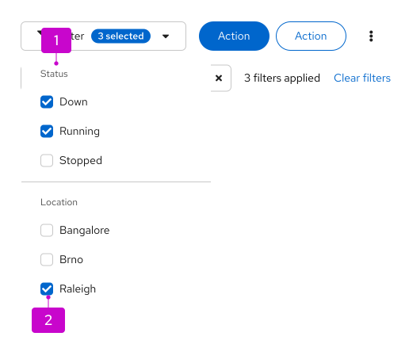

The following elements can be used in a faceted (checkbox) filter:
1. **Facets:** Different categories containing filter values, such as _Status_ or _Vendor_.
2. **Values:** What users might filter on. Each category is made up of checkbox selects, where each category can have multiple options selected. Never include 2 selection types within the same faceted filter.

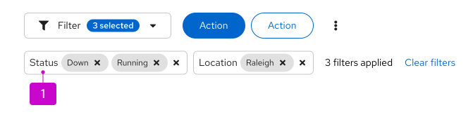

1. **Facets:** When the options menu is collapsed, selected values are displayed as labels in named groups, which use the name of the facet as the group label.

**Note:** Consider adding an “Other” option to attribute lists where items can not fall under any of the specified values.

#### When to use
Use a faceted filter when:
* The user is browsing a set of items without robust knowledge of what is in the set.
* The important characteristics of the items to be filtered are mostly traits with a small and discrete set of choices like color, status, availability, or distributor rather than arbitrary text or numeric values such as name, date created, or amount of available space.
* The facets to filter from are all checkbox select

**Do not use** a faceted filter when the important characteristics of the items are mostly open-ended values and/or have a mix of single and multiple select. Additionally, if space is limited, consider using an [attribute-value](#attribute-value-filter) filter instead.

#### Behavior
New filters are applied or removed as the user selects or deselects values using checkboxes. A badge count can optionally be added to the toggle to indicate the number of selections made in the filter. Selections will appear as filter labels underneath the filter. Note that there is an "AND" relationship between facets, and an "OR" relationship between values. 

#### Supported features
Faceted filters support [filter labels](#s), [badges](#badge-count), and [typeahead](#typeahead). 

## Filter validation
If your filter has limitations, you can present an error state on your filter toggle to communicate these limitations to users. Examples of instances where you can want to use filter validation include:
* In cases where free-form text input validation is needed
* When there is a limit on how many filters a user can apply at a time
* When there is a limit on how many options can be selected for 1 attribute

When using error validation in a filter, include a tooltip on hover with an explanation of what went wrong. 

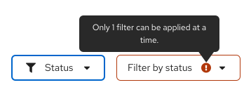

## Layout considerations
Filters can be included in a [toolbar](/components/toolbar) and are usually left aligned. There can be more than 1 filter used in a single toolbar, and in some cases, custom filters can make up a full toolbar. Filters can also be used alone outside of a toolbar.

## Mobile considerations
In responsive views, filters can be hidden within the filter icon. On click, the toolbar will expand to reveal the filter. If there are multiple filter elements, they will be collapsed into a single faceted filter. Read more about toolbars in mobile views in [the toolbar design guidelines](/components/toolbar/design-guidelines#the-toolbar-on-mobile).

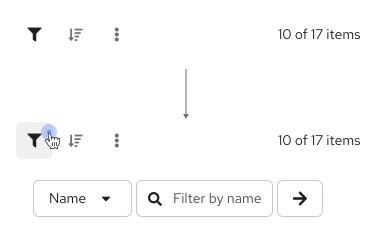

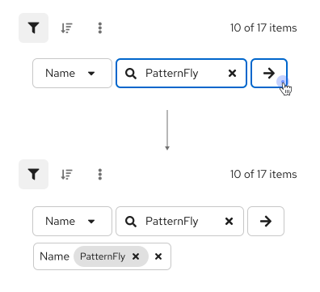

## Examples
**Filter group in data list toolbar**

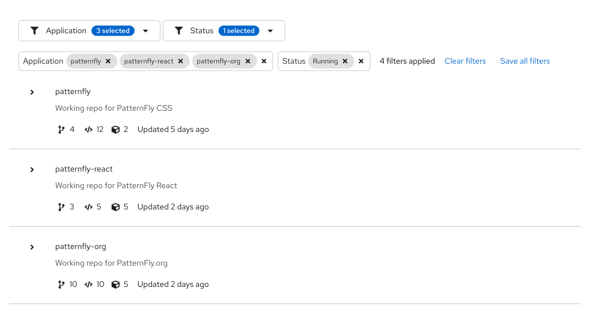

**Attribute filter in table toolbar**

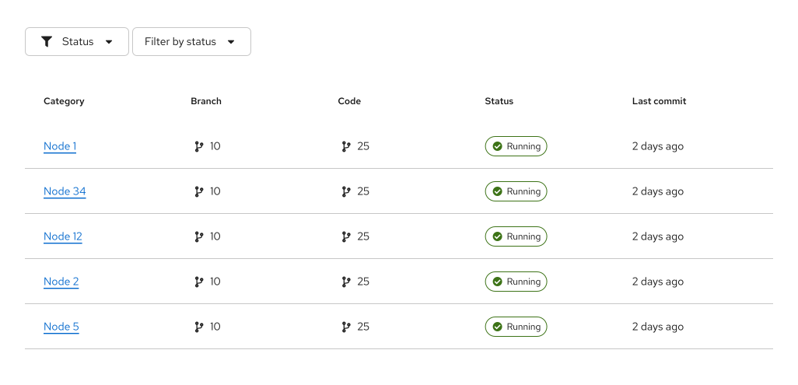

## Content

### Filters
Filter placeholder text in input fields should read “Filter by [attribute name].” Write all placeholder text in sentence case.

**Examples:** _Filter by status_, _Filter by vendor_

### Clearing filters
The option to clear all filters will be displayed after the last filter label. It should read “Clear filters” in sentence case. When clicked, it should remove all applied filters and collapse the toolbar back into a single row.