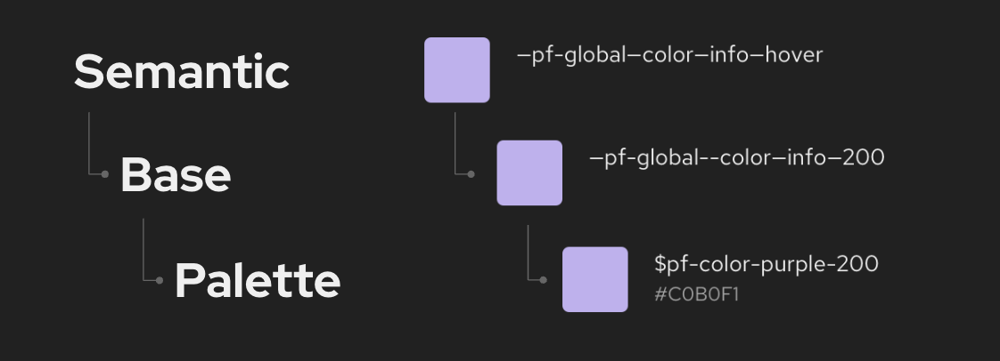

## PatternFly design tokens

PatternFly tokens have 3 layers: a palette layer, a base layer, and a semantic layer. 

### Palette layer 

Just the color palettes 

same idea as current color paletter variables

### Base layer 

“Palette” of tokens that the semantic layer can choose from
Grouped conceptually, named numerically
No duplicates within token concept groups

### Semantic layer

Top level tokens that we know and love
Grouped conceptually, named semantically
Reference base tokens, but can also reference other semantic tokens

## All tokens
