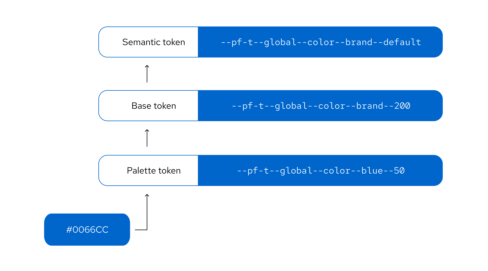

## Token structure and naming

### Token layers
The PatternFly token system has 3 distinct layers that build upon each other:

- **Palette tokens** use [PatternFly color palettes](/foundations-and-styles/colors#patternfly-palettes) to create a color foundation for other token layers to reference. 
- **Base tokens** expand on the palette layer to apply PatternFly colors to concepts. They also introduce additional concepts, like spacing and borders. Base tokens are grouped conceptually and named numerically, with no duplicate values in a concept group.
- **Semantic tokens** are the top-level tokens that are grouped conceptually and named semantically. They are built with base tokens and are the tokens that you should see and use in most use cases. Semantic naming is intentionally chosen to support the proper and relevant use of a token, which makes design consistency easier for everyone. 

### Token names
PatternFly token names follow a clear structure, composed of a `--pf-t` prefix and a series of token segments separated by double hyphens. This structure follows a **general-to-specific pattern** to ensure context is clear:

`--pf-t--[scope]--[component]--[property]--[concept]--[variant]--[state]`

Each token segment represents a different type of style information: 

| **Segment** | **Description** |
| :--- | :--- |
| Scope | The token's range, such as *global* or *chart*.
| Component | The component that the token relates to, such as *icon*, *background*, or *text*.
| Property | The style property of a component, such as *color*, *size*, *width*, or *radius*.
| Concept | The token's higher level concepts, such as *status*, *primary*, or *action*, which have different variant options.
| Variant | The variant of a component or concept, such as *link*, *plain*, *warning*, or *success*.
| State | The state that the component is in, such as *default*, *hover*, or *active*.

If a segment isn't relevant for a particular token then it will be skipped in the token's name:

| **Segments** | **Example** |
| :--- | :--- |
| [scope]--[component]--[property]--[concept]--[variant]--[state] | `--pf-t--global--background--color--action--plain--clicked` |
| [scope]--[component]--[property]--[variant]--[state]  | `--pf-t--global--background--color--backdrop--default` |
| [scope]--[component]--[property]--[variant]  |  `--pf-t--global--border--width--regular`  |

### Theming
Themes are collections of design tokens that reference specific visual values. These values change when a user switches themes, such as truning on dark mode. Using themes enables us to ship one design system while supporting multiple visual languages that meet different audience or brand requirements.

For more guidance, refer to our [themeing guidelines](/foundations-and-styles/theming). 