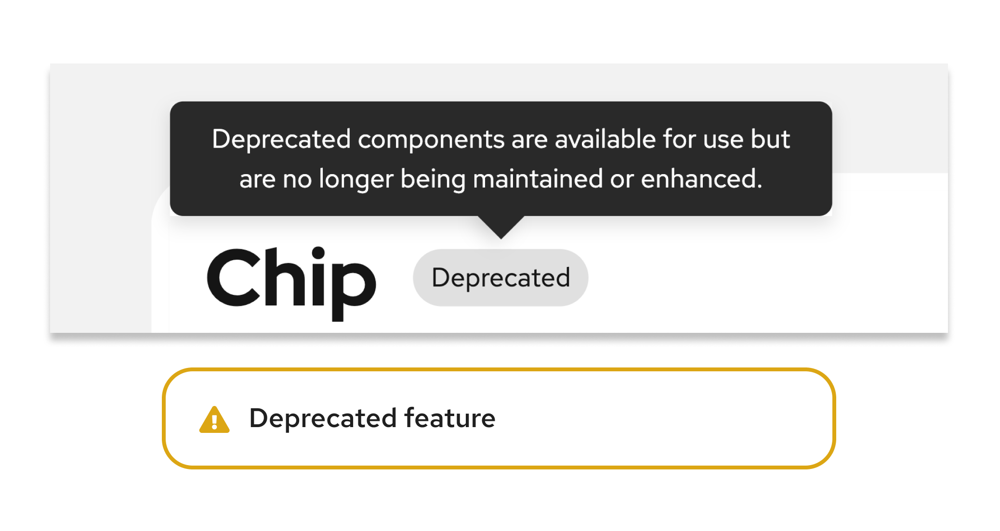

import './get-started.css';
import { Button, Card, CardHeader, CardTitle, CardBody, CardFooter, Divider, Icon, Grid, GridItem, PageSection, Split, SplitItem, Title, Tooltip, Content, ContentVariants } from '@patternfly/react-core';
import ExternalLinkAltIcon from '@patternfly/react-icons/dist/esm/icons/external-link-alt-icon';
import { Link } from '@patternfly/documentation-framework/components';

## What is PatternFly? 

PatternFly is an open source design system that enables designers and developers to create consistent and usable software products. 

A **design system** is a collection of software design standards and resources that facilitate more consistent and productive design processes. When you design and develop with a design system, you can reduce redundancy and enable a unified language between cross-functional teams. This means that products will be visually consistent, and will use patterns that support better usability and efficiency.

The PatternFly design system is created and maintained by Red Hat, and is used across Red Hat's product catalog, but it's open for anyone to use. Across our website, we provide code samples, clear standards, and additional resources to help designers and developers work together more efficiently. Together, we can build better user experiences.

## What does PatternFly include?

### Foundations

PatternFly's foundations create a strong base for the rest of the design system to be built with.

<Grid hasGutter>
<GridItem span={6}>
<Card isClickable isCompact isFullHeight>
    <CardHeader
        selectableActions={{
            to: "/design-foundations/about-design-foundations",
            selectableActionId: 'clickable-selectable-card-input-1',
          }}
    >
    <CardTitle component="h4"> **Design foundations** </CardTitle>
    </CardHeader>
    <CardBody> The most foundational elements of our design system, like color, typography, icons, and spacing. </CardBody>
</Card>
</GridItem>

<GridItem span={6}>
<Card isClickable isCompact isFullHeight>
    <CardHeader
        selectableActions={{
            to: "/tokens/about-tokens",
            selectableActionId: 'clickable-selectable-card-input-2',
          }}
    >    
    <CardTitle component="h4"> **Design tokens** </CardTitle>
    </CardHeader>
    <CardBody> Semantically named variables that represent visual attributes and design styles. </CardBody>
</Card>
</GridItem>
</Grid>

### Elements 

PatternFly’s core elements are what you will work directly with when building a UI.

<Grid hasGutter>
<GridItem span={6}>
<Card isClickable isCompact isFullHeight>
    <CardHeader
        selectableActions={{
            to: "/components/all-components",
            selectableActionId: 'clickable-selectable-card-input-3',
          }}
    >    
    <CardTitle component="h4"> **Components** </CardTitle>
    </CardHeader>
    <CardBody> Flexible, modular, building blocks that you can mix and match to create UIs. </CardBody>
</Card>
</GridItem>

<GridItem span={6}>
<Card isClickable isCompact isFullHeight>
    <CardHeader
        selectableActions={{
            to: "/layouts/about-layouts",
            selectableActionId: 'clickable-selectable-card-input-4',
          }}
    >
    <CardTitle component="h4"> **Layouts** </CardTitle>
    </CardHeader>
    <CardBody> Different methods for arranging components for different screen sizes and content presentations. </CardBody>
</Card>
</GridItem>

<GridItem span={6}>
<Card isClickable isCompact isFullHeight>
    <CardHeader
        selectableActions={{
            to: "/charts/about-charts",
            selectableActionId: 'clickable-selectable-card-input-5',
          }}
    >
    <CardTitle component="h4"> **Charts** </CardTitle>
    </CardHeader>
    <CardBody> Different methods to present data visualizations. </CardBody>
</Card>
</GridItem>

<GridItem span={6}>
<Card isClickable isCompact isFullHeight>
    <CardHeader
        selectableActions={{
            to: "/extensions/about-extensions",
            selectableActionId: 'clickable-selectable-card-input-6',
          }}
    >
    <CardTitle component="h4"> **Extensions** </CardTitle>
    </CardHeader>
    <CardBody> Reusable solutions that utilize multiple PatternFly components for cross-project use cases. </CardBody>
</Card>
</GridItem>
</Grid>

### Guidance

We provide extensive guidelines to help you create UIs following best practices. 

<Grid hasGutter>
<GridItem span={4}>
<Card isClickable isCompact isFullHeight>
    <CardHeader
        selectableActions={{
            to: "/patterns/about-patterns",
            selectableActionId: 'clickable-selectable-card-input-7',
          }}
    >
    <CardTitle component="h4"> **Patterns** </CardTitle>
    </CardHeader>
    <CardBody> Recommendations and solutions for common design problems that involve multiple components. </CardBody>
</Card>
</GridItem>

<GridItem span={4}>
<Card isClickable isCompact isFullHeight>
    <CardHeader
        selectableActions={{
            to: "/accessibility/about-accessibility",
            selectableActionId: 'clickable-selectable-card-input-8',
          }}
    >
    <CardTitle component="h4"> **Accessibility** </CardTitle>
    </CardHeader>
    <CardBody> Guidelines to follow in order to create products that are usable and accessible by all users. </CardBody>
</Card>
</GridItem>

<GridItem span={4}>
<Card isClickable isCompact isFullHeight>
    <CardHeader
        selectableActions={{
            to: "/ux-writing/about-ux-writing",
            selectableActionId: 'clickable-selectable-card-input-9',
          }}
    >
    <CardTitle component="h4"> **UX writing** </CardTitle>
    </CardHeader>
    <CardBody> Content guidelines that provide principles and best practices around writing for user experience. </CardBody>
</Card>
</GridItem>

</Grid>

### Additional developer resources

We offer more complex resources to assist with the development process.

<Grid hasGutter>
<GridItem span={6}>
<Card isClickable isCompact isFullHeight>
    <CardHeader
        selectableActions={{
            to: "/topology/about-topology",
            selectableActionId: 'clickable-selectable-card-input-10',
          }}
    >
    <CardTitle component="h4"> **Topology** </CardTitle>
    </CardHeader>
    <CardBody> A method for modeling the arrangement of elements in a network. </CardBody>
</Card>
</GridItem>

<GridItem span={6}>
<Card isClickable isCompact isFullHeight>
    <CardHeader
        selectableActions={{
            to: "/utility-classes/about-utility-classes",
            selectableActionId: 'clickable-selectable-card-input-12',
          }}
    >
    <CardTitle component="h4"> **Utility classes** </CardTitle>
    </CardHeader>
    <CardBody> Additional CSS classes that allow you to further customize and modify UI elements, like alignment, spacing, and shadows. </CardBody>
</Card>
</GridItem>

</Grid>

## Join the community

At the core of PatternFly is our global community of designers, developers, and other UX professionals with a passion for open source—in other words, our Flyers. Whether we're contributing to PatternFly or just staying up to date on new releases, we work together to make PatternFly a vibrant community of passionate people. Together, we celebrate creativity and foster a sense of teamwork and unity. 

The PatternFly community is never finished growing, and we want to keep it that way, so reach out whenever—we're always open.

  <Grid sm={12} md={4} hasGutter className="pf-v5-u-my-lg pf-v5-u-text-align-center ws-building-grid">
    <Card isCompact> 
      <CardTitle className="pf-v5-u-font-size-l"> Chat with us </CardTitle>
      <CardBody> 
        We have a Slack workspace, where you can ask us questions and share any feedback. Just like PatternFly, our Slack channels are open for all and we encourage you to join to connect with the team.
      </CardBody>
      <Divider />
      <CardFooter>
        [Join our Slack workspace <ExternalLinkAltIcon />](https://patternfly.slack.com/archives/C293LQ36J)
      </CardFooter>
    </Card>
    <Card isCompact>
      <CardTitle className="pf-v5-u-font-size-l"> Stay up to date </CardTitle>
      <CardBody>
        Make sure you're in the loop on important updates and discussions by signing up for PatternFly emails. We can send meeting reminders, updates, and other important information right to your inbox.
      </CardBody>
      <Divider />
      <CardFooter>
        [Sign up for our mailing list <ExternalLinkAltIcon />](https://www.redhat.com/dynamic-form/instance/934b1674-bc8a-4a13-8c9d-d19abcceb263)
      </CardFooter>
    </Card>
    <Card isCompact>
      <CardTitle className="pf-v5-u-font-size-l"> Join our meetings</CardTitle>
      <CardBody>
        Flyers may be spread all over the globe, but we make sure to come together to share updates and collect feedback. If you can't make it, all meetings are recorded and published on <a href="https://www.youtube.com/channel/UCqLT0IEvYmb8z__9IFLSVyQ"> our YouTube channel. </a>
      </CardBody>
      <Divider />
      <CardFooter>
        [View our Google calendar <ExternalLinkAltIcon />](https://calendar.google.com/calendar/embed?src=patternflyteam%40gmail.com&ctz=America%2FNew_York)
      </CardFooter>
    </Card>
    <Card isCompact>
      <CardTitle className="pf-v5-u-font-size-l"> Read our blog </CardTitle>
      <CardBody>
        Our team is passionate, and we have a lot to say about open source and user experience—too much to fit on our website! Our Medium publication hosts articles about PatternFly projects, industry practices, professional experience, and more. 
      </CardBody>
      <Divider />
      <CardFooter>
        [Visit our Medium publication <ExternalLinkAltIcon />](https://medium.com/patternfly)
      </CardFooter>
    </Card>
     <Card isCompact>
      <CardTitle className="pf-v5-u-font-size-l"> Follow us on X </CardTitle>
      <CardBody>
        If you want to keep up with us via social media, you can find us on X. We share meeting reminders, release announcements, community messages, and links to new Medium articles that you can add to your reading list. 
      </CardBody>
      <Divider />
      <CardFooter>
        [Follow us on X <ExternalLinkAltIcon />](https://x.com/patternfly)
      </CardFooter>
    </Card>
     <Card isCompact>
      <CardTitle className="pf-v5-u-font-size-l"> Request a new feature </CardTitle>
      <CardBody>
        We welcome all ideas for adding or improving features! We review all requests, taking into account scope and technical constraints. Accepted requests are placed on [our feature roadmap](https://github.com/orgs/patternfly/projects/16/views/2), and we'll work with you to design and develop a solution.
      </CardBody>
      <Divider />
      <CardFooter>
       [Visit our GitHub discussions board <ExternalLinkAltIcon />](https://github.com/orgs/patternfly/discussions/categories/feature-requests)
      </CardFooter>
    </Card>
  </Grid>

#### New communities
Sometimes Flyers branch out and build groups of their own, creating new communities. While these communities are separate from PatternFly and not supported as part of our design system, we still love seeing our Flyers turning their visions into actions.

- **[PatternFly Elements](https://patternflyelements.org):** A community created by web-based developers at Red Hat, focused on creating web components for use across Red Hat's sites and SaaS products. It offers theming options for your own brand library.

- **[PatternFly Kotlin](https://github.com/patternfly-kotlin/patternfly-kotlin):** A Kotlin implementation of PatternFly based on fritz2, targeting Kotlin/JS. The goal of this project is to provide all PatternFly components in Kotlin, matching the reactive nature of fritz2. The components use stores, handlers, and other elements from the fritz2 API. For a quick overview, [view the PatternFly Kotlin showcase.](https://patternfly-kotlin.github.io/patternfly-kotlin-showcase/#home)

- **[Ansible Component Guide and Sketch Library](https://www.sketch.com/s/6ccbd710-267d-4b69-9dae-bc19e1551056):** An additional resource that designers can use that is built on top of existing PatternFly components. It is a rapid mockup prototyping tool that can be used to quickly put together repeatable design patterns and layouts across projects. This is specific to Ansible, but many of the components are generalized and can fit many product use cases.

- **[PatternFly for Yew](https://github.com/patternfly-yew/patternfly-yew)**: Provides PatternFly components for Yew—a Rust based framework for creating web applications that can run in the browser using WASM. The project aims to create Yew components for all components and concepts found in PatternFly. For a quick demo and starter template, [see the PatternFly Yew Quickstart.](https://github.com/patternfly-yew/patternfly-yew-quickstart)

## Where do I start?

Now that you've been introduced to PatternFly, you're ready to start designing or start developing your product. Looking to get involved in the behind-the-scenes work? Check out our contribution guidelines for more instruction.

<Grid sm={12} md={4} hasGutter>
<Button size="lg" variant="secondary" component="a" href="/get-started/design"> Start designing </Button>
<Button size="lg" variant="secondary" component="a" href="/get-started/develop"> Start developing </Button>
<Button size="lg" variant="secondary" component="a" href="/get-started/contribute"> Contribute to PatternFly</Button>
</Grid>

## Release cadence

### Major releases

A major release is one that sees the version of PatternFly increase, for example PatternFly 5 to PatternFly 6. Major releases are the only releases with planned "breaking changes" that alter the way your product's code interacts with PatternFly's code. 

Along with each major release, we will provide detailed upgrade guides and codemods to support the work needed to upgrade your products to the latest version.

A major version of PatternFly will only be supported through the subsequent version. This means, with the release of PatternFly 6, we no longer offer support PatternFly 4.

### Minor and patch releases

Minor feature releases will be available quarterly to introduce non-breaking changes, like new features and enhancements. We will also share interim patch releases to fix any bugs that we find.

## Beta components 

New PatternFly components are first released in beta. To help you identify beta components, we add a blue label beside the component in the PatternFly.org navigation menu and an informational alert at the top of the component’s documentation pages.

Beta components continue to evolve as users share feedback. As these components are tested, they are subject to breaking changes, which are changes that affect visuals, applied CSS class names, or existing React properties (including the addition of new properties). We review beta components every quarter to evaluate their stability and the degree to which they meet product requirements. Once a component is stable, it's proposed as a promotion candidate. Once promoted, breaking changes are not made to components outside of a well-advertised breaking change release. 

Occasionally, after a component is promoted out of beta, subsequent enhancement requests require the introduction of new CSS class names and React properties. Whenever these enhancements are substantial enough to lead to further component updates (pending testing and feedback), then a beta label is applied to the new class names and properties, as well as relevant examples in the component’s documentation.

[Learn more about beta components and view a list of current promotion candidates here.](https://github.com/patternfly/patternfly-org/tree/main/beta-component-promotion)

If you are considering using a beta component, make sure to:

1. Play with the examples in the component's documentation on the PatternFly website to determine if the current implementation meets your needs. Open issues for any missing features, enhancement requests, or bugs.
2. Check the [PatternFly Issues GitHub Project board](https://github.com/orgs/patternfly/projects/7/views/1). Browse any open issues for the beta component to determine how much more the beta component could evolve in the near future.

## Deprecated components 

Deprecated components are components that are no longer recommended for use in PatternFly, either due to significant design or code changes. Once deprecated, a component is replaced with a newer implementation, and the previous implementation is no longer maintained or enhanced. 

Occasionally, a component page will contain a "React next" tab, which contains details about planned changes for the implementation of the component. This updated implementation will be promoted to the main component page as part of a major release, and will become the new recommended implementation. When this happens, the previous implementation will be deprecated. Deprecated component implementations will remain available until a following major release, but will no longer be maintained or updated.

Deprecated components will typically be available to use until the next major release, after which no documentation will be included on the current release website.

Deprecation includes: 

1. Components that are removed completely, in favor of a different component. 
    - The newly recommended component will be mentioned and linked on the deprecated component's page.
1. Components that still exist, but have significant implementation changes.
    - The new implementation will populate the "React tab," while documentation for the deprecated implementation will be placed under a "React deprecated" tab. You will see an alert on both the React and React deprecated pages.

Deprecated components can be imported from @patternfly/react-core/deprecated.

<!-- This section is WIP ** we need to wait to see how this content gets included **

Flexibility
PatternFly was built to be flexible and is scoped to work in tandem with other design systems. This means you’re able to use PatternFly components alongside components from systems like Bootstrap, Material.io, or older versions of PatternFly.

For example, our code is written like pf-v5-c-alert
alert
So if you had …
Include an example -->
