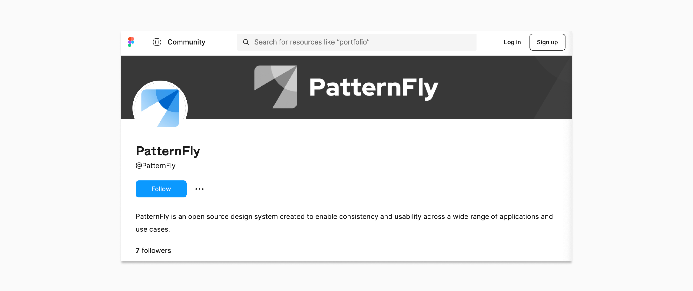
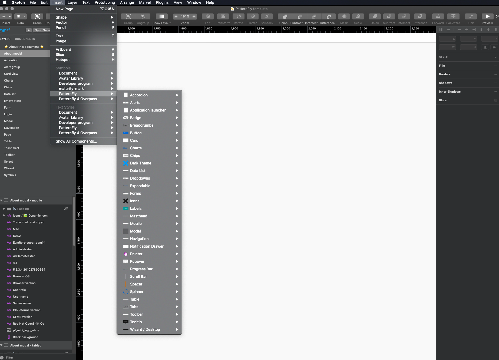
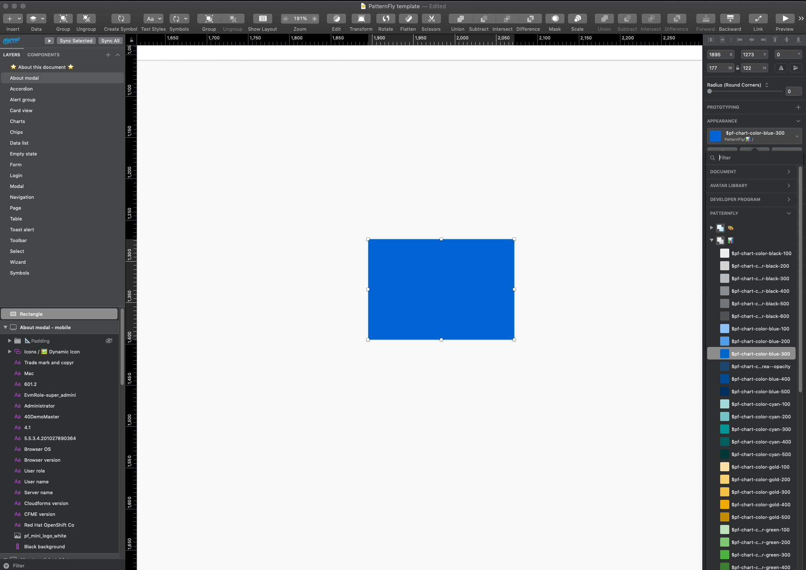

import { Alert } from '@patternfly/react-core';

To start designing with PatternFly, you will need to install our design kits and libraries. These resources give you full access to PatternFly's visual design system and enable you to create consistent and usable product experiences.

## Figma library

PatternFly 5 has been set up within Figma. To download the Figma library, which contains all PatternFly components and styles, visit our [PatternFly community page.](https://www.figma.com/@patternfly)

Previously, the PatternFly design kit was available within Sketch. We have migrated our design libraries to Figma, in order to take advantage of its real-time collaboration features that help streamline the design process and support better communication. While you may still use Sketch if it best fits your needs, it is no longer our recommendation. [See more details within our Sketch instruction.](/get-started/design#sketch-design-kit)

### Red Hat employees

If you are a Red Hat employee on the User Experience Design (UXD) team, you will be added to the UXD workspace in Figma. This allows you to instantly receive library updates as they are made by the team. 

If you are a Red Hat employee, but you are not on the UXD team, you should work with your manager to be added to your team's respective workspace in Figma.

### PatternFly community members

If you are not a Red Hat employee, you will need to create a copy of the [PatternFly 5 design file](https://www.figma.com/community/file/1300826511900225842/patternfly-5) to install the library within your own Figma workspace. 

Note that you will not be able to receive automatic library updates since you are working from a local copy. The PatternFly team will release any updates every other week, as part of their sprint schedule. Be sure to revisit our Figma community page in order to download the latest updates. 

## Sketch design kit

**Note:** We have migrated to Figma and no longer maintain or update our Sketch design kits. 

Initial PatternFly 5 components and styles have been added to Sketch, and can be accessed following the instructions outlined on this page, but no further updates will be released. You can continue to use Sketch, but keep in mind that you will not be following our latest recommendations and will not have access to new features. We recommend that you migrate to Figma so that you can continue to receive updated design resources.

The following information and instructions may be out of date.

### Design kit
The design kit is a symbol library implemented in Sketch to help designers, like you, create high-fidelity mockups that reflect PatternFly styling.

### Wireframe kit
A PatternFly wireframe kit (implemented in Sketch) is also available for creating low or mid-fidelity mockups that are compatible with PatternFly styles. The wireframe kit is separate from the design kit, but the two can be used together for a comprehensive approach to the design life-cycle.

[**Learn more about the wireframe kit**](https://github.com/patternfly/patternfly-design-kit/blob/master/PatternFly%204%20-%20Wireframe%20library%20and%20template/Wireframe%20kit%20guideline.md) <i class="ws-content-blueArrow fas fa-arrow-right pf-v6-u-mx-sm"></i>

### Style guidelines
What typography should you be using? What about colors? Spacing? Check out styles to learn everything you need to know about our foundational design elements.

[**View styles**](/design-foundations/colors) <i class="ws-content-blueArrow fas fa-arrow-right pf-v6-u-mx-sm"></i>

### Usage and behavior guidelines
Should you use a wizard or a form to solve this problem? How do you write a good button label? Which navigation makes the most sense? Get answers by clicking the Design guidelines tab associated within each component page.

[**View usage and behavior guidelines**](/components/about-modal/design-guidelines) <i class="ws-content-blueArrow fas fa-arrow-right pf-v6-u-mx-sm"></i>

### Content guidelines
How do you write great microcopy and text for your user interface? Read our content guidelines for general principles, guidance on voice, and a style guide to help you with everything from capitalization to date and time formats.

[**View content guidelines**](/ux-writing/about-ux-writing <i class="ws-content-blueArrow fas fa-arrow-right pf-v6-u-mx-sm"></i>

### Start building with components.
What does a toolbar look like? What about a filter chip? Components are the building blocks of the design system. Check out individual component pages to view examples, understand states and behaviors, and check out the code samples (if you’re into that kind of thing).

#### Download fonts
PatternFly currently uses Red Hat Text and Red Hat Display, [which you can download here](https://github.com/RedHatOfficial/RedHatFont). Once you've downloaded the repository, select all files in the "TTF" folder and double-click to install them onto your computer locally.

### What's in the design kit?

[**View demos**](/patterns/primary-detail) <i class="ws-content-blueArrow fas fa-arrow-right pf-v6-u-mx-sm"></i>

### What's in the design kit?

#### The template file

The template file contains complex components and demos like charts and forms that make it faster and easier for you to add common design patterns to your wireframes. Template examples can be viewed in [our demos](/components/about-modal/html-demos).

The contents of the template file are organized alphabetically by component or demo name. If you want to use any of the artboards in the template file to create custom designs, you should follow these rules:
1. Unhide “padding” group (this group contains all of the spacers we use to create the design)
2. Edit the design as desired using the spacers as your guide

#### The symbol library
The PatternFly symbol library contains individual components like buttons, alerts, and badges, that can be combined in any number of ways to solve common design problems. If you’re unfamiliar with Sketch symbols, it might be helpful to skim [this guide](https://www.sketch.com/docs/libraries/library-symbols) before you get started.

You can use any symbol offered in the Sketch symbol library to create your design. If you have any questions or need any clarification, you can post to the [PatternFly forum](https://forum.patternfly.org/). If you have any feedback about certain features or encounter a bug, you can file an issue against [patternfly-design-kit](https://github.com/patternfly/patternfly-design-kit/issues) on GitHub.

##### Navigating the symbol library
There are 2 kinds of symbols - library symbols and document symbols. Library symbols are available in any Sketch document, while document symbols are specific to the document in which they are found.

From the top toolbar in Sketch, select Insert → Symbols → Patternfly 4 to add symbols onto your page.

PatternFly symbols are designed to be as flexible and adaptable as possible. As such, designers should avoid detaching symbols from the library. However, there are rare instances where this may be necessary. Just know that once a symbol is detached, that symbol will no longer automatically update with new releases.

</img>

### Getting the design kit

The PatternFly design kit was originally developed for [Sketch users](#sketch-users), but is now available for use through [any design tool](#using-other-design-tools).

#### Download the font
PatternFly currently uses Red Hat Text and Red Hat Display. To download these fonts, go to https://github.com/RedHatOfficial/RedHatFont and download the whole repository. Then select all files in the "TTF" folder and double-click. This will install them onto your computer locally.

### Using Sketch

#### Before you start designing
The design kit is a collection of Sketch assets that make it easy for designers to create hi-fi mockups that accurately represent PatternFly components and layouts. It works with Sketch libraries. To use it, you need to install [Sketch version 68](https://www.sketch.com/) or above.

#### Download the template file
1. Access the [PatternFly template file](https://www.sketch.com/s/729c2eee-e8b6-4fcd-8a79-f6faa8c30f89) on Sketch cloud.
2. From the "..." menu on the top right, click **Download** to download the file onto your computer.

####  Add the symbol library
3. Access the [PatternFly design library](https://www.sketch.com/s/2cf1063b-5283-4e0b-b8a6-cbb1ac07e29e) on Sketch cloud.
5. From the "..." menu on the top right, click **Add library**. You'll be prompted with a modal - click "Open Sketch". Sketch should then open, and the download should happen automatically.

### Using other design tools

#### Before you begin
For non-Sketch users, we have created a compatible version of the symbol library to fit with any design tool of choice. We recommend importing the SVG versions into your design tool. Download the SVG set in the [patternfly-design-kit repo](https://github.com/patternfly/patternfly-design-kit/tree/master/Symbols-SVGs).

### Using the design kit
It’s important to understand some specific aspects about the design kit and the assets contained inside to make the most of the design system.

* [Spacers](#spacers)
* [Layers styles](#layer-styles)
* [Text styles](#text-styles)

### Spacers
The layout for all visual elements in Patternfly is determined by spacers. The spacers are used as padding between elements to ensure consistent layout and placement of components into a design that adheres to PatternFly guidelines. All symbols in the symbol library and templates have been made using spacers which are built-in to ensure correct use of elements.

The [template library](https://www.sketch.com/s/729c2eee-e8b6-4fcd-8a79-f6faa8c30f89) also contains examples of spacer use to clarify where elements should be placed within a given page or design.  These templates have been created in a way that reduces a user’s need to think about spacers. An example of a Login form template can be seen here with different sized spacers - demonstrated by their different colors - used to separate each symbol/component within the layout.

To see more information about spacers and their use please see our [spacer guidelines](/design-foundations/spacers).

### Layer styles
Symbols in the symbol are organized by component; after selecting a component, you’ll see the variations and states of that component.

For some components, you will have the option to customize them to your need by overriding certain layer styles and text labels from the sidebar on the right.

Layer styles are color selections for symbols in Sketch.

</img>

Colors in PatternFly are carefully considered, and custom layer styles are discouraged. There are specific color options to choose from for backgrounds, borders, icons and states, as well as an expansive color library for other elements that do not necessarily fit into a certain category.

Note that there is a difference between regular color options and chart color fill options. When changing a color in a chart, you should only use the colors in the chart fill “dropdown”, which includes fills for donut charts, line charts and regular bar charts. When changing the color of other elements, you should use the general color palette if the component does not fit into the other offered category options.

### Text styles
Currently, all PatternFly text styles use Red Hat Text and Red Hat Display fonts. If you have not done so already, make sure to download according to the instructions [above](#download-the-font) before starting your designs.

When inserting text into your design, always assign it a text style by selecting the text item, followed by selecting a text style from the appearance menu on the right toolbar.

### Staying up to date
Adjustments and bug fixes are made to the kit on a regular basis. When we make a change to any of the libraries, you'll be notified via the bell icon in the top right corner of the Sketch window that says “Library Update Available”. To update, click "Update" on the pop-up that appears.

We recommend that you keep your kit as up to date as possible. Once a change is accepted, you will not be able to revert to the previous version.

Please note that the Patternfly template will NOT be automatically updated as the symbol library is. Every time this template file is updated, you will need to re-download and re-save this as a template. We have added [release notes](https://github.com/patternfly/patternfly-design-kit/blob/master/PatternFly%20release%20notes.md) to the [design-kit-repo](https://github.com/patternfly/patternfly-design-kit/) that document additions and edits to the design kit. This is a good place to start to review what has been added to the template file.

Did you use the old versions of the symbols that were updated in files already? No problem -  you'll receive another notification in the top right of that specific Sketch file that will allow you to update them.
