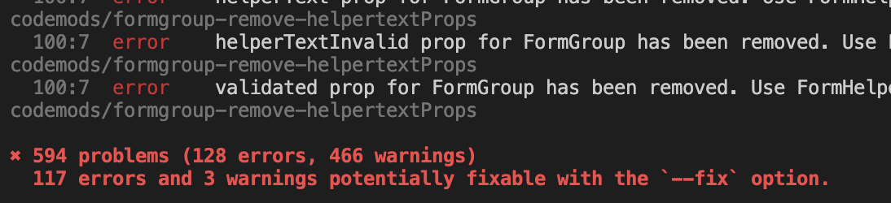

# PatternFly 5 

Our latest major release introduces new support and functionality to PatternFly, including: 

- React 18 support, 
- Official dark theme support, 
- An enhanced system of CSS classes and variables, 
- And more!

To learn about the most significant changes in this release, read our [release highlights](/get-started/release-highlights). A detailed list of all changes can be found in our [major release notes](/get-started/upgrade/release-notes). 

This guide outlines the major steps you should take to upgrade your product's codebase from PatternFly 4 to PatternFly 5. 

## Get help 

If you need support as you upgrade to PatternFly 5, the PatternFly team is here to help. Reach out to us on [Slack](https://join.slack.com/t/patternfly/shared_invite/zt-1npmqswgk-bF2R1E2rglV8jz5DNTezMQ) or ask a question on our [GitHub discussion board](https://github.com/orgs/patternfly/discussions). We'll always do our best to answer your questions and connect you with the right people quickly. 

## Upgrade your product's codebase

When you upgrade your product to PatternFly 5, several breaking changes will likely be introduced to your product’s codebase. We are using a suite of codemods to simplify and streamline the upgrade process. Instead of requiring you to manually identify all errors and issues in your codebase, you can run our codemods to quickly identify and fix major issues. Keep in mind that some changes will still require manual intervention, but our codemods can automatically fix a large amount of issues and flag any issues that do require manual work.

To utilize our codemods, refer to the following instructions. You can also [view the project on GitHub](https://github.com/patternfly/pf-codemods/) for additional details.

###  Run our codemods

**Note:** Running codemods after making manual changes will lead to even more manual intervention and cleanup. Because of this, we strongly recommend running codemods _before_ making any manual changes to your codebase.

To run our codemods, complete the following steps:

1. Run the following command, adding in the path to your product's source code: 

    ```{
    npx @patternfly/pf-codemods@latest <path to your source code>
    ```

   * You should see an output similar to running `lint`, with both a list of warnings and errors, as well as a total count of each, as shown in the following example:
     

   * If you see something different, please reach out before going further as there may be an issue.

2. Make note of any issues that get flagged.

3. Add the `--fix` flag to the end of your original command and run it again. 

4. Make note of the changes applied to your product's code base.

5. Note any errors that were not automatically fixed (some may simply be warnings) and manually repair issues that are critical.

6. Build your product.

7. Run codemods multiple times to ensure that all issues are flagged and addressed.

## Review and update variable and class names

We changed component class names, layout class names, utility class names, CSS variables, and SCSS variables. These changes mean that any existing CSS overrides will likely be targeting outdated styles. These changes will break all custom CSS overrides that reference any PatternFly class names or CSS variables, so it is important to review your overrides and ensure that they align with our updated naming conventions, which are detailed in this section. 

There are some cases where multiple applications that use PatternFly all plug into a larger application. In such cases, it's nearly impossible to coordinate a simultaneous update from PatternFly 4 to PatternFly 5. To prevent style collisions when multiple versions of PatternFly could be simultaneously running side by side in one UI, PatternFly has versioned all of its CSS using versioned prefixes.

For PatternFly 5, class names, variable names, and SCSS objects have all had `v5` added to their prefix in the following ways:

| Language/style | v4 prefix | v5 prefix|  Note |
| --- | ---| --- | ---  |
|  CSS |  `--pf-` |  `--pf-v5-` |
|  SCSS |  `.pf-`  | `$pf-v5-`  |
|  SCSS | `@mixin pf-`  | `@mixin pf-v5-`  |
|  SCSS | `@function pf-`  | `@function pf-v5-`  |
|  SCSS | `%pf-`  | `%pf-v5-`  |
| HTML class names  | `.pf-`  |  `.pf-v5-`  | excludes `.pf-m ` |

**Note:** PatternFly modifier classes, such as `pf-m-expanded` are not versioned and retain the same formatting that they had for PatternFly 4. 

### Utilize our `class-name-updater` Codemod

We offer [a `class-name-updater` Codemod](https://github.com/patternfly/pf-codemods/tree/main/packages/class-name-updater) to help support your updates. This utility automatically identifies class names that need to be updated as a result of the introduction of versioned class names in Patternfly v5, which helps highlight places in your codebase that may require changes to class names. Add the `--fix` flag to allow run the code mod and fix issues where possible. 

**Note:** It is important to consider that this utility performs a simple ‘find and replace’, so it's possible that it will inadvertently identify code that is formatted similarly to a PatternFly class name, but is not one.

## Upgrade deprecated components

You will have until our next major release to update the code for your components to match our newest recommendations. If you have not adopted our recommended implementation at that time, your components will be outdated and may not function as needed.

PatternFly 5 brings a new implementation to the following components, which can be upgraded according to the linked documentation:

- [Table](/components/table) 
- [Select](/components/menus/select)
- [Dropdown ](/components/menus/dropdown) 
- [Wizard](/components/wizard)
