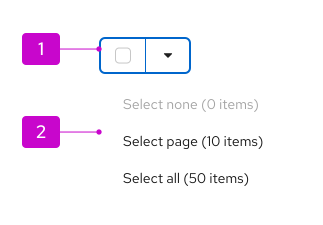
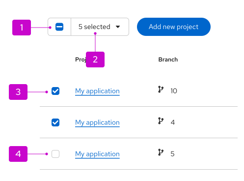
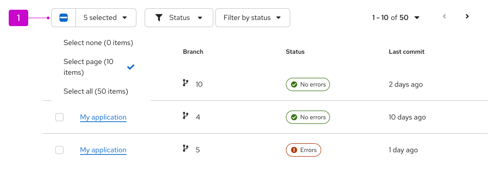
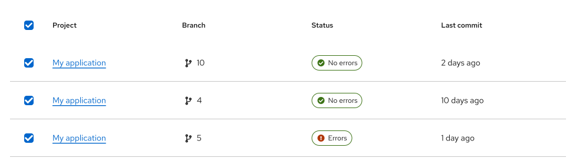
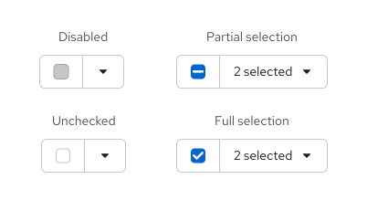
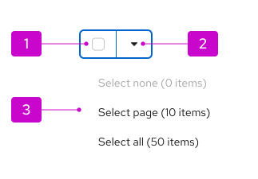
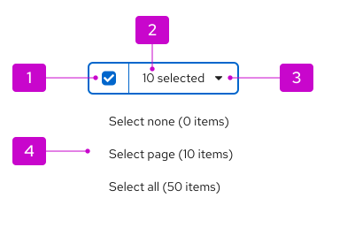

import '../../components/components.css';

**Bulk selection** enables users to select or deselect multiple items in a content view, such as lists, tables, or card views. 

## Bulk selector
You can add a bulk selection control in the toolbar of a content view. This control, a bulk selector, lets users control selection via a [split button](/components/menus/menu-toggle#split-button-toggle-with-checkbox) component. The bulk selector also reflects the selection status of the related content, including partial selection, full selection, or no selection.

1. **Bulk selector:** A split button that combines a selection checkbox with a dropdown menu toggle.

2. **Menu:** A list of bulk selection options for the related content view. A bulk selection menu should include the following options: 
    - "Select none", which clears a previous selection. If nothing is selected, this option should be disabled.
    - "Select page", which selects all items on the current page (when pagination is in use).
    - "Select all", which selects all items across all pages. This can be omitted if this isn't supported in your implementation.
    - (Optionally) Additional menu items that match some predetermined filter criteria, such as “Running VMs”, "Errors”, and so on.

1. **Checkbox:** Control that reflects the current selection state of the item. Checkbox states will be automatically updated by bulk selector menu selections, but can also be manually selected. Manually clicking the checkbox in the bulk selector will select all items in the related content view. 

2. **Selected item count:** Text label that reflects the total number of items selected. If pagination is in use, it will reflect the number of items selected across all pages.

3. **Selected checkbox:** Indicates that an item has been selected. Either a partial selection (dash) or a full selection (check mark) can be displayed in a checkbox. For more details about the behavior of the checkbox, refer to [checkbox states](#checkbox-states).

4. **Empty checkbox:** Indicates that an item has not been selected.

## Usage

### Selection in toolbars
A bulk selector is often placed in the toolbar of a table that uses pagination.

In this example, there are 50 total items in this dataset across 10 pages. Only the first page has been selected, so partial selection is reflected across checkboxes. The user can select (or deselect) additional items via the bulk selection checkbox, the bulk selection menu, or by clicking on a row's checkbox. The selected items count will update whenever selection is changed.

### Selection for global actions
Bulk selection is often used to select multiple items and perform an action on them. In these instances, the selection state persists&mdash;even after the action has completed&mdash;until the user purposefully changes the selection.

### Integrated selection for tables
Tables include integrated bulk selection by default in the header row.

A checkbox in a table's header row will select or deselect all items in the table (or all items on the current page if pagination is in use).

We recommend only using integrated bulk selection when a table doesn't contain a toolbar. When a toolbar is present, you should instead default to controlling bulk selection via the toolbar. This provides better visibility for the number of selected item, maintains better consistency between view types, and allows for more selection flexibility.

**Note:** To hide integrated bulk selection and enable the toolbar control in our [table component](/components/table), set the `canSelectAll` prop to "false".

## Behavior 

### Checkbox states

There are a few checkbox states that can result from bulk selection:

1. **Disabled:** Cannot be interacted with.
2. **Partial selection:** Uses the minus icon to represent that the item is part of a partial selection, meaning that only some items are selected. 
3. **Unchecked:** Represents that the item hasn't been selected.
4. **Full selection:** Uses the check mark icon to represent that the item is part of a full selection, where all items are selected in a content view.

#### No items selected 

1. **Checkbox:** Empty. When clicked, selects all items.
2. **Menu toggle:** Opens and closes the selection menu.
3. **Menu:** Displays selection options. "Select none" is disabled, since no items are selected.

#### Some items selected

1. **Checkbox:** Filled, containing a minus icon. When clicked, deselects all selected items.
2. **Text label:** Displays the number of selected items. When clicked, opens and closes the selection menu.
3. **Menu toggle:** Opens and closes the selection menu.
4. **Menu:** Displays selection options. 

The following guidance outlines the behavior of the bulk selector for different selection states.

#### All items selected

1. **Checkbox:** Filled, containing a check mark icon. When clicked, deselects all selected items.
2. **Text label:** Displays the number of selected items. When clicked, opens and closes the selection menu.
3. **Menu toggle:** Opens and closes the selection menu.
4. **Menu:** Displays selection options. 

## Placement 

When used in a toolbar, the bulk selector should be the first item.