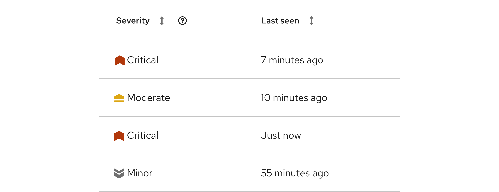
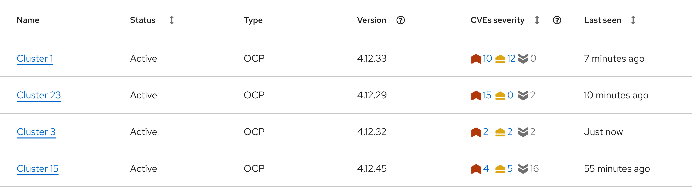

import { Button, Icon, Content, ContentVariants } from '@patternfly/react-core';
import './status-and-severity.css';
import RhUiSeverityCriticalFillIcon from '@patternfly/react-icons/dist/esm/icons/rh-ui-severity-critical-fill-icon';
import RhUiSeverityImportantFillIcon from '@patternfly/react-icons/dist/esm/icons/rh-ui-severity-important-fill-icon';
import RhUiSeverityMinorFillIcon from '@patternfly/react-icons/dist/esm/icons/rh-ui-severity-minor-fill-icon';
import RhUiSeverityModerateFillIcon from '@patternfly/react-icons/dist/esm/icons/rh-ui-severity-moderate-fill-icon';
import RhUiSeverityNoneFillIcon from '@patternfly/react-icons/dist/esm/icons/rh-ui-severity-none-fill-icon';
import RhUiSeverityUndefinedFillIcon from '@patternfly/react-icons/dist/esm/icons/rh-ui-severity-undefined-fill-icon';
import RhUiCheckCircleFillIcon from '@patternfly/react-icons/dist/esm/icons/rh-ui-check-circle-fill-icon';
import RhUiErrorFillIcon from '@patternfly/react-icons/dist/esm/icons/rh-ui-error-fill-icon';
import RhUiWarningFillIcon from '@patternfly/react-icons/dist/esm/icons/rh-ui-warning-fill-icon';
import RhUiInformationFillIcon from '@patternfly/react-icons/dist/esm/icons/rh-ui-information-fill-icon';
import RhUiNotificationFillIcon from '@patternfly/react-icons/dist/esm/icons/rh-ui-notification-fill-icon';

# Communicating status versus severity 

Providing users with clearly defined status and severity states is essential when sharing important context about their data streams and systems. Ensuring that accessibility standards are met in the UI plays a critical role in sharing this information.

- [**Status:**](#status-icons) Refers to the current state of a connected data source, system, or similar object.

- [**Severity:**](#severity-icons) Refers to how critical an identified issue is.

Status and severity are most effectively communicated through a combination of text, color, and an icon.

Though both can be used to warn users of issues, severity icons and status icons are not interchangeable. Status does not automatically convey the level of impact an issue may have.

## Content considerations 

Icons are often most meaningful when paired with text. If you're not certain that all users will recognize an icon on its own, add a descriptive text label or a tooltip. For guidance related to icon tooltips, refer to our [tooltips writing guide.](/content-design/writing-guides/tooltips)

## Status icons

Status icons convey the status of a data source, system, or similar object. They should not be used without a text label and/or additional context, like within [alerts,](/components/alert) [banners,](/components/banner#status) and [empty states.](/components/empty-state#with-status)

These icons are color coded to help users better understand what a message is trying to communicate. Status colors and status icons should not be swapped or rearranged. For example, a danger color should not be applied to an info status icon. 

The following table outlines the proper combination of status type, icon, and color tokens to use:

| **Status** | **Icon** | **Color token** | **Usage** |
| --- | --- | :---: | --- |
| Danger | <Icon status="danger" size="xl"> <RhUiErrorFillIcon /> </Icon> |`--pf-t--global--icon--color--status--danger--default` | Use when a major error or blocking error has occurred. |
| Warning | <Icon status="warning" size="xl"><RhUiWarningFillIcon /></Icon> | `--pf-t--global--icon--color--status--warning--default` | Use when a non-critical error has occurred.  |
| Success | <Icon status="success" size="xl"><RhUiCheckCircleFillIcon /></Icon> | `--pf-t--global--icon--color--status--success--default` | Use when a task or process has completed without error.|
| Info | <Icon status="info" size="xl"><RhUiInformationFillIcon /></Icon> | `--pf-t--global--icon--color--status--info--default` | Use for  general, informational messages. |
| Custom |  <Icon status="custom" size="xl"><RhUiNotificationFillIcon /></Icon> |`--pf-t--global--icon--color--status--custom--default` | Use for generic messages, with no associated severity. Allows you to use custom colors.|

### Usage 

Use status icons: 
- To provide more context to the meaning or current state of an alert, modal, banner, or similar component. 
- To properly identify the type of message being shared (based on the usage definitions in the previous table).

Do not use status icons: 
- To convey severity. Use [severity icons](#severity-icons) instead.
- To communicate a message without a text label. 
## Severity icons

When there is an issue or incident related to a source of data, it is important to communicate the severity of the situation to help users to measure and understand the impact that it may have. To facilitate effective communication, we offer a series of severity icons.

These icons utilize color and visual weight to reflect the sense of severity that the icon is communicating. As the icons progress from less severe to more severe, the visual weight shifts and the color becomes more attention-grabbing.

| **Severity level** |  
**Icon**
 | **Name** | **React name** | **Color token** | **Usage** |
| --- | :---: | --- | --- | --- | --- |
| Critical | 
<Icon iconSize="lg" className="critical"><RhUiSeverityCriticalFillIcon /></Icon>
 | rh-ui-severity-critical-fill | RhUiSeverityCriticalFillIcon | `--pf-t--global--icon--color--severity--critical--default`| Reserve for the highest severity issues. |
| Important | 
<Icon iconSize="lg" className="important"><RhUiSeverityImportantFillIcon /></Icon>
  | rh-ui-severity-important-fill | RhUiSeverityImportantFillIcon | `--pf-t--global--icon--color--severity--important--default` | Use for high-threat issues. |
| Moderate | 
<Icon iconSize="lg" className="moderate"><RhUiSeverityModerateFillIcon /></Icon>
 | rh-ui-severity-moderate-fill | RhUiSeverityModerateFillIcon | `--pf-t--global--icon--color--severity--moderate--default`| Use for moderate-threat issues. |
| Minor | 
<Icon iconSize="lg" className="minor"><RhUiSeverityMinorFillIcon /></Icon>
 | rh-ui-severity-minor-fill | RhUiSeverityMinorFillIcon | `--pf-t--global--icon--color--severity--minor--default`| Use for low-threat issues.  |
| None | 
<Icon iconSize="lg" className="none"><RhUiSeverityNoneFillIcon /></Icon>
 | rh-ui-severity-none-fill | RhUiSeverityNoneFillIcon | `--pf-t--global--icon--color--severity--none--default` | Use when there is no security threat.  |
| Undefined | 
<Icon iconSize="lg"  className="undefined"><RhUiSeverityUndefinedFillIcon /></Icon>
 | rh-ui-severity-undefined-fill | RhUiSeverityUndefinedFillIcon | `--pf-t--global--icon--color--severity--undefined--default` | Use if a severity level has not been determined yet, but is expected to change and be defined later. |

### Usage

Use severity icons: 
- To make it easier for users to quickly understand the impact of an issue.

Do not use severity icons: 
- To communicate the status of something. Instead, use [status icons.](#status-icons)
- Without applying the proper color. The severity color palette was chosen carefully to communicate a clear range of urgency, while ensuring proper color accessibility.

### Single issue

When you're displaying severity information about a single, standalone issue, use the appropriate severity level text label:

### Aggregated issues

Due to varying use cases, you can use anywhere between 3 to 6 icons to communicate a severity range. When arranging multiple severity icons, organize them from most severe to least severe.

| **Scale** | **Levels** | **Icons** |
| --- | --- | --- |
| 6-point scale | Critical, important, moderate, minor, none, undefined | <Icon iconSize="lg" className="critical"><RhUiSeverityCriticalFillIcon /></Icon> &nbsp;&nbsp; <Icon iconSize="lg" className="important"><RhUiSeverityImportantFillIcon /></Icon> &nbsp;&nbsp; <Icon iconSize="lg" className="moderate"><RhUiSeverityModerateFillIcon /></Icon>   &nbsp;&nbsp; <Icon iconSize="lg" className="minor"><RhUiSeverityMinorFillIcon /></Icon> &nbsp;&nbsp; <Icon iconSize="lg" className="none"><RhUiSeverityNoneFillIcon /></Icon> &nbsp;&nbsp; <Icon iconSize="lg" className="undefined"><RhUiSeverityUndefinedFillIcon /></Icon>  | 
| 5-point scale | Critical, important, moderate, minor, none or undefined (choose 1) | <Icon iconSize="lg" className="critical"><RhUiSeverityCriticalFillIcon /> </Icon> &nbsp;&nbsp; <Icon iconSize="lg" className="important"><RhUiSeverityImportantFillIcon /></Icon> &nbsp;&nbsp; <Icon iconSize="lg" className="moderate"><RhUiSeverityModerateFillIcon /></Icon>   &nbsp;&nbsp; <Icon iconSize="lg" className="minor"><RhUiSeverityMinorFillIcon /></Icon> &nbsp;&nbsp; <Icon iconSize="lg" className="none"><RhUiSeverityNoneFillIcon /></Icon>   or   <Icon iconSize="lg" className="critical"><RhUiSeverityCriticalFillIcon /> </Icon> &nbsp;&nbsp; <Icon iconSize="lg" className="important"><RhUiSeverityImportantFillIcon /></Icon> &nbsp;&nbsp; <Icon iconSize="lg" className="moderate"><RhUiSeverityModerateFillIcon /></Icon>   &nbsp;&nbsp; <Icon iconSize="lg" className="minor"><RhUiSeverityMinorFillIcon /></Icon> &nbsp;&nbsp; <Icon iconSize="lg" className="undefined"><RhUiSeverityUndefinedFillIcon /></Icon>   | 
| 4-point scale | Critical, important, moderate, minor |<Icon iconSize="lg" className="critical"><RhUiSeverityCriticalFillIcon /> </Icon> &nbsp;&nbsp; <Icon iconSize="lg" className="important"><RhUiSeverityImportantFillIcon /></Icon> &nbsp;&nbsp; <Icon iconSize="lg" className="moderate"><RhUiSeverityModerateFillIcon /></Icon>   &nbsp;&nbsp; <Icon iconSize="lg" className="minor"><RhUiSeverityMinorFillIcon /></Icon>  | 
| 3-point scale | Critical, moderate, minor | <Icon iconSize="lg" className="critical"><RhUiSeverityCriticalFillIcon /> </Icon> &nbsp;&nbsp; <Icon iconSize="lg" className="moderate"><RhUiSeverityModerateFillIcon /></Icon>   &nbsp;&nbsp; <Icon iconSize="lg" className="minor"><RhUiSeverityMinorFillIcon /></Icon>   | 

These groups of severity icons are especially useful in data displays, like tables and cards.

When you use multiple severity icons, include a count for each icon. To allow users to take action on issues, you can also link the counts to other resources. 

