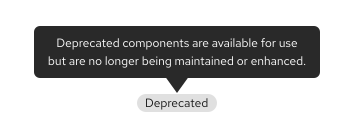

import '../components/components.css';

A PatternFly **release** refers to a newly published version of one or more PatternFly libraries, including major, minor, and patch releases. 

| Release type | Description | Versioning |
| :--- | :--- | :--- |
| **Major** | Releases that contain planned breaking changes that alter how your product's code interacts with PatternFly. | X.0.0 (6.0.0) |
| **Minor** | Our standard quarterly feature release that introduces non-breaking changes and enhancements. | X.Y.0 (6.1.0) |
| **Patch** | A minor release published between our quarterly cycles in order to fix critical bugs. | X.Y.Z (6.1.1)|

--- 

## What is PatternFly's release cadence? 

We release updates or new features to PatternFly every quarter, with details in our [release highlights](/releases/release-highlights/). A PatternFly release can be either major or minor, and will be closely aligned with long-term projects the team is working on.
## How long is a major version supported? 

A major version of PatternFly (like PatternFly 6) is supported only through the subsequent major version. For example, when PatternFly 6 was released, support for PatternFly 4 ceased.

To support you through major releases, we provide a detailed [upgrade guide](/releases/upgrade-guide), with codemods to speed up your transition work.

## What is the lifecycle of a PatternFly feature? 

### Beta features

Significant changes to components and design tokens are first released in beta. These features are marked with a nonstatus blue "Beta" label. 

Beta features are subject to change (API, visuals, or underlying code) based on user feedback. They are only promoted to fully-supported status once they are stable and thoroughly tested.

While a feature is in beta, it can receive breaking changes. Once promoted out of beta, we will not make further breaking changes outside of a planned major release.

When using a beta feature, refer to its documentation and experiment with provided examples. You can track development status and changes on the [PatternFly GitHub project board](https://github.com/orgs/patternfly/projects/7/views/1) or refer to the [beta component promotion README](https://github.com/patternfly/patternfly-org/tree/main/beta-component-promotion).

### Deprecated components

Deprecated components are implementations that*are no longer recommended for use, due to significant design or code changes. These components are marked with a nonstatus gray "Deprecated" label.

Once deprecated, a component is no longer maintained or enhanced. Deprecated component implementations will remain available until the following major release and can be imported from `@patternfly/react-core/deprecated`. After the following major release, a deprecated component and its documentation is removed from PatternFly.org. 

#### Deprecation scenarios

A component can be deprecated for a couple of reasons:
- **Complete removal:** A component is replaced by a different, newly recommended component.
- **Significant implementation change:** A component receives a new React implementation. The previous implementation documentation is moved to a "React deprecated" tab on the same page, until the following release, when it will be removed.