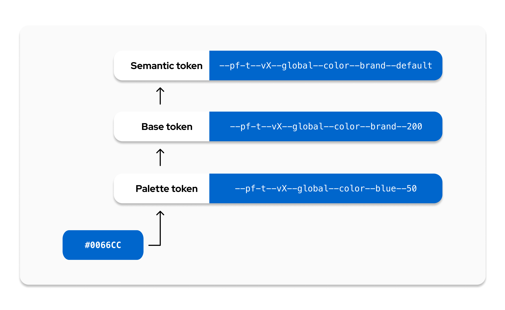

---
id: About tokens
section: tokens
--- 

**Design tokens** are variables that store visual design attributes like color, typography, and spacing. Tokens have a name and value that conveys their associated design style, making their purpose clear and recognizable.

PatternFly's tokens are set up as variables and styles within Figma, and are available as CSS variables for development. Tokens are only available as part of the PatternFly 6 release, so make sure you [upgrade to PatternFly 6](/get-started/upgrade) and/or [install our Figma library](/get-started/design#figma-library) in order to take advantage of tokens. PatternFly 6 components, charts, and extensions are all built with tokens.

[View all PatternFly design tokens.](/tokens/all-patternfly-tokens)

## Why use tokens? 

A token system enables a a shared language for building UIs and helps support better consistency and maintenance across the PatternFly design system.

### Consistency 
Tokens help maintain consistency across product design processes by ensuring that the same colors and styles are always used for the same use cases. By removing the decision making that would otherwise go into choosing the right color, heading level, spacing, and so on, designs can be created more consistently and efficiently.

### Easier maintenance
Tokens also enable easier design system maintenance. Whenever a color is changed as part of a redesign or update, all related tokens are automatically updated to reflect this change. This means that developers won't have to make any code changes to ensure that a product is up to date with the latest PatternFly recommendations. Likewise, designers will see that their Figma designs automatically update to reflect any changes made to tokens.

## Token layers
The PatternFly token system has 3 layers: palette tokens, base tokens, and semantic tokens. 

* **Palette tokens** use [PatternFly color palettes](/design-foundations/colors#patternfly-palettes) to create a color foundation for other token layers to reference. 

* **Base tokens** expand on the palette layer to apply PatternFly colors to concepts. They also introduce additional concepts, like spacing and borders. Base tokens are grouped conceptually and named numerically, with no duplicate values in a concept group.

* **Semantic tokens** are the top-level tokens that are grouped conceptually and named semantically. They are built with base tokens and are the tokens that you should see and use in most use cases. Semantic naming is intentionally chosen to support the proper and relevant use of a token, which makes design consistency easier for everyone. 

## Token names
PatternFly token names are composed of a `--pf-t` prefix and a series of token segments, separated by double hyphens:

`--pf-t--[scope]--[component]--[property]--[concept]--[variant]--[state]`

Each token segment represents a different type of style information: 

| **Segment** | **Description** |
| --- | --- |
| Scope | The token's range, such as *global* or *chart*.
| Component | The component that the token relates to, such as *icon*, *background*, or *text*.
| Property | The style property of a component, such as *color*, *size*, *width*, or *radius*.
| Concept | The token's higher level concepts, such as *status*, *primary*, or *action*, which have different variant options.
| Variant | The variant of a component or concept, such as *link*, *plain*, *warning*, or *success*.
| State | The state that the component is in, such as *default*, *hover*, or *active*.

If a segment isn't relevant for a particular token then it will be skipped in the token's name:

| **Segments** | **Example** |
| --- | --- |
| [scope]--[component]--[property]--[concept]--[variant]--[state] | `--pf-t--global--background--color--action--plain--clicked` |
| [scope]--[component]--[property]--[variant]--[state]  | `--pf-t--global--background--color--backdrop--default` |
| [scope]--[component]--[property]--[variant]  |  `--pf-t--global--border--width--regular`	|

