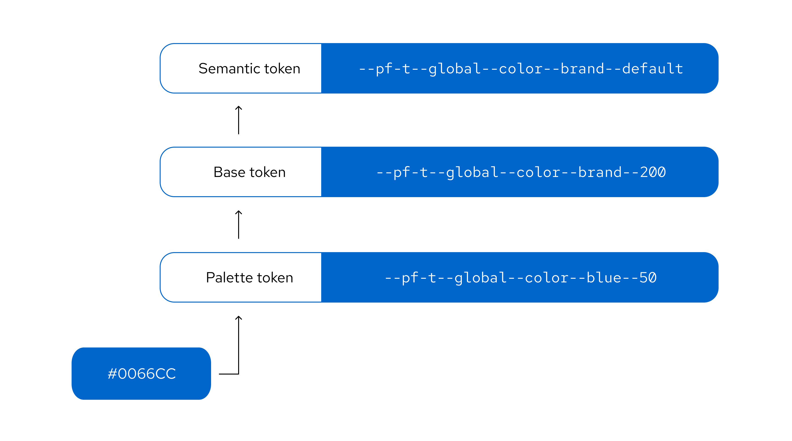

---
id: About tokens
section: tokens
--- 

**Design tokens** are variables that store visual design attributes like color, typography, and spacing. Tokens have a name and value that conveys their associated design style, making their purpose clear and recognizable. 

PatternFly's tokens are set up as variables and styles within Figma, and are exported as CSS variables for use in development. 

To learn more about designing with the PatternFly Figma library, [refer to our onboarding guide.](/get-started/design#figma-library)

You can also [view the complete list of PatternFly's design tokens.](/tokens/all-patternfly-tokens)

Tokens are part of the PatternFly 6 release, so you must [upgrade](/get-started/upgrade) in order to take advantage of tokens.

## Why use tokens? 

A token system enables a a shared language for building UIs and helps support better consistency and maintenance across the PatternFly design system.

### Consistency 
Tokens help maintain consistency across product design processes by ensuring that the same colors and styles are always used for the same use cases. By removing the decision making that would otherwise go into choosing the right color, heading level, spacing, and so on, designs can be created more consistently and efficiently.

### Easier maintenance
Tokens also enable easier design system maintenance. Whenever a color is changed as part of a redesign or update, all related tokens are automatically updated to reflect this change. This means that developers won't have to make any code changes to ensure that a product is up to date with the latest PatternFly recommendations. Likewise, designers will see that their Figma designs automatically update to reflect any changes made to tokens.

## Token names

PatternFly token names are composed of a '--pf-t' prefix, a version number, and a series of token segments, separated by double hyphens.

Each token segment represents a different type of style information. If a segment isn't relevant for a particular token then it will be skipped in the token's name. 

| **Segment** | **Description** |
| --- | --- |
| Scope | The token's range, such as *global* or *chart*.
| Component | The component that the token relates to, such as *icon*, *background*, or *text*.
| Property | The style property of a component, such as *color*, *size*, *width*, or *radius*.
| Concept | The token's higher level concepts, such as *status*, *primary*, or *action*, which have different variant options.
| Variant | The variant of a component or concept, such as *link*, *plain*, *warning*, or *success*.
| State | The state that the component is in, such as *default*, *hover*, or *active*.

## Token layers

The PatternFly token system has 3 layers: palette tokens, base tokens, and semantic tokens. 

* **Palette tokens** use [PatternFly color palettes](/design-foundations/colors#patternfly-palettes) to create a color foundation for other token layers to reference. 

* **Base tokens** expand on the palette layer to apply PatternFly colors to concepts. They also introduce additional concepts, like spacing and borders. Base tokens are grouped conceptually and named numerically, with no duplicate values in a concept group.

* **Semantic tokens** are the top-level tokens that are grouped conceptually and named semantically. These are built with base tokens and are the tokens that you will see and use the majority of the time. The naming is intentionally chosen to support the proper and relevant use of a token, which makes design consistency easier for everyone. 

## Tokens in Figma 

In Figma, tokens are stylized with a forward slash instead of a hyphen, but the segment names remain the same. While we hope that our semantic naming helps you quickly understand the purpose, here's a quick reference for some of the main ones.

### Colors 

May be scoped to background, border, text, icon, 

default 
hover 
clicked 

status
success 
warning 
danger 
info 
custom 
read
unread

nonstatus
red
orange
orange re
gold
green
cyam
blue
purple
gray

### Dimensions

Border 
radius 
width 

Spacer
control 

Shadows 
