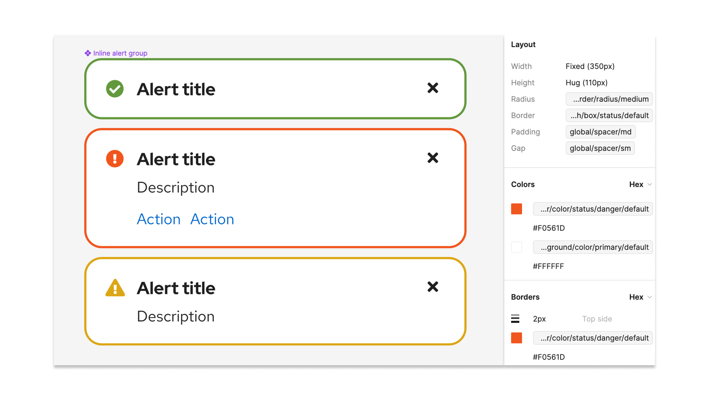

## Penta design kit

PatternFly tokens are only part of the PatternFly 6 [Penta design kit.]() In order to make use our token system, you will need to [upgrade to PatternFly 6]().

## What is in the Penta design kit

### Tokens 

Our tokens are set up at a high level as Figma variables and styles. They are intentionally scoped so that they can only modify relevant and related visual attributes. 

### Penta component library 

The Penta component library is built off of our tokens, so you will have access to all PatternFly tokens when you install the component library .   

## Using the Penta design kit 

To install the Penta design kit, [refer to our onboarding guide.](/get-started/design#figma-library)
