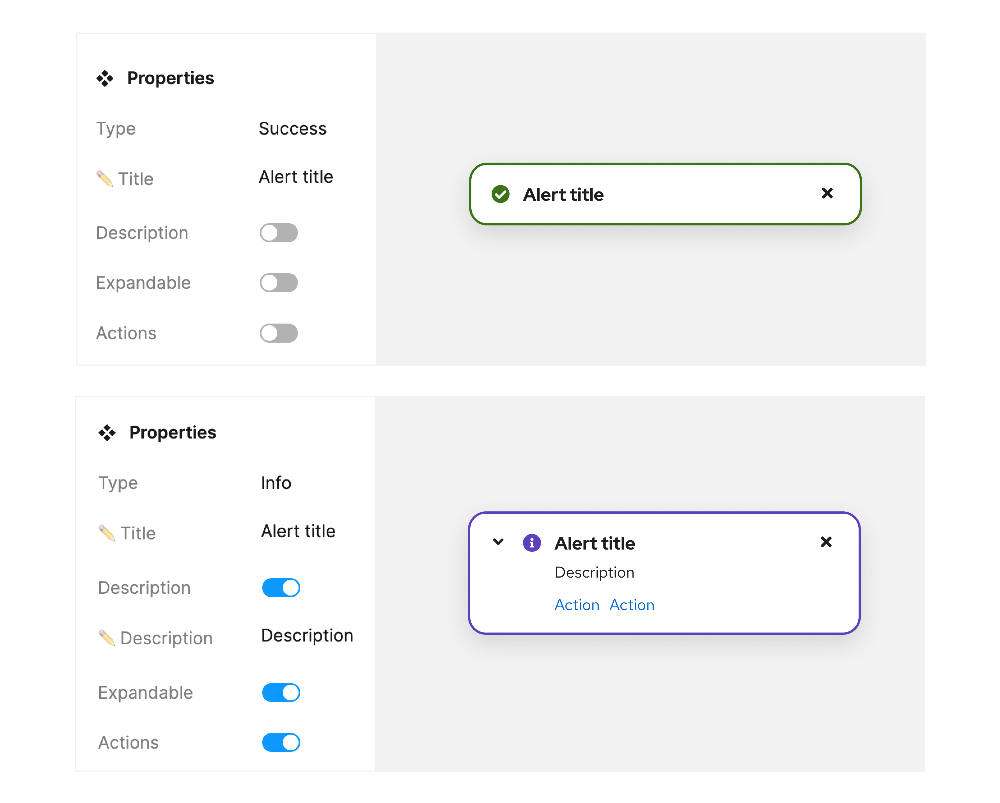

## Penta design kit

PatternFly tokens are only available as part of the PatternFly 6 [Penta design kit.]() In order to make use our token system, you will need to [upgrade to PatternFly 6]().

## What is in the Penta design kit

### Tokens 

Our tokens are set up at a high level as Figma variables and styles. They are intentionally scoped so that they can only be used to modify relevant and related visual attributes. 

In Figma, the variable names look similar to [token names](/tokens/all-patternfly-tokens), but will be separated by a forward slash (/) instead of a double hyphen (--).

### Penta component library 

The Penta component library is built off of our tokens, so you will have access to all PatternFly tokens when you install the component library .   

 

## Using the Penta design kit 

To install the Penta design kit, [refer to our onboarding guide.](/get-started/design#figma-library)

### Using Penta components

When insertain a component into a design workspace, you can adjust properties and variable modes to customize the appearance to your needs. 

 

### Making customizations 

Occassionally, you may find that you need to customize a design beyond what the PatternFly component allows. For example, adding text or adding custom spacing.

## Migrate to tokens

Our tokens are only available within Figma. If you've previously designed with PatternFly by using our Sketch design kits, you will need to begin to create all new product designs within Figma.

If you have any existing Sketch-based designs that you want to migrate into Figma, you will need to manually recreate each UI mockup using the Penta component library.