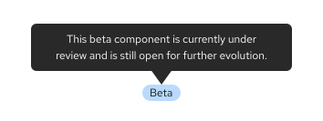

import '../content/get-started/get-started.css';
import { Button, Card, CardHeader, CardTitle, CardBody, CardFooter, Divider, Icon, Grid, GridItem, PageSection, Split, SplitItem, Title, Tooltip, Content, ContentVariants } from '@patternfly/react-core';
import ExternalLinkAltIcon from '@patternfly/react-icons/dist/esm/icons/external-link-alt-icon';
import { Link } from '@patternfly/documentation-framework/components';

## What is PatternFly?
PatternFly is an **open source design system**, dedicated to building consistent, usable enterprise software. We operate on principles of transparency and community contribution, making PatternFly accessible to everyone. Our primary goal is to empower designers and developers, enabling them to work more efficiently and build better user experiences together.

Like most design systems, we provide a comprehensive set of standards and resources to guide and streamline the design process. These resources are designed to reduce redundancy and establish a unified language for cross-functional teams, ultimately ensuring that products are visually consistent, accessible, and easy to use.

While PatternFly is used extensively across Red Hat products, anyone can use or contribute to PatternFly. On our website, you'll find ready-to-use code samples, clear guidelines, and a variety of additional tools and resources. 

## Why does Red Hat use PatternFly?
Red Hat prefers PatternFly as its design system due to our shared commitment to open source and robust enterprise experiences. We're specifically designed to meet Red Hat's complex needs, offering customizable components and a design kit that easily translates to code.

PatternFly's development is guided by Red Hat's product requirements, allowing us to deliver custom solutions quickly, ensure strong security and compliance, and manage changes predictably. This provides better stability and confidence for Red Hat's designers and developers.

As an MIT-licensed open source project, PatternFly aligns with Red Hat's core values of transparency and direct contribution. This enables us to create tailored solutions for critical enterprise workflows and build a unified open source brand across all Red Hat products.

### Benefits for developers and designers 
PatternFly empowers front-end developers with comprehensive documentation, native accessibility support, and flexibility through React and HTML libraries. Even new developers can create effective and inclusive interfaces.

Both designers and developers benefit from our extensive design guidelines, which offer well-documented shortcuts for simple components and complex UI solutions. Our open source approach encourages product teams to contribute or request changes, fostering a collaborative environment where they can actively shape the system they use. 

Red Hat UX designers can use PatternFly alongside the [UXD Hub](https://www.uxd-hub.com/), which documents additional product-specific design patterns. 

## Where do I start?

Now that you've been introduced to PatternFly, you're ready to start designing or start developing your product. Looking to get involved in the behind-the-scenes work? Check out our contribution guidelines for more instruction.

<Grid sm={12} md={4} hasGutter>
<Button size="lg" variant="secondary" component="a" href="/get-started/design"> Start designing </Button>
<Button size="lg" variant="secondary" component="a" href="/get-started/develop"> Start developing </Button>
<Button size="lg" variant="secondary" component="a" href="/get-started/contribute"> Contribute to PatternFly</Button>
</Grid>

## Join the community

At the core of PatternFly is our global community of designers, developers, and other UX professionals with a passion for open source—in other words, our Flyers. Whether we're contributing to PatternFly or just staying up to date on new releases, we work together to make PatternFly a vibrant community of passionate people. Together, we celebrate creativity and foster a sense of teamwork and unity. 

The PatternFly community is never finished growing, and we want to keep it that way, so reach out whenever—we're always open.

  <Grid sm={12} md={4} hasGutter className="pf-v5-u-my-lg pf-v5-u-text-align-center ws-building-grid">
    <Card isCompact> 
      <CardTitle className="pf-v5-u-font-size-l"> Chat with us </CardTitle>
      <CardBody> 
        We have a Slack workspace, where you can ask us questions and share any feedback. Just like PatternFly, our Slack channels are open for all and we encourage you to join to connect with the team.
      </CardBody>
      <Divider />
      <CardFooter>
        [Join our Slack workspace <ExternalLinkAltIcon />](https://patternfly.slack.com/archives/C293LQ36J)
      </CardFooter>
    </Card>
    <Card isCompact>
      <CardTitle className="pf-v5-u-font-size-l"> Stay up to date </CardTitle>
      <CardBody>
        Make sure you're in the loop on important updates and discussions by signing up for PatternFly emails. We can send meeting reminders, updates, and other important information right to your inbox.
      </CardBody>
      <Divider />
      <CardFooter>
        [Sign up for our mailing list <ExternalLinkAltIcon />](https://www.redhat.com/dynamic-form/instance/934b1674-bc8a-4a13-8c9d-d19abcceb263)
      </CardFooter>
    </Card>
    <Card isCompact>
      <CardTitle className="pf-v5-u-font-size-l"> Join our meetings</CardTitle>
      <CardBody>
        Flyers may be spread all over the globe, but we make sure to come together to share updates and collect feedback. If you can't make it, all meetings are recorded and published on <a href="https://www.youtube.com/channel/UCqLT0IEvYmb8z__9IFLSVyQ"> our YouTube channel. </a>
      </CardBody>
      <Divider />
      <CardFooter>
        [View our Google calendar <ExternalLinkAltIcon />](https://calendar.google.com/calendar/embed?src=patternflyteam%40gmail.com&ctz=America%2FNew_York)
      </CardFooter>
    </Card>
    <Card isCompact>
      <CardTitle className="pf-v5-u-font-size-l"> Read our blog </CardTitle>
      <CardBody>
        Our team is passionate, and we have a lot to say about open source and user experience—too much to fit on our website! Our Medium publication hosts articles about PatternFly projects, industry practices, professional experience, and more. 
      </CardBody>
      <Divider />
      <CardFooter>
        [Visit our Medium publication <ExternalLinkAltIcon />](https://medium.com/patternfly)
      </CardFooter>
    </Card>
     <Card isCompact>
      <CardTitle className="pf-v5-u-font-size-l"> Follow us on X </CardTitle>
      <CardBody>
        If you want to keep up with us via social media, you can find us on X. We share meeting reminders, release announcements, community messages, and links to new Medium articles that you can add to your reading list. 
      </CardBody>
      <Divider />
      <CardFooter>
        [Follow us on X <ExternalLinkAltIcon />](https://x.com/patternfly)
      </CardFooter>
    </Card>
     <Card isCompact>
      <CardTitle className="pf-v5-u-font-size-l"> Request a new feature </CardTitle>
      <CardBody>
        We welcome all ideas for adding or improving features! We review all requests, taking into account scope and technical constraints. Accepted requests are placed on [our feature roadmap](https://github.com/orgs/patternfly/projects/16/views/2), and we'll work with you to design and develop a solution.
      </CardBody>
      <Divider />
      <CardFooter>
       [Visit our GitHub discussions board <ExternalLinkAltIcon />](https://github.com/orgs/patternfly/discussions/categories/feature-requests)
      </CardFooter>
    </Card>
  </Grid>

#### New communities
Sometimes Flyers branch out and build groups of their own, creating new communities. While these communities are separate from PatternFly and not supported as part of our design system, we still love seeing our Flyers turning their visions into actions.

- **[PatternFly Elements](https://patternflyelements.org):** A community created by web-based developers at Red Hat, focused on creating web components for use across Red Hat's sites and SaaS products. It offers theming options for your own brand library.

- **[PatternFly Kotlin](https://github.com/patternfly-kotlin/patternfly-kotlin):** A Kotlin implementation of PatternFly based on fritz2, targeting Kotlin/JS. The goal of this project is to provide all PatternFly components in Kotlin, matching the reactive nature of fritz2. The components use stores, handlers, and other elements from the fritz2 API. For a quick overview, [view the PatternFly Kotlin showcase.](https://patternfly-kotlin.github.io/patternfly-kotlin-showcase/#home)

- **[Ansible Component Guide and Figma Library](https://www.figma.com/design/dOVzoCFCRlPXifj2WstR79/AAP-PF6-Style---Component-Guide?node-id=3-10950&t=PBFhyMs7gUxzGRH2-1):** An additional resource that designers can use that is built on top of existing PatternFly components. It is a rapid mockup prototyping tool that can be used to quickly put together repeatable design patterns and layouts across projects. This is specific to Ansible, but many of the components are generalized and can fit many product use cases.

- **[PatternFly for Yew](https://github.com/patternfly-yew/patternfly-yew)**: Provides PatternFly components for Yew—a Rust based framework for creating web applications that can run in the browser using WASM. The project aims to create Yew components for all components and concepts found in PatternFly. For a quick demo and starter template, [see the PatternFly Yew Quickstart.](https://github.com/patternfly-yew/patternfly-yew-quickstart)

## Learn about our design system 

### Release cadence

#### Major releases

A major release is one that sees the version of PatternFly increase, for example PatternFly 5 to PatternFly 6. Major releases are the only releases with planned "breaking changes" that alter the way your product's code interacts with PatternFly's code. 

Along with each major release, we will provide detailed upgrade guides and codemods to support the work needed to upgrade your products to the latest version.

A major version of PatternFly will only be supported through the subsequent version. This means, with the release of PatternFly 6, we no longer offer support PatternFly 4.

#### Minor and patch releases

Minor feature releases will be available quarterly to introduce non-breaking changes, like new features and enhancements. We will also share interim patch releases to fix any bugs that we find.

### Beta features

Significant changes to our components and design tokens are first released in beta. You can identify these features by the blue "beta" label in our site's navigation or in an alert within related documentation. Beta features are subject to change based on user feedback and are only promoted to fully-supported status once they are stable and thoroughly tested.

The API, visuals, or underlying code for a beta feature can receive breaking changes as we gather feedback. This includes changes to a component's CSS class names or React properties, as well as changes to specific token values for a visual theme. Once a feature is promoted out of beta, we will not make further breaking changes outside of a planned major release.

Before using a beta feature, we recommend reading its documentation and experimenting with the provided examples to ensure it meets your needs. You can track the development status and potential future changes for all beta features on the [PatternFly GitHub project board](https://github.com/orgs/patternfly/projects/7/views/1). For more specific information on the component promotion process, you can also refer to this [beta component promotion README](https://github.com/patternfly/patternfly-org/tree/main/beta-component-promotion).

### Deprecated components 

Deprecated components are components that are no longer recommended for use in PatternFly, either due to significant design or code changes. Once deprecated, a component is replaced with a newer implementation, and the previous implementation is no longer maintained or enhanced. 

Occasionally, a component page will contain a "React next" tab, which contains details about planned changes for the implementation of the component. This updated implementation will be promoted to the main component page as part of a major release, and will become the new recommended implementation. When this happens, the previous implementation will be deprecated. Deprecated component implementations will remain available until a following major release, but will no longer be maintained or updated.

Deprecated components will typically be available to use until the next major release, after which no documentation will be included on the current release website.

Deprecation includes: 

1. Components that are removed completely, in favor of a different component. 
    - The newly recommended component will be mentioned and linked on the deprecated component's page.
1. Components that still exist, but have significant implementation changes.
    - The new implementation will populate the "React tab," while documentation for the deprecated implementation will be placed under a "React deprecated" tab. You will see an alert on both the React and React deprecated pages.

Deprecated components can be imported from @patternfly/react-core/deprecated.

<!-- This section is WIP ** we need to wait to see how this content gets included **

Flexibility
PatternFly was built to be flexible and is scoped to work in tandem with other design systems. This means you’re able to use PatternFly components alongside components from systems like Bootstrap, Material.io, or older versions of PatternFly.

For example, our code is written like pf-v5-c-alert
alert
So if you had …
Include an example -->
