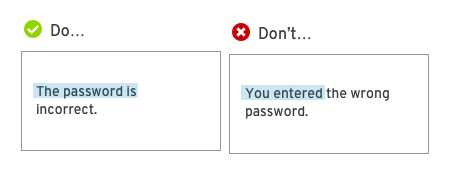

# Voice

To quote Red Hat’s brand standards, “The more you write, the less they’ll read.” Keep things clear, simple, and action-focused to make your content easy to understand, scan, and act on.

**General principles**

* [Be clear and concise](#be-clear-and-concise)
* [Be useful](#be-useful)
* [Be conversational](#be-conversational)
* [Be consistent](#be-consistent)
* [Write for all audiences](#write-for-all-audiences)

## Be clear and concise

Very simply, use plain language. Chunk content into short, related sections, and avoid long paragraphs or strings of text.

**Avoid technical jargon**

Jargon can confuse novice users and generally makes content more difficult to understand.

**Use simple verbs and tenses**

As nice as it might sound, avoid the future-perfect tense (and all of its complicated siblings.) Keep it simple.

**Use active voice**

Active voice tends to sound more natural and it's generally easier to understand. It also often provides a more concise way to get your point across.

**An exception to the _active voice_ rule: Errors!**

Errors messages are a good time to avoid active voice. Don’t assign blame to the user.

## Be useful

Focus on providing content that helps your users accomplish their tasks.

**Put the important stuff first**

Don’t make users read something twice. Consider what your user needs to know most, and put that information up front.

**Keep users in the interface**

Use informative titles, headers, and contextual help (like tooltips, popovers, and helper text) to enable users to accomplish their tasks without leaving the interface.  

If you find yourself struggling to provide enough information to enable users to succeed, it could be an early indicator of a confusing or difficult user experience.

## Be conversational

**Try to sound like a human**

No one wants to talk to a robot. Don't be afraid to use contractions! But remember to stay professional. Never use all caps and only use an exclamation point if you would actually raise your voice to say it out loud.

And don't be overly mannerly. Only use please when the user is being inconvenienced.

**Use second person**

Focus on your user! Use “you” and “your” to keep people focused on what they can accomplish.

## Be consistent

Use the same terminology to describe actions and objects across the entire user experience. If you refer to something as a sandwich on the home page, don't refer to it as a hoagie in the user settings. Even when two different terms could technically mean the same thing, it's important to choose one and stick with it.  

## Write for all audiences

**Be conscious of internationalization and translation**

If you’re writing for something that might be translated into different languages, you need to consider that when making choices.
* Avoid idioms like _cross your fingers_; they don’t translate.
* Avoid vague terms like _stuff_ or _kind of_; they can be translated incorrectly.
* Avoid humor; it generally doesn’t translate well.
* Translated text can be a drastically different length than the text you originally provide. Ensure the text you use can be 50% shorter or 50% longer with no negative impact on design.

**Write for accessibility**

Consider how your content will be consumed by users with different needs.
* Avoid directional language like, _Use the button to the left..._ It will not help a user who is working with a screen reader.
* Use proper heading levels (like H1, H2, etc.) to articulate the organization of the content on a page.
* Use the following guidelines when writing text that is only visible to a screen reader, like an aria-label that describes an icon button:
  * Avoid redundancy. Screen readers will announce the name of the component or element as well as associated property and state when the HTML is defined correctly.
  * Ensure labels for elements like buttons or links make sense when pulled out of the context.
  * When you define an aria-label for an element that also has associated visible text in the UI, ensure the aria-label begins with the same text that appears in the UI to avoid confusion with screen reader users who have vision.
  * Avoid unnecessary capitalization.
  * Avoid _leet speak_ that uses numbers or special characters in place of letters (like "a11y" for accessibility).

Learn more about our approach to accessibility in our [accessibility guide](/get-started/accessibility-guide).
