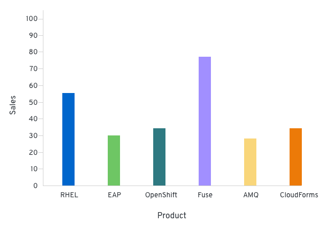
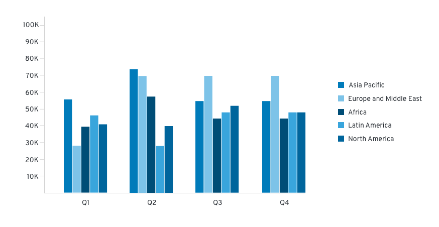
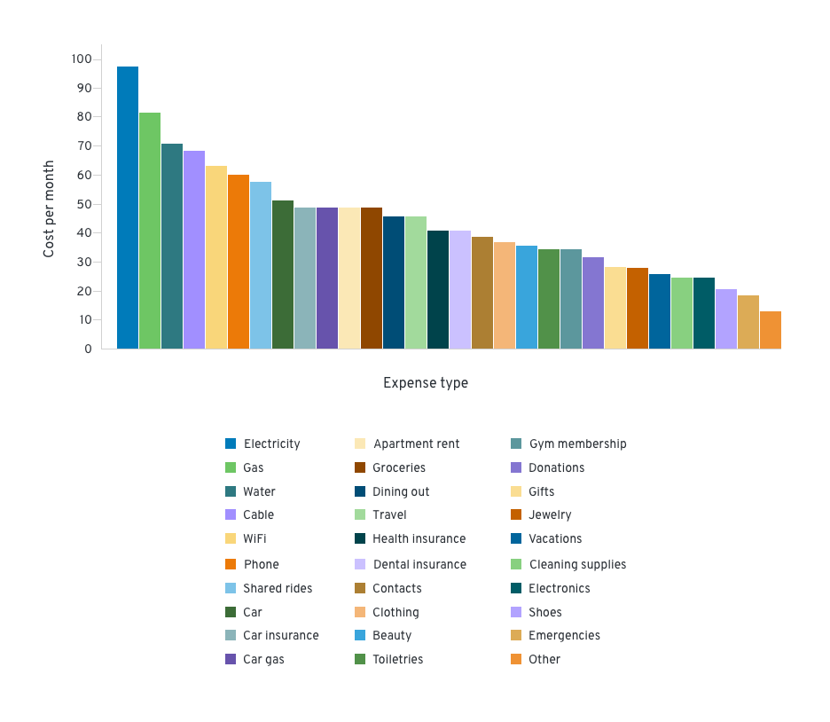

import theSystem from './thesystem.gif';
import oneFamily from './onefamily.gif';
import { Alert, Gallery, GalleryItem, Grid, GridItem } from '@patternfly/react-core';

# Colors for charts
## Chart colors

Colors for charts includes a recommended set of colors proposed for bar charts, donut charts and pie charts. There are six base colors (blue to orange) that the system is built on. Each base color has its own color family, which includes lighter and darker hues of the base. These families use a monochromatic color order. They are organized in a way that increases contrast while still looking extremely visually appealing. The variation of colors will depend on the type and amount of data at hand.

<Grid>
    <GridItem span={2}>
        <Grid>
            <GridItem span={6}>
                

            </GridItem>
            <GridItem span={6}>
                
#8BC1F7

                
Global CSS Variable

                
<code>--pf-chart-color-blue-100</code>

            </GridItem>
        </Grid>
    </GridItem>
    <GridItem span={2}>
        <Grid>
        <GridItem span={6}>
            

        </GridItem>
        <GridItem span={6}>
            
#519DE9

            
Global CSS Variable

            
<code>--pf-chart-color-blue-200</code>

        </GridItem>
        </Grid>
    </GridItem>
    <GridItem span={2}>
        <Grid>
            <GridItem span={6}>
                

            </GridItem>
            <GridItem span={6}>
                
#0066CC

                
Global CSS Variable

                
<code>--pf-chart-color-blue-300</code>

            </GridItem>
        </Grid>
    </GridItem>
    <GridItem span={2}>
        <Grid>
            <GridItem span={6}>
                

            </GridItem>
            <GridItem span={6}>
                
#004B95

                
Global CSS Variable

                
<code>--pf-chart-color-blue-400</code>

            </GridItem>
        </Grid>
    </GridItem>
    <GridItem span={3}>
        <Grid>
            <GridItem span={6}>
                

            </GridItem>
            <GridItem span={6}>
                
#002F5D

                
Global CSS Variable

                
<code>--pf-chart-color-blue-500</code>

            </GridItem>
        </Grid>
    </GridItem>
    <GridItem span={2}>
        <Grid>
            <GridItem span={6}>
                

            </GridItem>
            <GridItem span={6}>
                
#A2D99C

                
Global CSS Variable

                
<code>--pf-chart-color-green-100</code>

            </GridItem>
        </Grid>
    </GridItem>
    <GridItem span={2}>
        <Grid>
            <GridItem span={6}>
                

            </GridItem>
            <GridItem span={6}>
                
#88D080

                
Global CSS Variable

                
<code>--pf-chart-color-green-200</code>

            </GridItem>
        </Grid>
    </GridItem>
    <GridItem span={2}>
        <Grid>
            <GridItem span={6}>
                

            </GridItem>
            <GridItem span={6}>
                
#6EC664

                
Global CSS Variable

                
<code>--pf-chart-color-green-300</code>

            </GridItem>
        </Grid>
    </GridItem>
    <GridItem span={2}>
        <Grid>
            <GridItem span={6}>
                

            </GridItem>
            <GridItem span={6}>
                
#509149

                
Global CSS Variable

                
<code>--pf-chart-color-green-400</code>

            </GridItem>
        </Grid>
     </GridItem>
    <GridItem span={3}>
        <Grid>
            <GridItem span={6}>
                

            </GridItem>
            <GridItem span={6}>
                
#3B6C37

                
Global CSS Variable

                
<code>--pf-chart-color-green-500</code>

            </GridItem>
        </Grid>
    </GridItem>
    <GridItem span={2}>
        <Grid>
            <GridItem span={6}>
                

            </GridItem>
            <GridItem span={6}>
                
#8BB4B9

                
Global CSS Variable

                
<code>--pf-chart-color-cyan-100</code>

            </GridItem>
        </Grid>
     </GridItem>
    <GridItem span={2}>
        <Grid>
            <GridItem span={6}>
                

            </GridItem>
            <GridItem span={6}>
                
#5C969D

                
Global CSS Variable

                
<code>--pf-chart-color-cyan-200</code>

            </GridItem>
        </Grid>
    </GridItem>
    <GridItem span={2}>
        <Grid>
            <GridItem span={6}>
                

            </GridItem>
            <GridItem span={6}>
                
#2E7981

                
Global CSS Variable

                
<code>--pf-chart-color-cyan-300</code>

            </GridItem>
        </Grid>
    </GridItem>
    <GridItem span={2}>
        <Grid>
            <GridItem span={6}>
                

            </GridItem>
            <GridItem span={6}>
                
#015C65

                
Global CSS Variable

                
<code>--pf-chart-color-cyan-400</code>

            </GridItem>
        </Grid>
    </GridItem>
    <GridItem span={3}>
        <Grid>
            <GridItem span={6}>
                

            </GridItem>
            <GridItem span={6}>
                
#00434B

                
Global CSS Variable

                
<code>--pf-chart-color-cyan-500</code>

            </GridItem>
        </Grid>
    </GridItem>
    <GridItem span={2}>
        <Grid>
            <GridItem span={6}>
                

            </GridItem>
            <GridItem span={6}>
                
#CBC0FF

                
Global CSS Variable

                
<code>--pf-chart-color-purple-500</code>

            </GridItem>
        </Grid>
    </GridItem>
    <GridItem span={2}>
        <Grid>
            <GridItem span={6}>
                

            </GridItem>
            <GridItem span={6}>
                
#B1A3FF

                
Global CSS Variable

                
<code>--pf-chart-color-purple-200</code>

            </GridItem>
        </Grid>
    </GridItem>
    <GridItem span={2}>
        <Grid>
            <GridItem span={6}>
                

            </GridItem>
            <GridItem span={6}>
                
#A18FFF

                
Global CSS Variable

                
<code>--pf-chart-color-purple-300</code>

            </GridItem>
        </Grid>
    </GridItem>
    <GridItem span={2}>
        <Grid>
            <GridItem span={6}>
                

            </GridItem>
            <GridItem span={6}>
                
#8476D1

                
Global CSS Variable

                
<code>--pf-chart-color-purple-400</code>

            </GridItem>
        </Grid>
    </GridItem>
    <GridItem span={3}>
        <Grid>
            <GridItem span={6}>
                

            </GridItem>
            <GridItem span={6}>
                
#6753AC

                
Global CSS Variable

                
<code>--pf-chart-color-purple-500</code>

            </GridItem>
        </Grid>
    </GridItem>
    <GridItem span={2}>
        <Grid>
            <GridItem span={6}>
                

            </GridItem>
            <GridItem span={6}>
                
#F9E0A2

                
Global CSS Variable

                
<code>--pf-chart-color-gold-100</code>

            </GridItem>
        </Grid>
    </GridItem>
    <GridItem span={2}>
        <Grid>
            <GridItem span={6}>
                

            </GridItem>
            <GridItem span={6}>
                
#F6D173

                
Global CSS Variable

                
<code>--pf-chart-color-gold-200</code>

            </GridItem>
        </Grid>
    </GridItem>
    <GridItem span={2}>
        <Grid>
            <GridItem span={6}>
                

            </GridItem>
            <GridItem span={6}>
                
#F4C145

                
Global CSS Variable

                
<code>--pf-chart-color-gold-300</code>

            </GridItem>
        </Grid>
    </GridItem>
    <GridItem span={2}>
        <Grid>
            <GridItem span={6}>
                

            </GridItem>
            <GridItem span={6}>
                
#F0AB00

                
Global CSS Variable

                
<code>--pf-chart-color-gold-400</code>

            </GridItem>
        </Grid>
    </GridItem>
    <GridItem span={3}>
        <Grid>
            <GridItem span={6}>
                

            </GridItem>
            <GridItem span={6}>
                
#C58C00

                
Global CSS Variable

                
<code>--pf-chart-color-gold-500</code>

            </GridItem>
        </Grid>
    </GridItem>
    <GridItem span={2}>
        <Grid>
            <GridItem span={6}>
                

            </GridItem>
            <GridItem span={6}>
                
#F4B678

                
Global CSS Variable

                
<code>--pf-chart-color-orange-100</code>

            </GridItem>
        </Grid>
    </GridItem>
    <GridItem span={2}>
        <Grid>
            <GridItem span={6}>
                

            </GridItem>
            <GridItem span={6}>
                
#EF9234

                
Global CSS Variable

                
<code>--pf-chart-color-orange-200</code>

            </GridItem>
        </Grid>
    </GridItem>
    <GridItem span={2}>
        <Grid>
            <GridItem span={6}>
                

            </GridItem>
            <GridItem span={6}>
                
#EC7A08

                
Global CSS Variable

                
<code>--pf-chart-color-orange-300</code>

            </GridItem>
        </Grid>
    </GridItem>
    <GridItem span={2}>
        <Grid>
            <GridItem span={6}>
                

            </GridItem>
            <GridItem span={6}>
                
#C46100

                
Global CSS Variable

                
<code>--pf-chart-color-orange-400</code>

            </GridItem>
        </Grid>
    </GridItem>
    <GridItem span={3}>
        <Grid>
            <GridItem span={6}>
                

            </GridItem>
            <GridItem span={6}>
                
#8F4700

                
Global CSS Variable

                
<code>--pf-chart-color-orange-500</code>

            </GridItem>
        </Grid>
    </GridItem>
</Grid>

## The system
Although the system may seem complex, it is completely customizable. The idea is that you can put together your desired colors and amount of colors and the system will still sort them correctly. Here’s how the system works:

In this instance, there are only four base colors, therefore four color families. The order begins by going through each base color. Next, it alternates between the lightest and darkest values of each family. Finally, if you still need more colors, it alternates between the second lightest and second darkest colors of each family. In variable-terms: #1a-d base colors, #2a-d [color]-100/[color]-500 alternating, #3a-d [color]-500/[color]-100 alternating, #4a-d [color]-200/[color]-400 alternating, and #5a-d [color]-400/[color]-200 alternating. No matter the colors inputted, the process will remain the same.

### Chart with few variables (1-6)

If you are dealing with data that includes six or less variables, we recommend using the base colors to represent each. For example, if you collected data on how many sales were made per product at your organization during one period of time, it could look like this if plotted using a bar chart.

### Chart with nested (grouped) variables

If you have a set of data that includes grouped variables, we recommend using the color families to represent each. Grouped variables would include a set of parents and children variables. Each group would use a color family that would be represented in the same order as the base colors are listed. So, depending on the amount of nested variables you have, the first color family would be blue, then green, cyan, etc. The colors would start over if there are more than 6 groups, returning back to the blue family. An example of this type of data would be quarterly sales broken down by geographical locations.

### Chart with many variables (>6)

If the set of data includes more than six variables, we recommend applying the multichromatic order system, which uses all of the colors in the color system, to the data. This includes a mix of base colors and colors from their family. An example of this type of data would be the cost of living expenses during a period of time.

## Using the system with one color family

You can also use the color order system with one color family. This creates a monochromatic effect. It works using the same logic and order. We recommend using this system for charts with nested variables. The order begins by going through each base color, then lightest, darkest, second lightest, and ending with second darkest. In variable-terms: #1 [color]-300 (base color), #2 [color]-100, #3 [color]-500, #4 [color]-200, #5 [color]-400. The hues will always follow this order.

