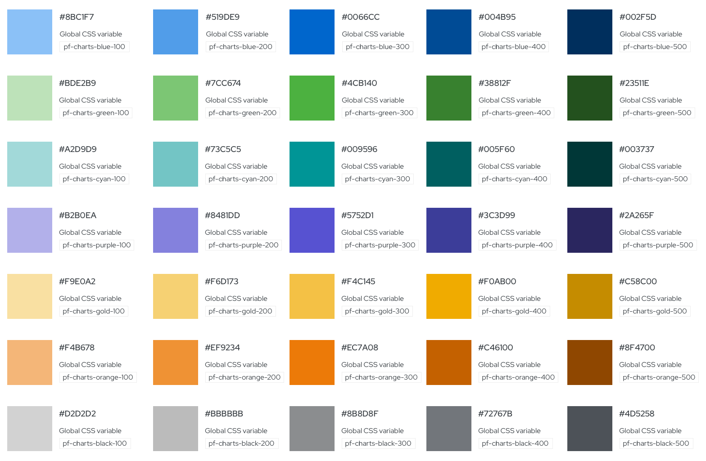
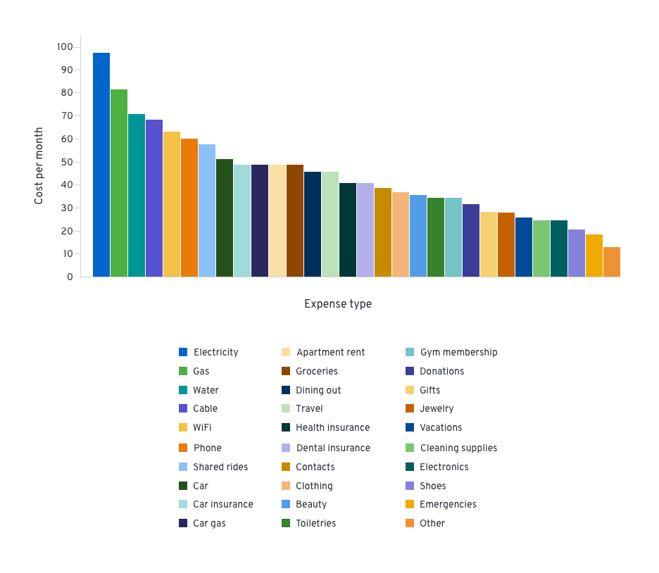

# Colors for charts
## Chart colors

Colors for charts includes a recommended set of colors proposed for bar charts, donut charts and pie charts. There are six base colors that the system is built on. Each base color has its own color family, which includes lighter and darker hues of the base. These families use a monochromatic color order. They are organized in a way that increases contrast while still looking extremely visually appealing. The variation of colors will depend on the type and amount of data at hand.

## The system
Although the system may seem complex, it is completely customizable. The idea is that you can put together your desired colors and amount of colors and the system will still sort them correctly. Here’s how the system works:

In this instance, there are only four base colors, therefore four color families. The order begins by going through each base color. Next, it alternates between the lightest and darkest values of each family. Finally, if you still need more colors, it alternates between the second lightest and second darkest colors of each family. In variable-terms: #1a-d base colors, #2a-d [color]-100/[color]-500 alternating, #3a-d [color]-500/[color]-100 alternating, #4a-d [color]-200/[color]-400 alternating, and #5a-d [color]-400/[color]-200 alternating. No matter the colors inputted, the process will remain the same.

### Chart with few variables (1-6)

If you are dealing with data that includes six or less variables, we recommend using the base colors to represent each. For example, if you collected data on how many sales were made per product at your organization during one period of time, it could look like this if plotted using a bar chart.

### Chart with nested (grouped) variables

If you have a set of data that includes grouped variables, we recommend using the color families to represent each. Grouped variables would include a set of parents and children variables. Each group would use a color family that would be represented in the same order as the base colors are listed. So, depending on the amount of nested variables you have, the first color family would be blue, then green, cyan, etc. The colors would start over if there are more than 6 groups, returning back to the blue family. An example of this type of data would be quarterly sales broken down by geographical locations.

### Chart with many variables (>6)

If the set of data includes more than six variables, we recommend applying the multichromatic order system, which uses all of the colors in the color system, to the data. This includes a mix of base colors and colors from their family. An example of this type of data would be the cost of living expenses during a period of time.

## Using the system with one color family

You can also use the color order system with one color family. This creates a monochromatic effect. It works using the same logic and order. We recommend using this system for charts with nested variables. The order begins by going through each base color, then lightest, darkest, second lightest, and ending with second darkest. In variable-terms: #1 [color]-300 (base color), #2 [color]-100, #3 [color]-500, #4 [color]-200, #5 [color]-400. The hues will always follow this order.

