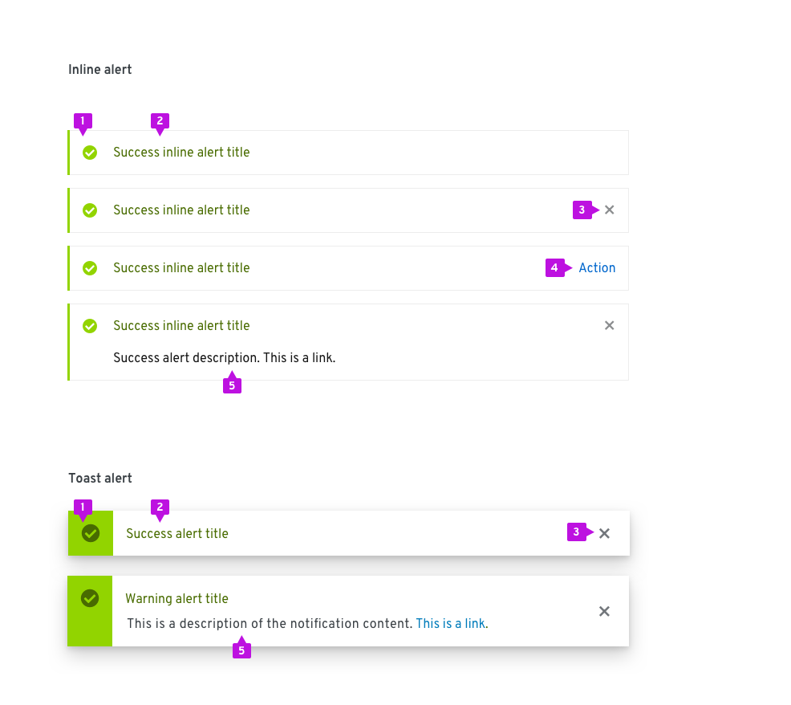
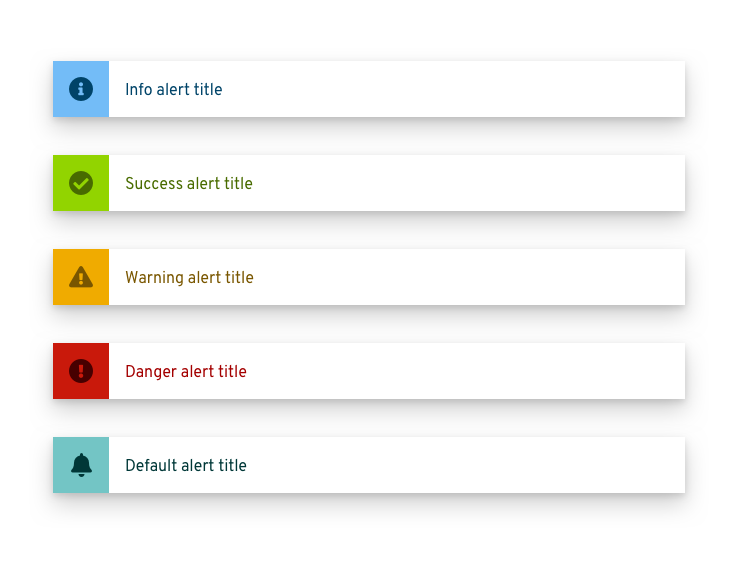
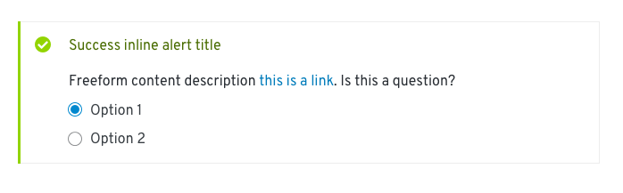
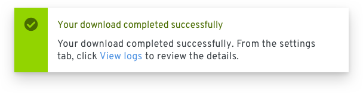

# Alerts and notifications
Alerts are used when the system wants to notify the user about some status or other event. These guidelines talk about how to properly use different types of alerts in your designs.

## Elements
### Alert
Alerts are used to communicate status information to the user without blocking other actions through the user interface. There are two styles that can be applied to an alert depending on whether it is intended as an [inline](#inline-alerts) or [toast](#toast-alerts) alert. Regardless of the styling, the basic elements of all alerts are consistent. Since toast alerts should always be dismissable, only a subset of variations should be used.

1. **Status area:** Use an icon and color to indicate status or severity of the alert.
2. **Alert title:** Include a short descriptive message. Long message text will wrap. Text color is coded to match alert type.
3. **Close (optional):** Dismiss the alert. Required for toast alerts and optional for inline alerts.
4. **Action (optional):** An action can be placed inside of an alert. Only a single action is supported. Note that the alert can include a close button or a single action, but not both.
5. **Description (optional):** If a longer message is required, it can be included within the Description field.

#### Communicating status
The status area and alert title are coded to communicate the severity of an alert.

|Type     |Color (background/ icon & title)    |Icon    |Usage      |
|---------|---------|--------|--------------|
|Info     |Blue (#73bcf7/ #004368)    |fa-info-circle|Use for general informational messages (default)|
|Warning  |Orange (#F0AB00/ #795600)  |fa-exclamation-triangle |Use to indicate that a non-critical error has occurred|
|Critical |Red (#c9190b/ #a30000)     |fa-exclamation-circle | Use to indicate that a critical or blocking error has occurred
|Success  |Green (#92D400/ #486b00)   |fa-check-circle | Use to indicate that a task or process has completed successfully
|Default  |Cyan (#73C5C5/ #004368)   |fa-bell | Use for generic messages with no associated severity

## Usage
There are two primary use cases when alerts are used:

* **Synchronous notifications:** Synchronous notifications are returned as a direct response to some user action like clicking the Submit button on a form.

* **Asynchronous notifications:** Asynchronous notifications are generated by the system in response to some internal event. They may reflect status of a process, an internal error, or similar system event.

Three alert patterns are defined in PatternFly for addressing these use cases.

|           |Usage     |UI placement     |Persistence
|-----------|----------|-----------------|---------------|
|[Inline alerts](#inline-alerts)|Synchronous notifications that are a direct response to a user action, eg., clicking the Submit button, and can be informational or can identify actions that are required on that page before the user can continue. |Appear at the top of the content area and push other content down. | Persist until the user dismisses them or navigates away from the page.
|[Toast alerts](#toast-alerts) |A system notification that doesn’t interrupt the user’s current workflow. |Enter from the right edge of the screen and overlay content. |Remain until they time out, or the user dismisses them.
|[Modal alerts](#modal-alerts) |Interrupting the flow until the user takes action. |Overlay the UI and prevent further user actions until the user closes the modal. |Yes, until the user dismisses the modal.

### Inline alerts
Inline alerts are synchronous and appear as the result of a user action or upon loading a page. They insert an alert at the top of the content area, push down other content, and will persist until the user closes them or navigates away from the page.

An inline alert should never block the user from interacting with other content on a page. For notifications with a severity of info or warning it should be possible to dismiss an inline alert by clicking the Close button on the alert. If Close is not included, the alert will dismiss only when the condition raising it has been cleared.

In addition to static message content and links, interactive elements may optionally be included in the body of an inline alert when the user is being asked for some input or feedback.

#### When to use
Use an inline alert when you want to return feedback as the result of a user action within a page while allowing the user to continue working. Common uses for inline alerts include form validation or warning messages that should not interrupt the user’s flow.

#### When not to use
Do not use inline alerts to reflect the status of an asynchronous operation. In this case, a Toast Alert should be used.

#### Alternative solutions
If the user must take action to address a situation before proceeding consider using a modal. Inline alerts are preferred to a modal when the problem can be corrected on the current page, however.

#### Behavior
Inline alerts should only be inserted into a page in response to a user action as part of a page refresh. If the user dismisses the alert by clicking the Close button, the alert should disappear and the content of the page should animate up to fill the vacated space.

### Toast alerts
Toast alerts enter from the right edge of the screen and remain until they time out or until the user dismisses them.

Single toast alerts appears in the upper right, below the page header, and animates from the right. Toast alerts overlay other content on the page.

Toast alerts should be used to draw attention to an event that is being added to the notification drawer, when in use. Note: when the notification drawer is open, and new notifications appear, they should appear at the top of the notification list and not generate a toast alert.

Actions and links may be used in alerts, but only as a shortcut or redundant means to navigate or invoke the action. A toast alert should never be used as the only means for taking actions on an alert event. Toast notifications must always have a close button so the user can dismiss them.

#### When to use
Use toast alerts when you want to report an asynchronous event without interrupting the user’s current workflow.

#### When not to use
Do not use a toast alert when an event requires immediate action or for synchronous events like form validation.

#### Behavior
Transient toast alerts automatically dismiss after a period of time. Eight (8) seconds is a recommended timeout, but alerts should remain visible if the user is hovering over them.

### Stacking multiple alerts
Multiple alerts will stack. The most recent alert should appear at the top and others will push down. When alerts are deleted, any space above will be filled by pushing remaining alerts up in the stack order.

An Alert Group component allows a set of alerts to be properly positioned and stacked as shown below.

### Modal alerts
When a condition occurs that requires immediate action, a modal message dialog is recommended.

For more information about designing modal messages see the [message dialog design guidelines](/design-guidelines/usage-and-behavior/modal).

## Content guidelines
Message text should be succinct and clearly state what the issue or problem is. Embedded links should navigate the user to the location where they can take action.

Alert notifications present special challenges for accessibility. Screen readers will announce the arrival and message content of an incoming toast alert, but user focus will not be placed there. This will make it difficult for these users to directly act on the alerts itself. Therefore we recommend that any message containing actions be descriptive of how the action can be performed in the application. Messages that contain links should specify the location in text as well as including a simple text link. For example, a simple notification message might take the form:

A more accessible version of this message would look like this:

While this is more verbose, it has the advantage of being usable for both sighted and non-sighted users by providing instructions to screen reader users about where they can go to complete the action.

## Related components and demos
**HTML/CSS**
* [Alert](/documentation/core/components/alert)
* [Alert group](/documentation/core/components/alertgroup)

**React**
* [Alert](/documentation/react/components/alert)
