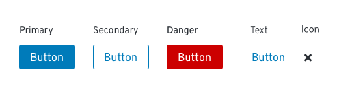
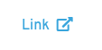

# Buttons and links
Buttons communicate and trigger actions a user can take in an application or website. Links are used to take users somewhere, like another page inside of a web application, or an external site such as help or documentation.  

Technically, a button represents a box area that can be clicked or tapped, while a link represents text that can be clicked or tapped.

## Usage
[Button usage](#button-usage)

[Link usage](#link-usage)

## Button usage
A button should represent an action a user can take, like submitting a form, cancelling a process, or creating a new object. When the user clicks a button, the associated action should be triggered or performed immediately.

### Button types
Use different button types to build hierarchy in an application layout.

  

  **Primary button**

  Use primary buttons for the main action you want a user to take on a page. Try to limit primary buttons to one per page.

  **Secondary button**

  Use secondary buttons for secondary actions a user can take. For example, a cancel button would be secondary to a submit button on a form or modal.

  **Danger button**

  Use danger buttons for actions a user can take that are potentially destructive or difficult/impossible to undo, like deleting or removing user data.

  **Text button**

  Use a text button for secondary or tertiary actions on a page or modal. For example, you might use text buttons to indicate actions a user might take on items in a data list or table to reduce visual clutter and save space.

  **Icon button**

  Use icon buttons for actions that are commonly associated with icons. For example, you could use the close icon to exit a modal or window, or use the hamburger icon to toggle a menu.

<!--  ### Using buttons in your designs
We recommend aligning buttons to different elements or areas on the screen depending on the content being provided. The recommended alignment simplifies scanning and helps users complete and submit form content more quickly.  

#### Buttons on full page forms
* Place the primary button to the left of the cancel button.
* Align submit buttons with left-edge of input fields.

#### Buttons on modals
* Align submit buttons to the bottom right of the modal.
* Place the primary button to the right of the cancel button.
* Align submit buttons with right-edge of input fields.

We'll want to include some information for button usage on wizards when we have some examples.
 #### Buttons on wizards
The placement of buttons on wizards will depend on the layout of content you present. -->
## Link usage
Links are used to take users somewhere, like another page inside of a web application, or an external site like help or documentation.

For links that navigate users to any location external to the current website or application, link text must be followed by the external link icon.

### When not to use
Don't use link text to represent actions.

## Content

**Writing button labels**

* Button labels should be specific and clearly communicate their associated action.
* Always use verbs or verb phrases.
* Aim for short (1-3 words) labels wherever possible.
* Avoid long button labels that might risk wrapping.

**Writing link labels**

Use specific, action-focused labels that match what the user will see when they arrive at their location. For example, if you are sending a user to a dashboard, your link label might read _View dashboard_. For a link directing a user to a support forum, you might say _Get help in the support forum_.

See our [content guidelines](/design-guidelines/content/writing) for additional guidance.

## Related components and demos
**HTML/CSS**
* [Button](/documentation/core/components/button)

**React**
* [Button](/documentation/react/components/button)
