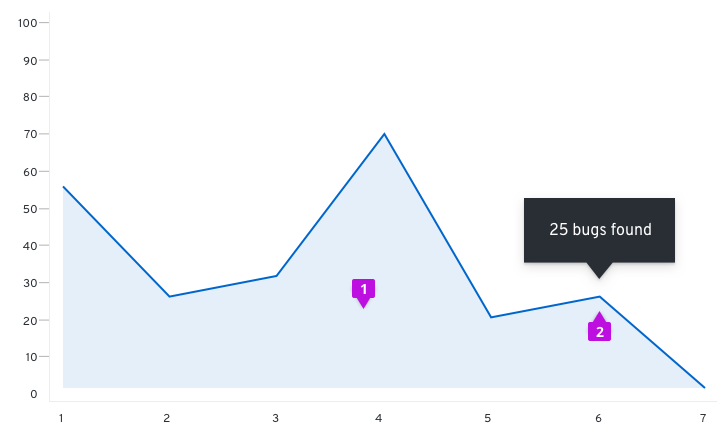
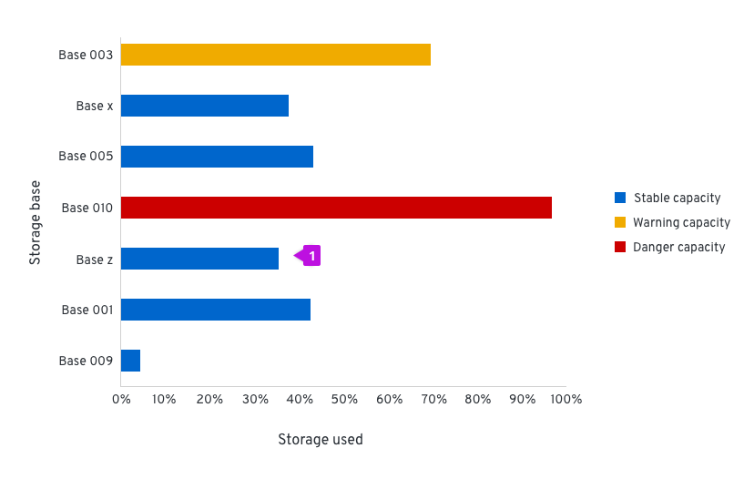
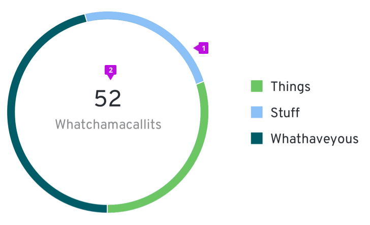
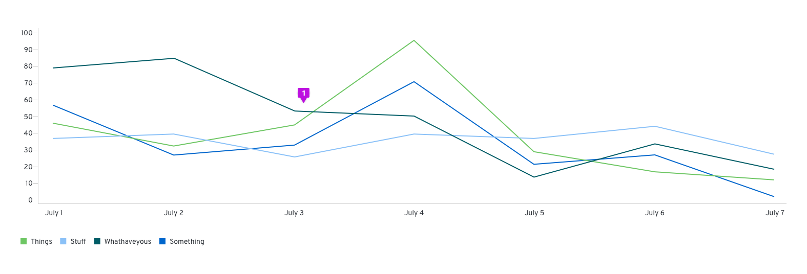
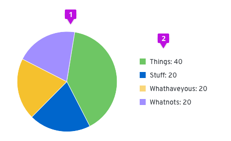

path: "/design-guidelines/usage-and-behavior/charts"

# Charts

## General usage guidelines
_Charts are only available in React_

1. Title: We recommend that titles are always added above and left-aligned to charts.
2. Legends: We recommend using legends when charts include more than one variable and therefore use more than one color. If space is not available to display names of horizontal and vertical axes, a legend must be added instead. The legend should list the colors that each variable obtains and the name of the variable. They can either be placed left-aligned to the right of the chart or centered below the chart.

## Types

### Area chart
An area chart is used to display metrics for continuous data. It offers an area fill for visual emphasis that function to indicate the cumulative data.

#### Usage
The most common use case for area charts is to show trending over a continuous scale (usually time). Use this instead of a line chart when you need to provide more visual emphasis than a simple line chart would offer. It is possible to stack area charts to compare more than one continuous data sets. See [Line charts](https://v2.patternfly.org/design-guidelines/usage-and-behavior/charts#line-chart) for more information about them.

#### Example

1. Data area fill: The area fill is presented below the data line. Data area fills use colors that conform with the [Colors for charts](https://v2.patternfly.org/styles/colors-for-charts).
2. Interactive data points: Specific data points may be represented by dots on the line portion of the area chart. The tooltip will contain the data values for that specific point in time.

#### React component
[Area chart](https://v2.patternfly.org/documentation/react/components/areachart)

### Bar chart

Bar charts are used to easily display two variables, one on the horizontal x-axis and one on the vertical y-axis.

#### Horizontal vs. vertical bar charts

The orientation of bar charts is dependent on the data and space at hand. Any bar chart should be able to be displayed in either direction if applicable.

#### Usage
The benefit of using a bar chart is that discrete quantities of data can easily be compared visually. As long as each bar is labeled properly, it is possible to reorder the values without losing vital information. We recommend that bar charts are used for comparing quantities rather than donut or pie charts, which differentiate by angle and area. As a rule of thumb, bar charts are a great way to show and compare categorical data. If you want to show continuous data over time, you may consider using a [Line chart](https://v2.patternfly.org/design-guidelines/usage-and-behavior/charts#line-chart) or [Area chart](https://v2.patternfly.org/design-guidelines/usage-and-behavior/charts#area-chart) instead.

#### Example

1. Bar: All bars should be the same width. The height of the bar represents its value. The spacing between bars should be equal as well, mimicking the axis value spacing. For recommendations on fill colors, see [Colors for charts](https://v2.patternfly.org/styles/colors-for-charts).

#### React component
[Bar chart](https://v2.patternfly.org/documentation/react/components/barchart)

### Stacked bar charts

Stacked bar charts describe totals while allowing a degree of internal breakdown of the data. An advantage of stacked bar charts is the order of the stack can be swapped without changing the overall total. These can be illustrated vertically and horizontally depending on available space and the data being described.

#### Example

1. Stacked bar: The first series name is represented by the topmost stacked bar, and the last series name is represented by the bottommost stacked bar. For recommendations on series colors, see [Colors for charts](https://v2.patternfly.org/styles/colors-for-charts).

#### React component
[Stacked bar chart](https://v2.patternfly.org/documentation/react/components/stackchart)

### Donut chart
Donut charts represent relative amounts that must add up to 100%.

#### Usage
The most common use cases for donut charts are to show progress completion as a percentage, show utilization for an object as a percentage and show the relationship of a set of values to a whole. Use donut charts to compare an individual section to the whole. As said previously, the entire donut should add up to 100% and the fill represents a percentage of that. There should be no more than six categories in total, similar to pie charts We recommend that you use the [Colors for charts](https://v2.patternfly.org/styles/colors-for-charts) to represent your data when thresholds are not present. Consider using a [Bar chart](https://v2.patternfly.org/design-guidelines/usage-and-behavior/charts#bar-chart) if you would like to compare one category to another.

#### Example

1. Donut chart fill: We recommend that the [Colors for charts](https://v2.patternfly.org/styles/colors-for-charts) are used for the donut chart color when thresholds are not being represented. Each color is separated by a small amount of padding at #FFFFFF.
2. Label: When the Donut Chart is contained within a dashboard card, there is a label defining what the Donut Chart represents. The label may be shown either inside or outside of the Donut Chart. The label my also represent the total value of the data set. If this optional representation is chosen, it should follow the format of [total numeric value] + [data set label]. If the label does not fit within the donut, place it outside of the donut and leave the center empty.

#### React component
[Donut chart](https://v2.patternfly.org/documentation/react/components/donutchart)

### Line chart

A line chart plot a series of discrete data samples that are good for showing continuous data and trend information. Sample values on the line can be measured and extracted.

#### Usage
The most common use case for line charts is to compare several data sets over a period of time. They can be used to project trends into the past or future. A best fit line is created and extended in both directions to do so, but the validity of the projection is not certain. If you want to show and compare categorical data, you may consider using a bar chart.

Multiple lines on the same chart allow the user to visualize relationships between varying data sets, such as correlated events, similarities or unexpected differences. We recommend displaying no more than 6 lines on a single graph to avoid confusion.

#### Example

1. Line: Line charts can optionally visually represent data points as dots on the line. If so, the same interaction that occurs when hovering over one in an [Area chart](https://v2.patternfly.org/design-guidelines/usage-and-behavior/charts#area-chart) will occur in line charts. For line colors, we recommend using the [Colors for charts](https://v2.patternfly.org/styles/colors-for-charts).

#### React component
[Line chart](https://v2.patternfly.org/documentation/react/components/linechart)

### Pie chart

Pie charts are commonly used to show percentages or proportional data.

#### Usage
It makes sense to choose a pie chart when you need to compare a set of values to a whole. For example, you might choose a pie chart when visualizing the number of sales made by a team of five people; each segment of the chart represents one salesperson’s performance in the context of the rest of the team. The sum of all of the segments of the chart must equal 100%, and the data points should be mutually exclusive. It is recommended that there are no more than six segments per single pie chart.

A pie chart may be the wrong choice when you need to compare categories to one another, because it can be difficult to distinguish small differences between segments. If you wish to compare values to each other, the [Bar chart](https://v2.patternfly.org/design-guidelines/usage-and-behavior/charts#bar-chart) may be a more effective pattern.

#### Example

1. Pie chart fill: We recommend that fill colors should be based on the [Colors for charts](https://v2.patternfly.org/styles/colors-for-charts).

#### React component
[Pie chart](https://v2.patternfly.org/documentation/react/components/piechart)

### Charts in cards
If a chart lives in a card, the title of that chart will be placed on the header of that card instead of the chart. The rest of the chart guidelines should be followed for the chart itself.

