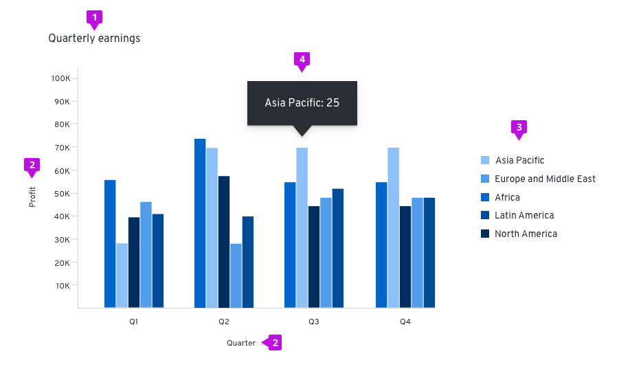
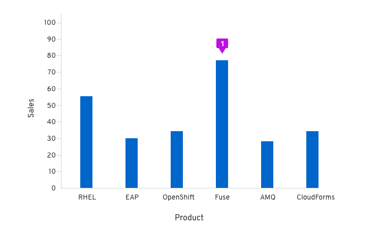
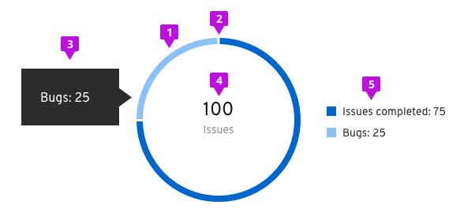
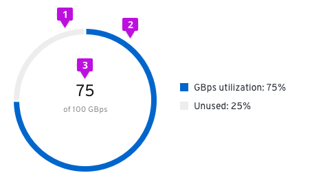
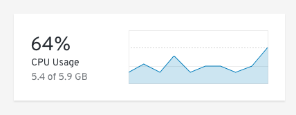

# Charts

## General usage guidelines
_Charts are only available in React_

1. Title: We recommend that titles are always added above and left-aligned to charts.
2. Axis labels and scale values: We recommend using tick marks to clearly mark scale values on the y-axis. The text for axis labels and scale values should be 12px font in standard text color. All scale values should be equally distributed across the axis and the axis label should fall outside the scale values, centered with the axis line.

3. Legends: We recommend using legends when charts include more than one variable and therefore use more than one color. If space is not available to display names of horizontal and vertical axes, a legend must be added instead. The legend should list the colors that each variable obtains and the name of the variable. The text on the legend should be 14px size and standard text color. They can either be placed left-aligned to the right of the chart or centered below the chart.
<!-- 4. Grid lines: We recommend using horizontal gridlines for vertical bar, line and area charts and vertical gridlines for horizontal charts. The line thickness should be 1px with #D2D2D2 color. By default, victory charts enable both horizontal and vertical lines, so a custom component needs to be added in order to override that. See here for information about adding custom gridlines (some link -- need to update). -->

## Types

### Area chart
An area chart is used to display metrics for continuous data. It offers an area fill for visual emphasis that function to indicate the cumulative data.

#### Usage
The most common use case for area charts is to show trending over a continuous scale (usually time). Use this instead of a line chart when you need to provide more visual emphasis than a simple line chart would offer. It is possible to stack area charts to compare more than one continuous data sets. See [Line charts](#line-chart) for more information about them.

#### Example

1. Data area fill: The area fill is presented below the data line. Data area fills use colors that conform with the [Colors for charts](/design-guidelines/styles/chart-colors).
2. Interactive data points: Specific data points may be represented by dots on the line portion of the area chart. The tooltip will contain the data values for that specific point in time.

<!--#### React component
[Area chart](/documentation/react/components/areachart)-->

### Bar chart

Bar charts are used to easily display two variables, one on the horizontal x-axis and one on the vertical y-axis.

#### Horizontal vs. vertical bar charts

The orientation of bar charts is dependent on the data and space at hand. Any bar chart should be able to be displayed in either direction if applicable.

#### Usage
The benefit of using a bar chart is that discrete quantities of data can easily be compared visually. As long as each bar is labeled properly, it is possible to reorder the values without losing vital information. We recommend that bar charts are used for comparing quantities rather than donut or pie charts, which differentiate by angle and area. As a rule of thumb, bar charts are a great way to show and compare categorical data. If you want to show continuous data over time, you may consider using a [Line chart](#line-chart) or [Area chart](#area-chart) instead.

#### Example

1. Bar: All bars should be the same width. The height of the bar represents its value. The spacing between bars should be equal as well, mimicking the axis value spacing. For recommendations on fill colors, see [Colors for charts](/design-guidelines/styles/chart-colors).

<!--#### React component
[Bar chart](/documentation/react/components/barchart)-->

### Stacked bar charts

Stacked bar charts describe totals while allowing a degree of internal breakdown of the data. An advantage of stacked bar charts is the order of the stack can be swapped without changing the overall total. These can be illustrated vertically and horizontally depending on available space and the data being described.

#### Example

1. Stacked bar: The first series name is represented by the topmost stacked bar, and the last series name is represented by the bottommost stacked bar. For recommendations on series colors, see [Colors for charts](/design-guidelines/styles/chart-colors).

<!--#### React component
[Stacked bar chart](/documentation/react/components/stackchart)-->

### Donut charts
Donut charts represent relative amounts that must add up to 100%.

#### Usage
These are the most common use cases for donut charts:
  - Showing the relationship of a set of values to a whole
  - Showing utilization for an object as a percentage (with or without thresholds)

Donut charts can use percentages or integer values to compare parts to the whole. Consider using a [Bar chart](#bar-chart) if you would like to compare one category to another. Decide whether percentages or integers is most compatible with your use case and make sure to be consistent throughout. We recommend displaying these values within the donut, see [Donut utilization](#donut-utilization) for styling. Don’t use more than six categories in total. We recommend that you use the [Colors for charts](/design-guidelines/styles/chart-colors) guidelines to represent your data when thresholds are not present.

1. **Segment fill**: We recommend using [Colors for charts] (/design-guidelines/styles/chart-colors) for different items within the donut chart.
2. **Segment padding**:  Always provide 3px of padding between segments.
3. **Chart tooltip**:  A tooltip will appear upon hover that states the segment name and value. Depending on the type of donut, the information may change.
  - **Donut**: We recommend stating the segment name and the value being represented. For example, if the segment represents “Bugs,” and the value being represented is 25, your chart tooltip would state, “Bugs: 25.”
  - **Donut utilization**: Only the utilization segment will allow for hover. We recommend stating the segment name and the utilization value being captured. For example, if the user is tracking GBps utilization, the chart tooltip would state “GBps utilization: 75%.”
  - **Donut utilization with thresholds**: We recommend stating the threshold name, the segment name, and the value being represented. For example, if the threshold being met is “Danger,” and the segment represents “Storage capacity,” and the value being represented is 92%, your chart tooltip would state, “Danger: Storage capacity: 92%.”  We recommend stating the threshold name “at” the percentage the threshold begins (ex. Warning at 60%).
4. **Legend**: In order to fulfill accessibility requirements, we recommend adding a legend to all donuts.

<!--#### React component
[Donut chart](/documentation/react/charts/donut)-->

### Donut utilization
 

1. **Unused segment fill**: The unused area of the donut chart will always remain at #EDEDED.
2. **Used segment fill**: We recommend using #0066cc for the used area of the donut chart. See [Colors for charts](/design-guidelines/styles/chart-colors) for other recommended color options.
3. **Utilization label**: Both percentages and whole numbers can be used to represent the utilization for donut charts. They are to be centered within the donut and styled as shown. The label should be using 24px font in standard text color with 14px font underneath in secondary text color.
4. **Chart tooltip**: Since this is a utilization donut chart, the tooltip will display the percentage of data utilized.

<!--#### React component
[Donut utilization](/documentation/react/charts/donut-utilization)-->

### Donut utilization with threshold

1. **Threshold segment fill**: The outer segments of the chart are static and represent the thresholds for your use case. The example diagrams show utilization thresholds for a database and are used to let users know when they move from a safe zone into a danger zone. For threshold segments, use incremental shades of  grey starting at #EDEDED then to #D2D2D2 then to #BBBBBB. Provide 3px of padding between each segment.
2. **Utilization segment fill**: This dynamic chart is a concentric circle within the donut thresholds and will represent the data set. For this chart, we recommend using the following colors:
  - #0066cc before the data set has hit a threshold
  - #F0AB00 once the data set has hit the warning threshold
  - #C9190B once the data set has hit the danger threshold
3. **Legend**: The utilization segment color swatch will change in accordance to the chart.

4. **Chart tooltip**: Both the threshold segments and utilization segment can be hovered over.

<!--#### React component
[Donut utilization](/documentation/react/charts/donut-utilization)-->

### Line chart

A line chart plot a series of discrete data samples that are good for showing continuous data and trend information. Sample values on the line can be measured and extracted.

#### Usage
The most common use case for line charts is to compare several data sets over a period of time. They can be used to project trends into the past or future. A best fit line is created and extended in both directions to do so, but the validity of the projection is not certain. If you want to show and compare categorical data, you may consider using a bar chart.

Multiple lines on the same chart allow the user to visualize relationships between varying data sets, such as correlated events, similarities or unexpected differences. We recommend displaying no more than 6 lines on a single graph to avoid confusion.

#### Example

1. Line: Line charts can optionally visually represent data points as dots on the line. If so, the same interaction that occurs when hovering over one in an [Area chart](#area-chart) will occur in line charts. For line colors, we recommend using the [Colors for charts](/design-guidelines/styles/chart-colors).

<!--#### React component
[Line chart](/documentation/react/components/linechart)-->

### Pie chart

Pie charts are commonly used to show percentages or proportional data.

#### Usage
It makes sense to choose a pie chart when you need to compare a set of values to a whole. For example, you might choose a pie chart when visualizing the number of sales made by a team of five people; each segment of the chart represents one salesperson’s performance in the context of the rest of the team. The sum of all of the segments of the chart must equal 100%, and the data points should be mutually exclusive. It is recommended that there are no more than six segments per single pie chart.

A pie chart may be the wrong choice when you need to compare categories to one another, because it can be difficult to distinguish small differences between segments. If you wish to compare values to each other, the [Bar chart](#bar-chart) may be a more effective pattern.

#### Example

1. Pie chart fill: We recommend that fill colors should be based on the [Colors for charts](/design-guidelines/styles/chart-colors).

<!--#### React component
[Pie chart](/documentation/react/components/piechart)-->

### Charts in cards
If a chart lives in a card, the title of that chart will be placed on the header of that card instead of the chart. The rest of the chart guidelines should be followed for the chart itself.

