# Data input
Data input controls allow the user to provide information by selecting from a known set of options or a constrained format/value range.  

**Selection controls:** [Checkboxes](#checkbox), [Radio buttons](#radio-buttons), [Select lists](#select-lists), [Switch](#switch)

**Bound-entry controls:** Bound entry controls like [date picker](#Datepicker) and [slider](#slider) are _in progress and coming soon_ to PatternFly 4.

## Usage: Selection controls
Use selection controls to enable users to select from a predetermined set of options. Choose controls based on the the following considerations:
* How many options do you have to present to the user?
* How many items does the user need to be able to select?

### Checkbox
Use checkboxes to allow users to choose **one or more items** from a list of possible choices.

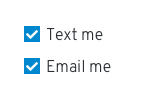

You can also use a single checkbox to allow a user enable or disable a feature or setting.

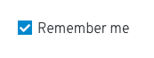

**When not to use**
* Don't use checkboxes for lists that are longer than 5 items. Instead, use a [select list](#select-lists).
* Don't use checkboxes for lists where the user can only select one mutually exclusive option. Instead, use [radio buttons](#radio-buttons).

**Labeling and alignment**
Checkbox labels fall to the right of the checkbox control.

You can use headings to label a group of checkboxes. Placement of headings will depend on the layout of other content in the form or on the page you’re designing. The checkbox control should always be aligned with the left edge of other controls or input fields in the form or on the page.

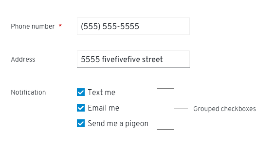

Whenever possible, arrange the checkboxes in a vertical list.

If you have space constraints (and your labels are short) you can also use a multi-column grid.

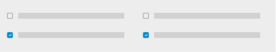

You can nest other controls underneath a checkbox. Enable and disable nested options when the user selects or de-selects a checkbox.

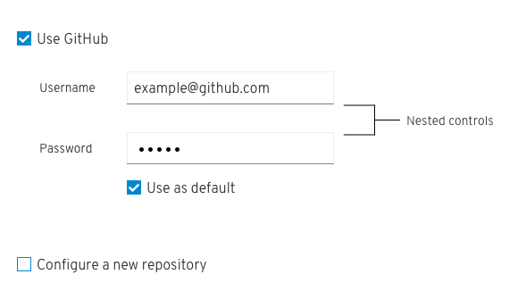

### Radio buttons
Use radio buttons to allow users to select **one item** from a list of possible choices.

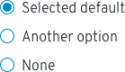

* Use radio buttons when a user needs to make one mutually exclusive choice. Only one option can be selected at a time.
* A default option should always be selected for the user. If the user selects a different option, the default option is deselected.
* To enable the user to select a null option, provide a radio button with the label “None.”

**When not to use**
Do not use a radio button when you have more than 5 options to provide to the user. Instead, use a [select list](#select-lists).  

**Labeling and alignment**
Radio button labels fall to the right of the radio button control.

Arrange radio buttons vertically or horizontally depending on space considerations. Vertically arranged radio buttons are easier to scan and are the preferred arrangement.

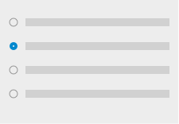

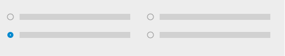

If necessary, you can use radio buttons to nest other controls.

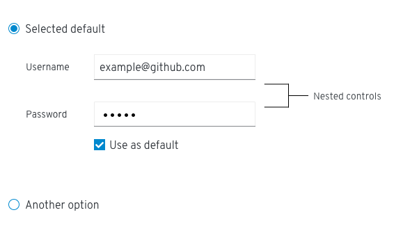

### Select lists
Use a select list to enable users to select one or more items from a list. Select lists should also be used when options are dynamic or variable.

PatternFly offers several variations of select list:
* Single select enables users to select a single, mutually exclusive option.

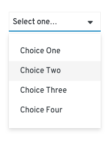

* Multi-select enables users to select one or more options.

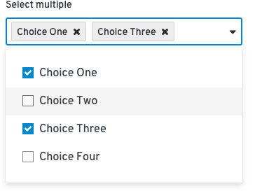

* Typeahead is available for all select lists when you have lists with more than ten options. Typeahead enables users to type into an input field to narrow the list of available options that is displayed.

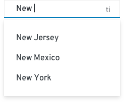

When providing fewer than five options, you can use [radio buttons](#radio-buttons) or [checkboxes](#checkbox) to display all options to the user simultaneously if you don’t have any space constraints.

### Switch
Provide a switch to allow users to instantly toggle between an enabled or disabled state.

* Label your switch with the affected attribute or capability.
* Don’t use a switch if the options you’re presenting to the user are anything other than “on” or “off.” Instead, use radio buttons.

## Usage: Bound-entry controls
Use bound-entry controls to enable users to enter special data types, such as dates, times, and other numeric data. Bound-entry controls constrain user input and combine keyboard and mouse interaction. These controls are designed to only allow valid inputs. As a result, field validation should be unnecessary.

Datepicker and Slider components coming soon!

<!-- ### Datepicker
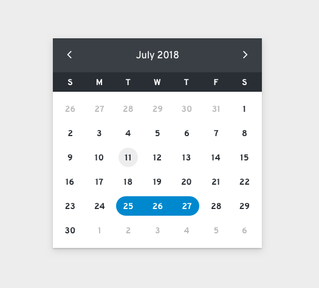

### Slider
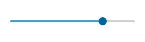 -->

## Errors and validation
In general, data input controls should work to help users avoid input errors. Do your best to disable options that might result in an error, and provide input components that help the user provide accurate data in the correct format. For example, a datepicker is better than a text field when asking users to provide a date because it helps to enforce the appropriate syntax.

For situations where you do need to provide validation and errors, it is best to provide inline errors as soon as a field leaves focus.

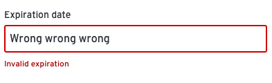

For more information about providing validation and errors for data input, see the [forms design guidelines](/design-guidelines/usage-and-behavior/forms#provide-errors-and-validation).
