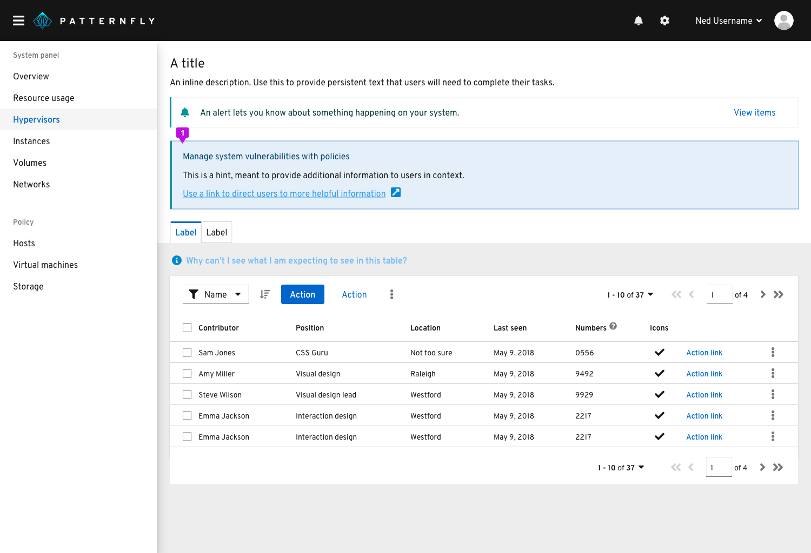
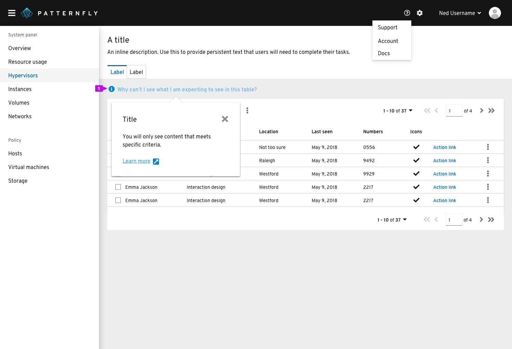

# Embedded assistance
Use embedded assistance to provide additional help for users in context. Embedded assistance should be provided in a way that enables the user to find the information they need at the moment they need it while completing a particular step or task.

## Principles
**Use thoughtfully and sparingly**

Never use embedded assistance as a substitute for usable and intuitive design.
Embedded assistance should work to support and augment good user experience design.

**Assume intermediate proficiency**

Assume that the bulk of a users’ time in an application will be spent at a level of competency or proficiency rather than expert or novice.
* Aim to defer novice information and reduce expert-level complexity.

**Keep your content hierarchy in mind**

Plan content hierarchy to provide the right content in the right place at the right time. You can think about content hierarchy in three levels:
* Level 1: critical information a user must have in order to complete a main task. Level 1 information should be available persistently with titles, headers, inline descriptions, and labels.
* Level 2:  information that supports users with additional context as they complete their tasks. This information is nice to have, but not critical to task completion and likely only needed by a subset of users. Level 2 content can be provided using progressive disclosure methods like popovers, popover hints, or tooltips.
* Level 3:  information that enables users to find and access external resources like support or documentation.

**Don’t forget the docs**

Always provide a way for users to access the full set of documentation for your user interface.
* Links to full documentation should always open in a new tab or window
* Links to doc should be provided in the application masthead. In cases where the global product masthead is not suitable for a doc set (ie, for a platform containing multiple application bundles that don’t share a single doc set), doc links can be provided in the navigation.

## Forms of embedded assistance and how to use them

1. [Persistent text](#persistent-text)
2. [Hints](*hints)
3. [Popover hints](#popover-hints)
4. [Popovers](#popovers)
5. [Tooltips](#tooltips)

### Persistent text
Persistently available text like titles, headers, descriptions, and labels enables the user to understand where they are, what they are doing, and what they need to do to use the interface and complete their task.

**Usage**

When crafting persistent text, target users with an intermediate level of proficiency and defer novice or expert content to other levels of the content hierarchy. For example, a description beneath a title that explains the purpose and goals of a page might make sense on a form or wizard that users are only going to access occasionally, but can be too much for a dashboard that users will see every time they log in.

**Examples**
* Navigation items and page titles
* Chart titles and labels
* Wizard or modal titles
* Form titles, descriptions, and labels
* Button labels
* Filter labels

### Hints
Hints provide a one-step reminder, explanation, or call to action for a page or modal.

**Usage**

A hint should be used to provide information that can help the user understand an interaction or prerequisite step that needs to be performed and might not be obvious, or to help the user get more out of the interface.

### Popover hints
Popover hints offer another method to provide contextual help where the user needs it. Hints anticipate and answer a question for the user.

**Usage**

Use popover hints when there is no obvious UI element to add an information icon to. For example, you may want to address a common question users have regarding an entire page or table.

Hint text should adopt link button styling and always be preceded by an information icon. Clicking on the link text should trigger a popover that provides an answer to the question being posed in the hint text.

### Popovers
Popovers provide helpful contextual information at the moment users need it.

**Usage**

Use popovers to anticipate and answer questions for the user, help explain unfamiliar terms, or provide context around a task.

Always use a popover with an information icon when using the pattern to define a term or explain a concept.

Popovers are triggered on a click and dismissed in one of the following ways:
* The user clicks the exit icon
* The user clicks an action button inside the popover
* The user clicks anywhere on the screen outside the popover

Never hide critical information in a popover. Critical information is any information the user *must have and will always need* in order to complete a task.

**Examples**
* On form field labels
* On titles, headers, other kinds of labels

### Tooltips
Use tooltips to define new or unfamiliar UI elements that aren’t described directly in the user interface, or to get additional data from a data point or element in a chart or table.

**Usage**

* Tooltips should provide new and valuable information. Never use a tooltip to repeat information that is already available in the UI.
* Don’t use tooltips with information icons to present contextual information in forms and other areas. Instead, use a popover.

**Examples**
* Icon tooltips
* Chart tooltips

## Related components and demos
**HTML/CSS**
* [Button](/documentation/core/component/button)
* [Content](/documentation/core/component/content)
* [Popover](/documentation/core/component/popover)
* [Tooltip](/documentation/core/component/tooltip)

**React**
* [Popover](/documentation/react/components/aboutmodal)
* [Tooltip](/documentation/react/components/aboutmodal)
* [Button](/documentation/react/components/button)
* [Text](/documentation/react/component/text)
