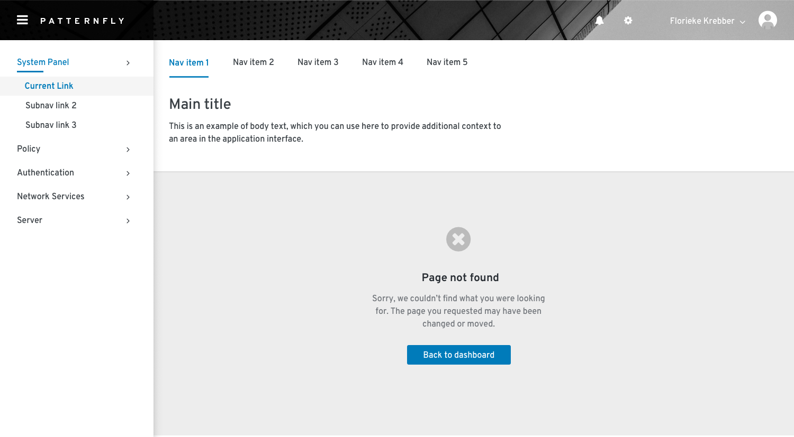
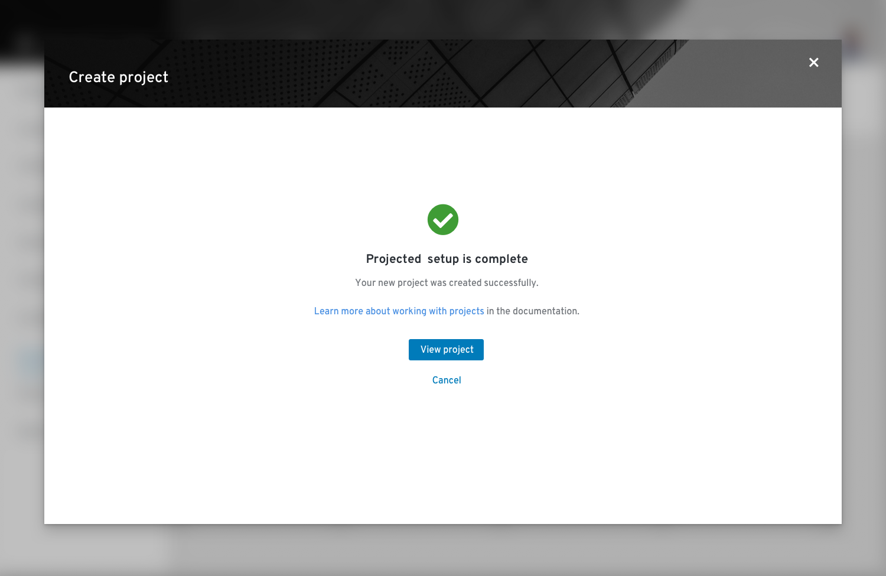

# Empty state
Use an empty state to educate users and guide them with positive and proactive next steps in any situation where there is no data or information to display.

## Elements

1. **Icon/image (optional):** Display associated object icons here. An icon is only recommended for full page empty states
2. **Title:** Provide a concise explanation
3. **Body:** Provide additional information that helps a user understand why the space is empty, what they can do to move forward, and the value or benefit that is gained by taking the next step
4. **Primary button:** Primary call to action
5. **Secondary buttons (optional):**  Alternative options for the user. There can be more than one secondary action.

## Usage
There are several common use cases for empty states:

**First-use**

In a first-use situation, there is nothing to display because the user has not created or added anything yet. Use this opportunity to educate users about how to get started and introduce any associated value or benefit to taking action.

**No data to show**

Help users understand why there is no data to display and explain what they can do to move forward. For example, there may be no data to show because the user has a series of filters applied and the system cannot locate a match. It’s also possible there is no data because all issues are resolved or all tasks are complete.

**Configuration is required**

In this situation, a user may need to take steps to configure, connect, or enable something in order to view associated information or take advantage of features.

**The user is not entitled or the user role does not have access**

Help users understand why they are not able to view content and provide next steps.

**A backend failure**

Provide the user with information about the error that is easy to understand, and provide clear next steps they can take to resolve the issue.

**Success**

Provide the users with information letting them know they’ve successfully completed a process. For example, you might provide a success state at the end of a tutorial or the completion of a wizard.

<!-- ## Variations

Empty states are most commonly presented in data lists, data tables, card views, or as a full page.

*In a data list*

*In a small card*

*In a large card*

*In a full screen*
-->
