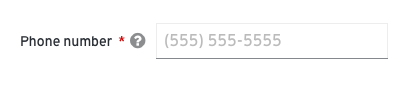

# Forms
A form is a group of elements used to collect information from a user. Forms can be presented to the user in a variety of contexts depending on the use case and scenario.

## Elements
Most forms will contain the following basic elements:

*Form elements*

1. [Labels](/design-guidelines/usage-and-behavior/data-input) - Field labels can be aligned to the left or top of the field depending on the layout of your page and the amount of space you have to work with. Learn more about field labels in the [text and data input design guidelines](/design-guidelines/usage-and-behavior/data-input).

  *Aligned to the top*

  

  *Aligned to the left*

  

2. [Text field](/design-guidelines/usage-and-behavior/data-input) - provides an area for users to input free-form text.

3. [Data input](/design-guidelines/usage-and-behavior/data-input) - provides a way for users to submit any information that is not free-form text. For example, you might use a check box to enable users to select from multiple predetermined values or a radio button to enable users to select one value from a list of several values. Input components are designed for specific use cases. Learn more about data input variations in the [text and data input design guidelines](/design-guidelines/usage-and-behavior/data-input).

4. [Help](#provide-the-right-kind-of-help) - provides assistance in any area where the user might need additional information or context to provide the right input
    * Infotip - provides content in a popover or tooltip.
    * Input help - provides help inside of or directly below a field.
        * Placeholder text
        * Helper text

5. [Errors and validation](#provide-errors-and-validation) - ensures that the correct information is collected before the form can be submitted to the system.

6. Action buttons - enables a user to submit or exit a form. Button placement depends on the type of form you're presenting to the user.

  When using forms in a modal, align buttons to the right edge of the input field. Place the primary button on the far right and the secondary button to the left.

  *Buttons on a modal*

  

  When using full page forms, align buttons to the left, placing the primary button on the left and secondary on the right.

  *Buttons on a full page form*

  

  7. Required field indicator

## Usage
### Provide the right data input
PatternFly provides a variety of input components that enable a user to make a selection. Each component was created to serve a specific use case.

Learn more about data input in the [text and data input design guidelines](/design-guidelines/usage-and-behavior/data-input).

### Provide the right kind of help
**Infotips**
Use an infotip to provide context around a text or input field. Infotips are represented with a question icon and can be displayed in a popover or a tooltip.

* Use a **tooltip** for brief (1 sentence or less) explanations
* Use a **popover** for longer (2 sentences or more) explanations, content that requires formatting like numbered or bulleted lists, or content that requires you to include buttons, links, or images.
* Popovers or tooltips should be displayed to the top of the icon.

*Infotip example - top aligned labels*

*Infotip example - left aligned labels*

**DO**
* Use infotips for any field that may require additional background or explanation.
* Keep descriptions as concise as possible.

**DON'T**
* Don’t use infotips to compensate for bad design or rely on them to explain a graphic or word choice.
* **Never** hide critical information in an infotip. Don’t put any information into an infotip that a user will always need to complete their task.

**Helper text**
Helper text is text below a form field that helps a user provide the right information, like _Enter a unique name_. Use helper text for information that a user needs to know in order to enter the correct information. For context or background information that is “nice to have,” use an infotip.

*Helper text example*

**DO**
* Keep helper text concise while providing enough information to enable a user to complete their task.
* Use helper text to provide critical information that is secondary to the field label.
* Limit the use of helper text to avoid overwhelming the user.

**DON'T**
* Try to avoid helper text that exceeds the length of the input area.
* **Never** use helper text as a replacement for field labels.

**Placeholder text**
Placeholder text is text inside a form field that provides an example of the required or recommended format for text input.

For example, placeholder text for a date might be _e.g. DD/MM/YYYY_.

Use placeholder text when the requested data type might be unfamiliar or the field requires the user to provide data in a specific format.

*Placeholder text example*

**DO**
* Try to limit the use of placeholder text to unfamiliar input types or specific syntax requirements (like a specific date format, number format, etc).
* Always precede placeholder text with "e.g." followed by a space. For example "e.g. (781)555-5555" or "e.g. 491"
* Keep hints concise; never extend the length of the text field.
* Limit the use of syntax hints to avoid overwhelming the user.

**DON'T**
* Don’t use placeholder text to communicate complex and lengthy requirements like password requirements. Instead, use an infotip.
* Don’t provide placeholder text when it isn't necessary.
* **Never** use placeholder text as a replacement for field labels.

### Provide errors and validation
When a form field submission results in an error, let users know as soon as possible. Always present error states on the form, and use inline errors whenever possible. The error state you can use will depend on whether validation happens on the client or the server.

**Client-side validation**
Client-side validation can be performed as soon as a field loses focus, and allows you to use inline validation to alert users of errors or issues immediately. This type of validation allows users to quickly see and address issues.

Some common use cases include:
* A user entering data in an invalid format
* A user leaving a required field blank
* A user leaving a required field incomplete

> Note: Inline error messages replace any existing helper text.

*Inline error*

**Server-side validation**
Server-side validation is performed when the user attempts to submit a form. A user completes the form in its entirety and the page is reloaded with any errors detected.

For server-side validation, use an inline alert along with inline errors wherever possible to make it simple for the user to quickly identify areas that need to be fixed.

Notifications should describe the error and help users solve the problem.

See [alerts and notifications](/design-guidelines/usage-and-behavior/alerts-and-notifications) for more information.

### Use progressive disclosure
Use progressive disclosure to hide and show fields based on the users’ selection. This approach keeps the workflow short and allows the user to focus on only the fields relevant to them. It also avoids using color to indicate whether or not a field is available, making it suitable for colorblind users.

*Progressive disclosure example*

### Form examples
**In a card**

**In a modal**

**As a wizard**

**Specifications**
When you're laying out your form elements, we recommend leaving enough vertical space to accommodate a line of caption text (about 32px) beneath form fields to account for inline errors and helper text. For more information see [Spacers](/design-guidelines/styles/spacers).

### Content
Think of a form as a conversation between your application and your user. Apply the following principles to organize and craft content for your forms:

**Focus on the task and context**
Make sure you are clear about what the user is trying to accomplish with this form and how your users are thinking about the task they’re trying to complete.

* What are they trying to achieve?  
* What kinds of questions will they have?
* Where might they get stuck?

Start by writing out the conversation you might have with someone if you were guiding them through the task. This exercise can help you organize your form, name your fields appropriately, better understand the context of the task, and write in a more natural way.

**Use your understanding of context to plan your content hierarchy:**

* **Include the most critical information in the field label.** Answer the most basic question first: what data do I need to provide here? The field label you choose will depend on the context of your form. For example, is it enough to request a name, or do you need to specify first name, last name, and middle initial?

* **Include critical secondary information as helper text.** Critical secondary information is information a user must have in order to provide the right input. For example, a user creating a name for a new asset may need to specify a unique name for that asset. Letting the user know this up front helps avoid unnecessary errors.

* **Include background information/context as field-level help in a popover.**
For example, you could use this type of help to define an unfamiliar term or concept that a novice user might not be familiar with. **Never hide critical information in a popover.**

* **Use natural language**
Again, think of a form as a conversation with your user. No one wants to have a conversation with a robot.

See our [content guidelines](/design-guidelines/content/) for additional guidance.

## Components and demos used
The PatternFly components listed can be used in a number of ways to build forms to suit specific needs or use-cases.

**HTML/CSS components**
* [Form](/documentation/core/components/form)
* [Button](/documentation/core/components/button)
* [Check](/documentation/core/components/check)
* [Content](/documentation/core/components/content)
* [Dropdown](/documentation/core/components/dropdown)
* [Formcontrol](/documentation/core/components/formcontrol)
* [Inputgroup](/documentation/core/components/inputgroup)
* [Popover](/documentation/core/components/popover)
* [Progress](/documentation/core/components/progress)
* [Switch](/documentation/core/components/switch)
* [Tooltip](/documentation/core/components/tooltip)

**React components**
* [Form](/documentation/react/components/form)
* [Button](/documentation/react/components/button)
* [Checkbox](documentation/react/components/checkbox)
* [Dropdown](/documentation/react/components/dropdown)
* [Progress](/documentation/react/components/progress)
* [Radio](/documentation/react/components/radio)
* [Select](/documentation/react/components/select)
* [Switch](/documentation/react/components/switch)
* [TextArea](/documentation/react/components/textarea)
* [Text](/documentation/react/components/text)
* [Popover](/documentation/react/components/popover)
* [TextInput](/documentation/react/components/textinput)
* [Tooltip](/documentation/react/components/tooltip)
