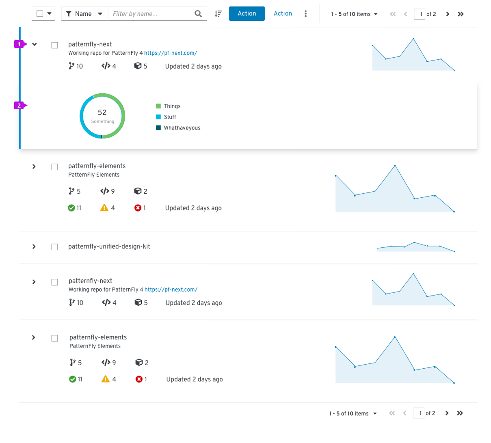
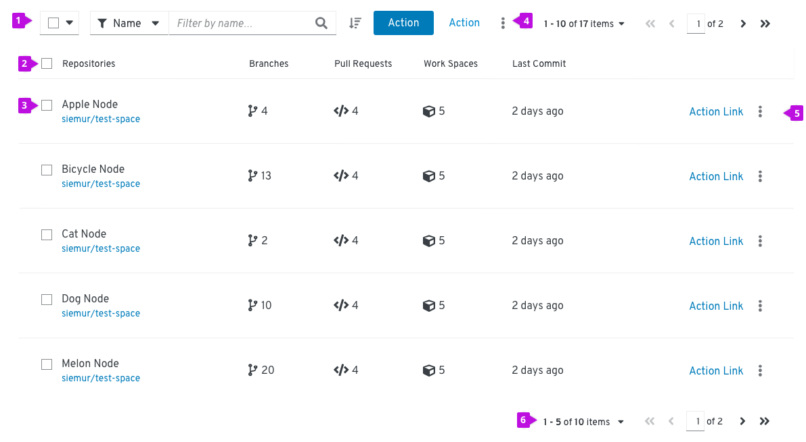
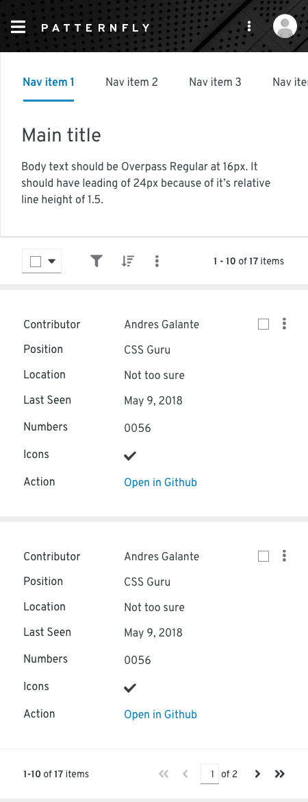
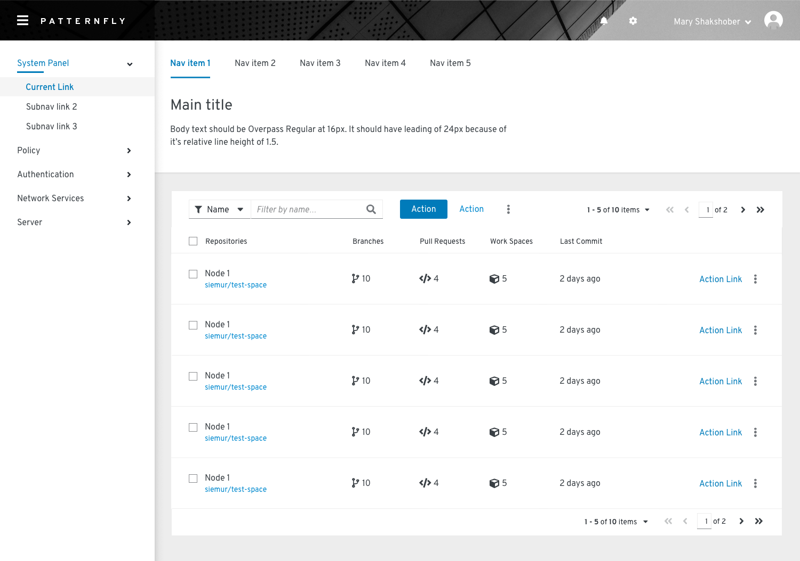

# Lists and tables
PatternFly offers two components for displaying large data sets: [data list](/documentation/react/components/datalist/) and [table](/documentation/react/components/table/). While they satisfy similar use cases, choosing the correct component to use in your design will be dependent on the type of data you need to display.

Use [data lists](#data-lists) when:
* A flexible layout is more important than arranging information in a grid
* You want to include active content like a chart
* Content displayed may vary between rows

Use [tables](#tables) when:
* Users will want to consume data as a grid (i.e. structured rows and columns)
* You want column headers

## Data lists
PatternFly supports several variations of the data list component.

### Standard data list

1. **[Toolbar](../toolbar/design.md):** The toolbar sits above the list and contains controls for manipulating list data. Common actions include filtering, sorting, and pagination.
2. **Row:** Row height may be variable and sizes to the content. Rows in a data list may take any supported layout.
3. **Inline actions:** These actions apply only to the current row/item.

#### When to use
Use a data list when the information you want to display is not easily structured into a tabular format, you want a more flexible layout within rows, or you plan to embed rich content like a chart or an image into a row.

#### When not to use
The data list is not recommended for displaying content that is better presented in tabular format with well defined columns and headings. Instead, use a table.

#### Alternative solutions
Alternative to a data list include [tables](#tables) or card views. Card views and data lists have similar properties, but information in a card view is chunked into a grid of individual cards. In choosing between a data list and a card view, consider the type of data that will be displayed and the format that best suits that data. If you cannot easily fit all of the data that needs to be displayed into a card, a data list might be a better solution.

#### How to use
Think of each row in a data list as a container for some formatted content. In PatternFly 4, data list rows can accept any [layout](/documentation/react/layouts/bullseye) supported by the design system as long as all rows apply the same layout. Here are some common layouts that may be useful in a data list:

* **[Grid](/documentation/react/layouts/grid):** When you want to display content in a responsive grid
* **[Level](/documentation/react/layouts/level):** When you want to justify content evenly over the width of the row
* **[Split](/documentation/react/layouts/split):** When you want to distribute content evenly with a main content area in the center

### Actionable data list
The actionable data list provides checkboxes that enable users to select one or more rows and act on that selection using options in the toolbar.

1. **Checkbox:** Enables a user to select a row
2. **Global actions:** Actions that can be applied to all selected items

#### When to use
Use actionable data lists when you need to enable a user to select and act on multiple items in the list.

#### When not to use
Do not use actionable data lists when actions are restricted to a single row or object. In this case, place actions inline within the row.

### Expandable data list
The expandable list adds an expansion panel to every row to reveal more details about the item.

1. **Expansion caret:** Toggles the expansion open and closed
2. **Expansion panel:** A container that is revealed when the expansion is open. It can accept any supported layout to present additional content to the user.

#### When to use
Use an expandable data list when you have more information than will comfortably fit inside a row, or you want to provide a way for advanced users to access information that is not applicable to all users.

## Tables
* **Standard table:** Combines the styling of a list view with behaviors that are commonly associated with a table (sometimes referred to as a hybrid list)
* **Compact table:** Maximizes the amount of data that can be displayed in a small space

### Standard table

1. **[Toolbar](/design-guidelines/usage-and-behavior/toolbar):** Sits above the table and contains controls for manipulating table data. Common actions include filtering, sorting, and pagination.
2. **Select all:** When present, selects all items in a table. If pagination is being used, this will only select items on the current page.
3. **Column headers:** Should align with the content they contain. If the user is able to sort on a column, the first click on the header will sort the content of the table on the content in that column. Subsequent clicks will toggle the direction of the sort. Table data can only be sorted on one column at a time. See [Sorting by columns](#sorting-by-columns) for more information on the sort component.
4. **Select checkbox:** Selects this row
5. **Global actions:** Actions that apply to all selected items
6. **Inline actions:** Actions that apply only to the current row/item
7. **Pagination footer:** When present, provides navigation to additional pages

#### When to use
Use a standard table when the information you want to display fits into a structured, tabular format (i.e. has distinct rows and columns).

#### When not to use
Do not use for less structured or variably structured data that cannot be easily organized into columns. In these situations, use a [data list](#data-lists).

#### How to use
Consider the structure of the data you want to display and organize that information into columns. Columns will typically have column headers. Every row within a table must have a consistent format. If the table row includes actions, they should always be placed in the rightmost column(s).

### Compact table

#### When to use
Use a compact table when you want to show as much data per page as possible and readability is a secondary concern.

### Expandable table

1. **Expansion:** Expands the row
2. **Expansion panel:** Contains details associated with a row

#### When to use
Use when you have more information than will comfortably fit inside a row or you want to provide a way for advanced users to access information that is not applicable to all users.

### Compound-expandable table

1. **Expandable cell:** A cell that can be clicked to reveal more detail about an item. If the expansion for an item is already open, clicking on a different cell will close the current item and open a new one.
2. **Expansion panel:** Contains details associated with an expandable item.

#### When to use
Use a compound expandable list when you want multiple expansion panels that relate to specific table columns where it would not make sense to combine all of this information into a single, simple expansion.

## Tables on mobile
The PatternFly 4 table is designed to be fully responsive. When columns no longer fit within the width of the viewport, columns are stacked so that data in each row is displayed as sets of attribute-value pairs.

## Sorting by columns
Sorting by columns is possible for any table variation. Enabling the component within a table eases the ability to scan and read through the content. This option is favored over adding sorting functionality to the toolbar.

1. **Sorted column:** When a column is being sorted by, the column header will turn blue and the sort icon will represent the direction of the sort. Subsequent clicks on the sortable column header will toggle the direction of the sort.
2. **Hovered sort:** When a column is sortable, the sort icon will appear to the right of the column header. Upon hover, the  icon will change to a darker grey indicating that the icon is actionable.
3. **Sortable column:** When a column is sortable, the sort icon will appear to the right of the column header in a light grey color. Sorting will not become active until the user selects the column header. This triggers the arrow to point upwards and the content to be sorted in ascending order.

### When to use
The default sort order for a table should support the primary use case for the application. All columns in a table do not require sort functionality. That is, you can disable the header sort function on some columns and enable it on others.

### Example
If a table contains these two attributes: (System Name | Last Sync) you may want to show the most recently synced system at the top of the table (ie, it is the default sort column), because a primary use case for this table is verifying that you have successfully connected or troubleshot the system’s connection to Cloud Services.

If a table contains these three attributes: (System Name | Last Sync | Severity) you may want to show the system with the highest Severity because that is the system the user should tend to first.

## Using lists and tables in a page
Lists or a tables should be placed in the body of a page. The width should be set by the containing element.

In this example, a table is positioned in the body of a page in a card.

## Components and demos used

**HTML/CSS**

* [Data list](/documentation/core/components/datalist)
* [Table](/documentation/core/components/table)

**React**
* [Data list](/documentation/react/components/datalist)
* [Table](/documentation/react/components/table)
