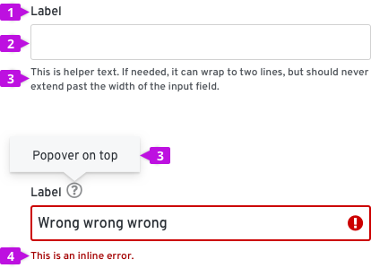

# Text input
Use text input to gather free-form text from a user.

## Elements

1. Label
2. Input field
3. [Help](#help) - provides contextual assistance like popovers, placeholder text, or helper text, in any area where the user might need additional information to provide the right input.
4. [Errors and validation](#errors-and-validation) - ensures that the correct information is collected before the form can be submitted to the system.

## Usage
* Be sure to size input fields appropriately to anticipate the longest likely value (if a maximum character length is known).
* When a value is too long to be fully displayed in a text field, use [truncation](/design-guidelines/content/grammar-and-terminology#truncation).
* Provide a [text area](/documentation/react/components/textarea) for input anticipated to be longer than a single line.

* Pre-populate fields with known values when possible, e.g. a default IP address.
* When presented in a form, the initial input field is usually the first input field required. The primary input field should receive focus when the form is presented to the user.

### Help
**Popovers**
Use a popover to provide context around a text or input field. Popovers are represented with a question icon and displayed when the user clicks on the icon.

**Helper text**
Helper text is text below a form field that helps a user provide the right information, like Enter a unique name.

**Placeholder text**
Placeholder text is text inside a form field that provides an example of the required or recommended format for text input. For example, placeholder text for a date might be e.g. DD/MM/YYYY.

For more information about how to provide help content, see  the [forms design guidelines](/design-guidelines/usage-and-behavior/forms#provide-the-right-kind-of-help).

### Errors and validation
Wherever possible, use inline errors to notify users that something has gone wrong. Inline errors help should be short and help users quickly identify and understand what they need to fix and why.

For more information about how to provide errors and validation, see  the [forms design guidelines](/design-guidelines/usage-and-behavior/forms#provide-errors-and-validations).
