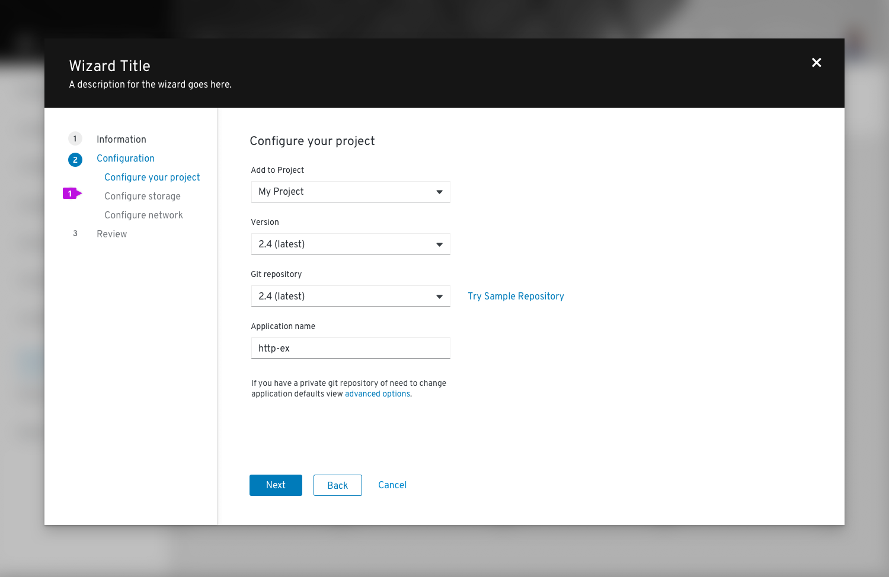
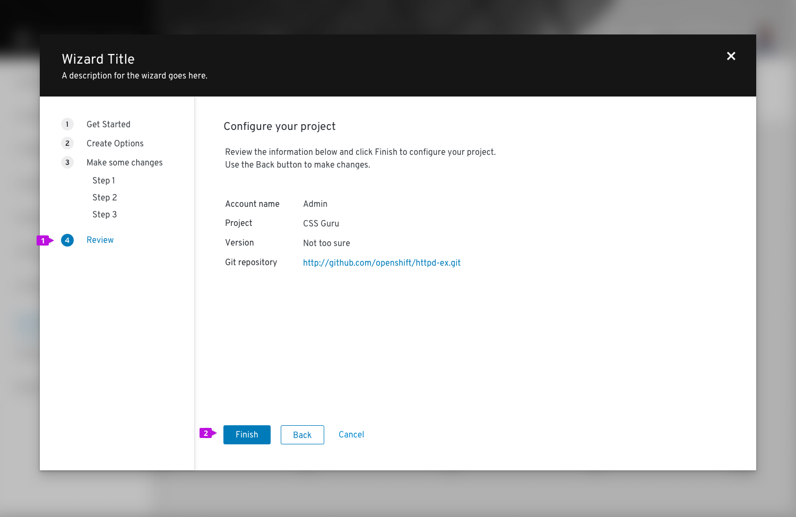
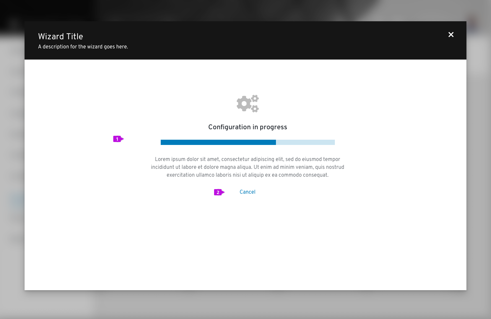
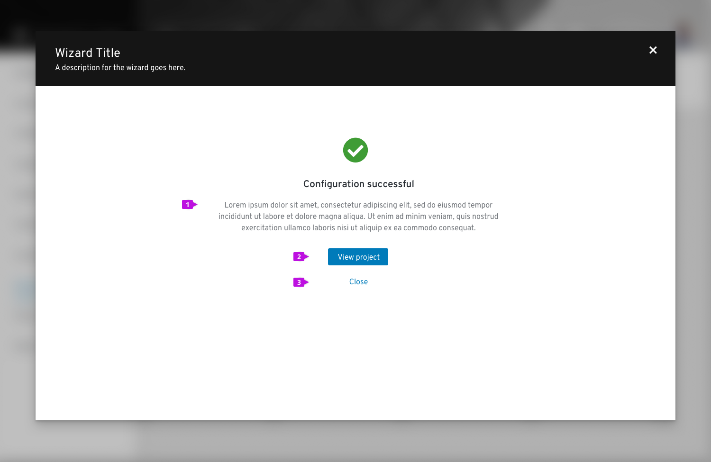
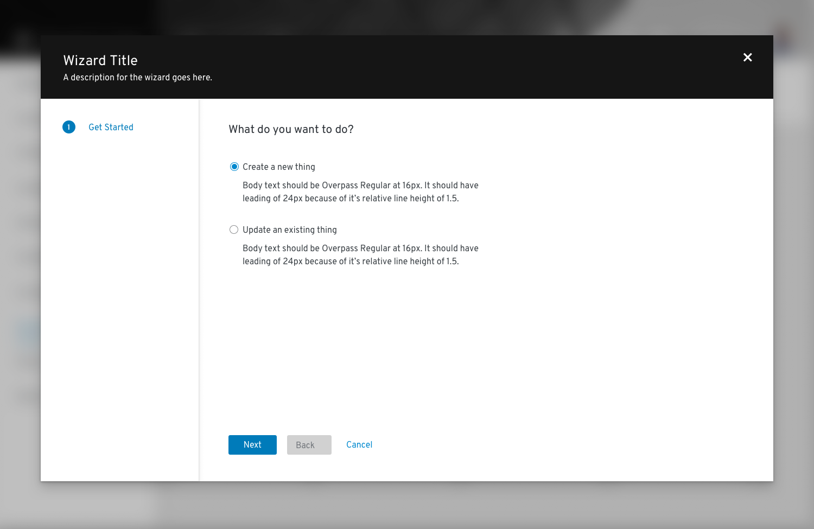
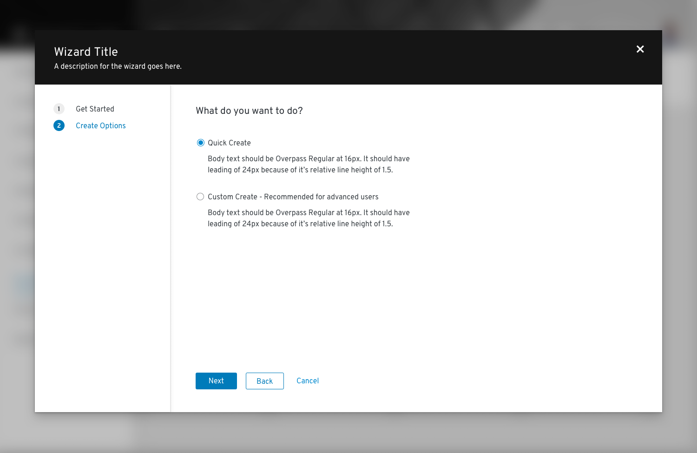
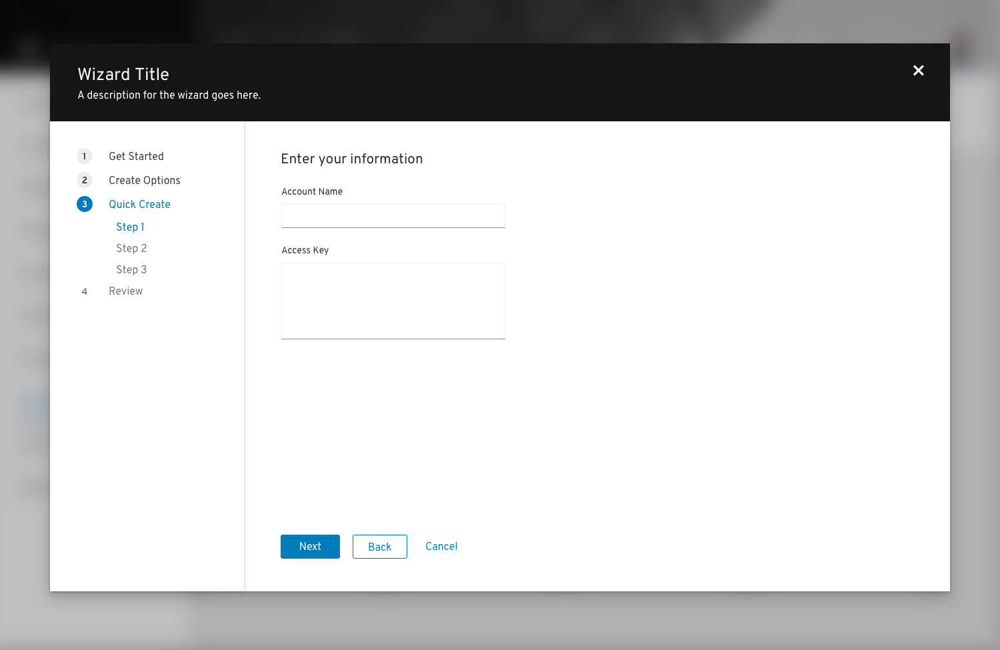
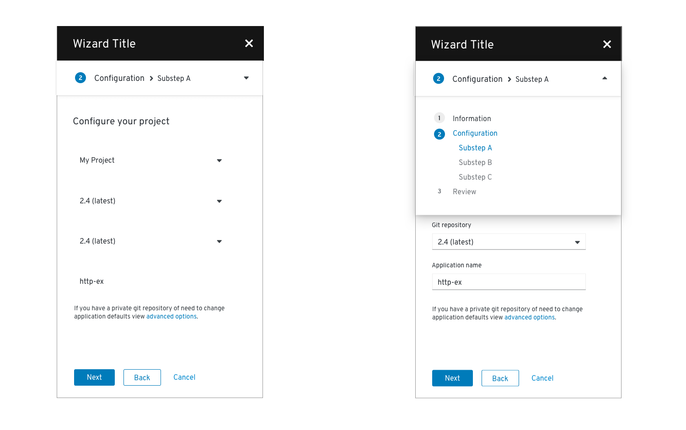

# Wizard
Wizards provide a guided workflow that offers a path to complete a task, create an object or objects, or finish a series of steps for some other outcome.

## Usage
Use a wizard when

* A system or product requires a set of information to be input by a user in a standard fashion. The guided stepped approach helps to eliminate errors of omission and catch them before having to process the entire chunk of information.
* A simple form is not sufficient to aid a user in completing a task
* Your users are inexperienced and you do not want to overwhelm them with complexity.

Avoid using a wizard for simple data entry tasks in which a basic form would suffice.

The PatternFly wizard is designed as a modal experience. This will keep users focused on the task at hand. They must either complete all of the steps of the wizard or cancel before navigating elsewhere within an application.

## Elements of a wizard
The wizard lives in a modal dialog. The width of the modal is variable and should be sized to comfortably fit the contents of the wizard at typical desktop screen resolutions.

### Simple wizard

1. **Header**: wizards always have a header area that contains the wizard title, description, and a close button.
2. **Steps sidebar**: enumerated steps are displayed in the sidebar. Steps can be fixed or updated as the user proceeds through the process (see Progressive Wizard).
3. **Visited step**: a step that has been already visited. In most cases users can click this step to return to a prior point in the flow.
4. **Current step**: the current step is always highlighted.
5. **Disabled step**: steps that follow the current step are usually disabled to enforce the sequential flow.
6. **Body**: the contents of a step itself. Any valid form elements can be incorporated within the body. The size of the modal that contains the wizard can be adjusted based on the contents of the body section. If the height of the body section causes the bottom of the modal to push beyond the height of the viewport, a vertical scrollbar will appear. However it is recommended to break your workflow into small enough steps so that scrolling is not necessary on typical monitor sizes.
7. **Button footer**: Buttons control the wizard flow. Default buttons are Next, Back, and Cancel. You may optionally add other actions, e.g. Skip to Finish or Start Over.

#### Behavior
In a standard wizard the user moves through the wizard sequentially, a step at a time. The Next button is always used to advance the wizard. In addition:

* The Back button is disabled on the first page of the wizard.
* To abandon the wizard, the user selects Cancel in the button footer or the Close button in the header. Closing the wizard will discard current changes, so it may be appropriate to insert a confirmation message before executing this operation.
* Wizard steps are skippable if the user configures them to be
* The user can jump to steps directly if the user clicks on a step in the nav (if the step is not disabled)

### Wizard with sub-steps
Sub-steps can be added to the sidebar. Use sub-steps when there is a hierarchical relationship between a group of steps, if a primary step contains too much content to be displayed on one page, or when there is a set of optional settings that make sense to group together where the user need not visit each page.

1. **Sub-steps**: sub-steps are always nested inside of a major step.

#### Behavior

* You may force the user to execute sub-steps in order by disabling future steps. Or enable all steps if the user should be able to click freely between sub-steps.

* Clicking Next or Back should navigate through the substeps as it would for the major steps.

### Review and completion
The last step in a wizard should always be a Review step. This should include a summary of what the user has input so the user may confirm them before committing their changes.

1. **Review step**
2. **Finish button**: on the last step of the wizard, the Next button is labeled Finish by default. This is a configurable choice and should be replaced by a more specific verb or verb-object word pair like “Create” or “Configure networks,” when possible.

If it will take a long time (more than a few seconds) for changes to be applied, a progress screen is recommended. This can be constructed from a variation of the [empty state](/design-guidelines/usage-and-behavior/empty-state) pattern by embedding a progress bar and appropriate messaging within the body of the wizard.

1. **Progress message**: include a progress bar with appropriate messaging using an empty state pattern.
2. **Cancel button (optional)**: include a cancel button only if the operation can be terminated once it is started. Cancel should back out all changes and leave the system in the state that existed before the user launched the wizard.

Note that once changes have been committed, the steps sidebar is hidden and the user can no longer make changes.

Once the changes initiated by the wizard are completed, a final confirmation screen should be displayed. Again, this can leverage an empty state pattern to present a success (or failure) message to users.

1. **Completion message**: provide appropriate messaging to inform the user about the outcome of the wizard.
2. **Primary action**: in most cases this will be a navigational button to close the wizard and take the user to a page where they can see the results of their changes, e.g. a new project that was created. If there is no appropriate destination or if results will be seen on the current page, make the primary action Close.
3. **Secondary action(s) (optional)**: If the primary action is other than Close, include a Close button here to close the wizard and return to the prior page. Other secondary actions can also be included. See [Empty state](/design-guidelines/usage-and-behavior/empty-state) for button placement.

In some cases the result of a wizard is to dispatch a task to the background to execute changes in the back end. In these circumstances, we recommend that you provide a navigation link to monitor task progress and/or simply a Close button.

### Progressive wizard
A progressive wizard takes the same form as the standard wizard or wizard with substeps above but accommodates a situation where the exact number of steps is not known when the wizard is first loaded. Steps in the sidebar can be changed or added as the user progresses through the wizard.

Here is an example...

Step 1: The user is presented with a Get started screen where they can specify what they want to do.

Step 2: Based on their choice to create a new object, they are presented with a second set of options. But the remaining steps are still unknown.

Step 3: After the choose “Quick create” and click Next, they can now be presented with a full set of steps. It should be possible to revisit either of the first two steps making different choices and steps shown should update accordingly.

### Mobile considerations
When viewing a wizard on a mobile device, the steps sidebar will be hidden and collapse into a drop down menu panel as shown below.

## Content
You should keep the following in mind while designing your wizard screens:

* Keep step labels short. The title at the top of each screen may be used to elaborate on the step label, but in all cases there should be a direct relationship between the step label and the screen title.
* The last step should always be labeled review.
* Default button labels for wizard navigation are: Next, Back, and Finish. If you are replacing the default button labels, keep them short and action oriented, e.g. “Create network.”

## Related components and demos
**Core HTML/CSS**
* [Wizard](/documentation/core/components/wizard)

**React**
* [Wizard](/documentation/react/components/wizard)
