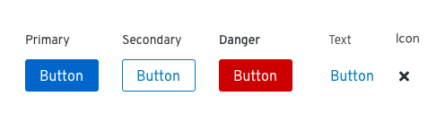

# Buttons and links
Buttons communicate and trigger actions a user can take throughout an experience. Links are used to take users somewhere, like another page inside of a web application, or an external site such as help or documentation.  

Technically, a button represents a box area that can be clicked or tapped, while a link represents text that can be clicked or tapped.

## Primary elements
### Button elements

1. Button box  
2. Button label

### Link elements

1. Link label
2. Link underline (on hover)
3. External link icon (optional)- use when the link will navigate users to an external page. Pages should open in a new tab or window.

## Usage
[Button usage](#button-usage)
[Link usage](#link-usage)

## Button usage
A button should represent an action a user can take, like submitting a form, cancelling a process, or creating a new object. When the user clicks the button, the associated action should be triggered or performed immediately.

### Button types
Use different button types to build hierarchy in an application layout.

  

  **Primary button**
  Use primary buttons for the main action you want a user to take on a page. Try to limit primary buttons to one per page.

  **Secondary button**
  Use secondary buttons for secondary actions a user can take. For example, a cancel button would be secondary to a submit button on a form or modal.

  **Danger button**
  Use danger buttons for actions a user can take that are potentially destructive or difficult/impossible to undo, like deleting or removing user data.

  **Link button**
  Use a link button for secondary or tertiary actions on a modal or page. For example, actions a user might take on items in a data list or table could be represented as link buttons to avoid visual clutter and save space.

  >Note: Don't use a link button as a replacement for an actual link. While they may look the same to the user, they serve different purposes and should be treated differently. Remember: buttons communicate and trigger actions and links take you somewhere. See [Link usage](#link-usage) for more information.

  **Icon button**
  Use icon buttons for actions that are commonly associated with icons. For example, you could use the close icon to exit a modal or window, or use the hamburger icon to toggle a menu.

### Using buttons in your designs
#### Buttons on full page forms
* Place the primary button to the left of the cancel button.
* Align submit buttons with left-edge of input fields.

#### Buttons on modals
* Align submit buttons to the bottom right of the modal.
* Place the primary button to the right of the cancel button.
* Align submit buttons with right-edge of input fields.

#### Buttons on wizards
The placement of buttons on wizards will depend on the types of content you present.

## Link usage
Links should be used to take users somewhere. If you want to use link text to represent low-priority actions on a screen, use a [link button](#link-button).

For links that navigate users to any location external to the current website or application the user is currently in, link text must be followed by the external link icon.

## Content
**Writing button labels**
* Button labels should tell the user what will happen with they click a button.
* Always use verbs or verb phrases.
* Use specific labels that clearly describe the user action.
* Aim for short (1-3 words) labels wherever possible.
* Do not use long button labels that might risk wrapping.

**Writing link labels**

See our [content guidelines](/design-guidelines/content/) for additional guidance.
