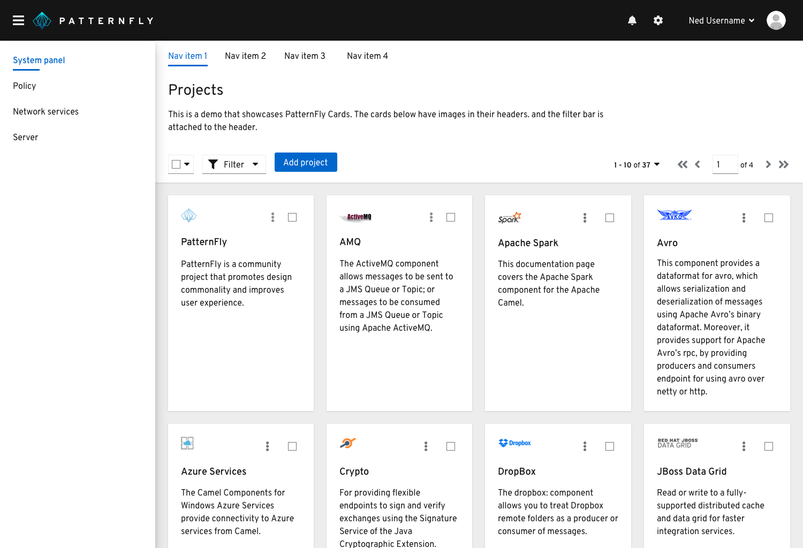
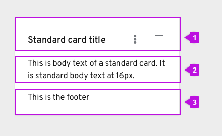
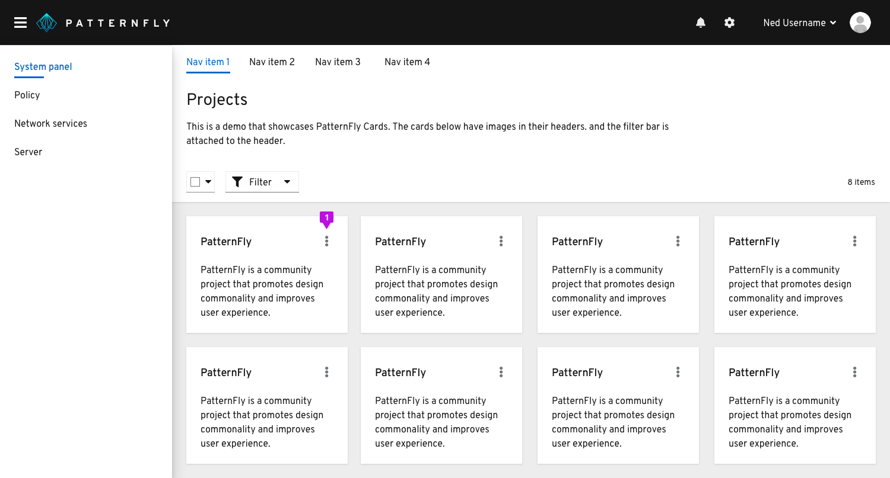
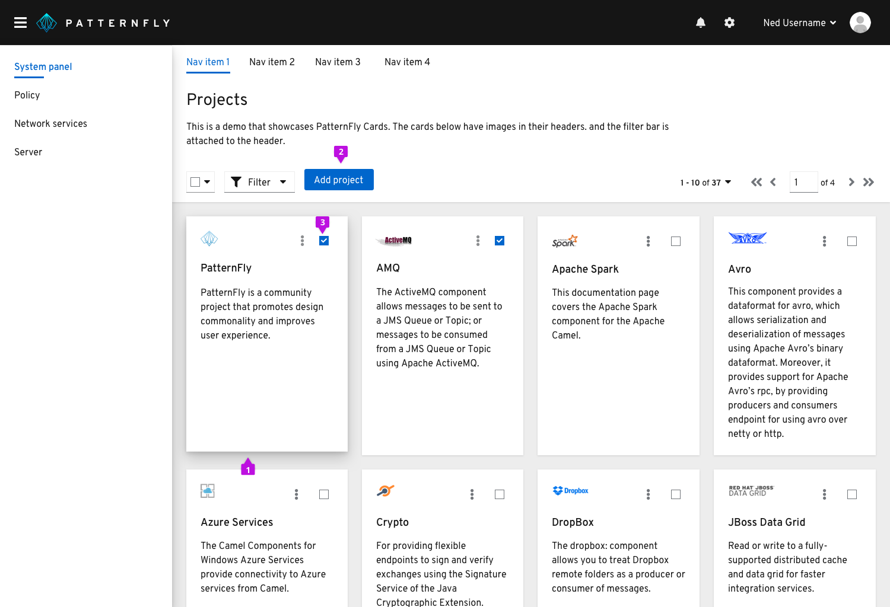
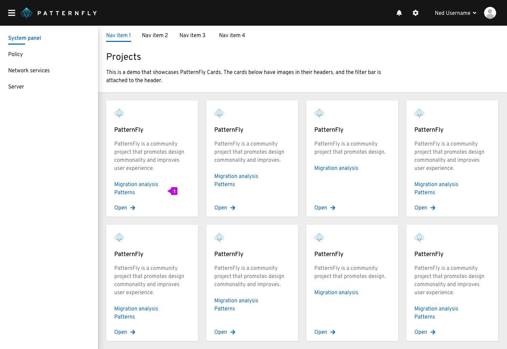
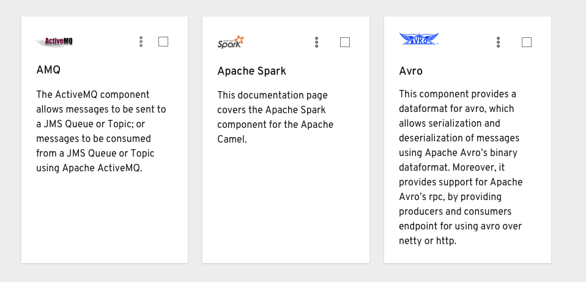
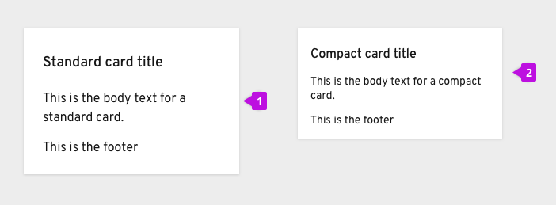
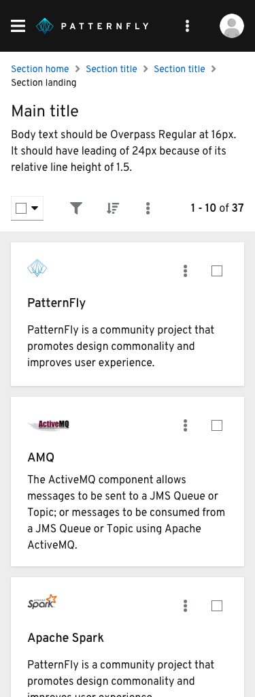

Card view organizes content into a grid of cards. It is useful for displaying a small to moderate amount of content in a way that is not visually overwhelming.

## When to use
Use Card view to:
1. Display pieces of content that are best identified by a graphic or other visual representation
2. Enable users to easily visualize and compare information
3. Summarize a large number of objects at once within the same page

## When not to use
The Card View should NOT be used if users need to quickly scan a large amount of text-based content. Consider using a [Table or List view](/design-guidelines/usage-and-behavior/lists-and-tables).

## Cards

### Card elements

A card usually contains three sections:
1. A header
2. A body
3. A footer

Cards are flexible and allow for customization of parts. For example, a card can contain a header with image, actions, and a body, or it can contain only a header and body, or it can contain a header with image, body and footer.

### Actions
There are a few ways of customizing actions on cards. Depending on your use case, we recommend the following.

#### Multiple inline actions

1. If there are more than two actions that can be performed to a single item, those should be placed in a kebab in the top right corner of the header.

#### Global actions
If the action provided can be performed globally (or to multiple pieces of content at the same time), place that action in the toolbar above the card view. In this instance, you would add a checkbox in the right corner of your card so that one or more items can be selected.

1. Upon hover, the card’s shadow turns from small to large.
2. Global actions placed in the toolbar.
3. Each card will contain a checkbox in the top right corner. This will allow the user to perform an action against multiple cards. When a user selects a card, that checkbox will turn blue to indicate selection.

#### Inline actions
If the action provided can only be performed to a single item, place that action somewhere in the body or footer of the card. In this case, a checkbox would not be necessary since the actions are item-specific. If there are few cards with single actions, it would be best to use the secondary button style. If there are many cards with single actions, it would be best to use a link button or link text.

This case is a common use case where cards are used as navigation or drill down indicators. If you are dealing with this type of use case, be sure to present the action that the user will be performing on the card. This helps differentiate this type of navigational card from a standard card. Then, if you use a mixture of types of cards in your application, it will be easier for the user to distinguish these indications.

1. Link text is placed in the body since there are many cards with single actions.

### Images

When using images on cards, they must have a meaning. The purpose of these images are to help the user identify that specific type of content. Images are normally placed above the header if they are on the smaller side. They can also be placed within the body if they are a larger visualization.

### Card types

PatternFly supports two types of cards:
1. Standard
2. Compact

The differences between the two lie within the typography sizing and section spacing. Standard cards use standard body text for all sections and 24px bordering spacing around the elements within the card. Compact cards, on the other hand, use standard body text only for the header and small text for the other sections. These cards use 16px spacing around all the elements within the card. Depending on the content you are dealing with and the context of the card view, one visual style may fit better than the other.

## Card view on mobile
Cards will size down appropriately based on the built-in CSS responsiveness behaviors. Most of the time, they will be following the grid layout, expanding and compressing at certain breakpoints. At this smallest mobile size, they take up almost the entire width of the screen.

## Related components and demos
**HTML/CSS**
* [Card view](/documentation/core/demos/cardview)

**React**
* [Card](/documentation/react/components/card)
