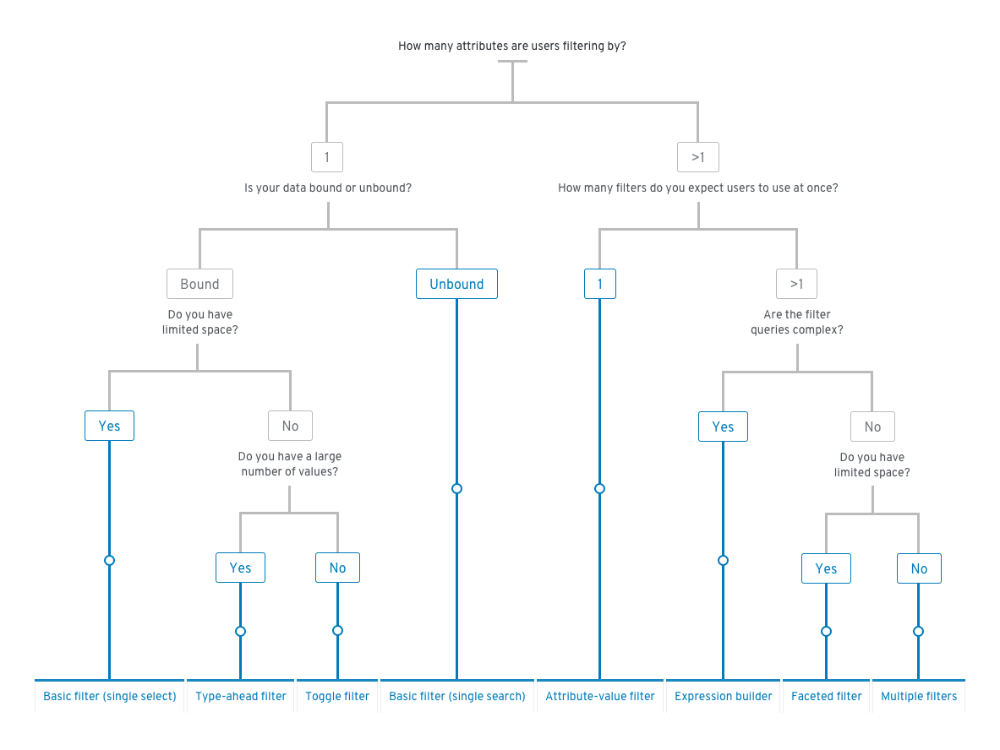
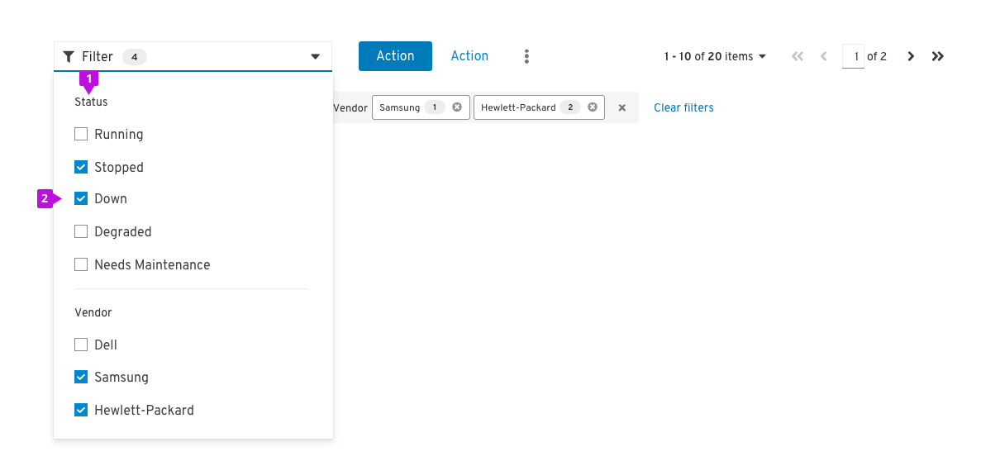
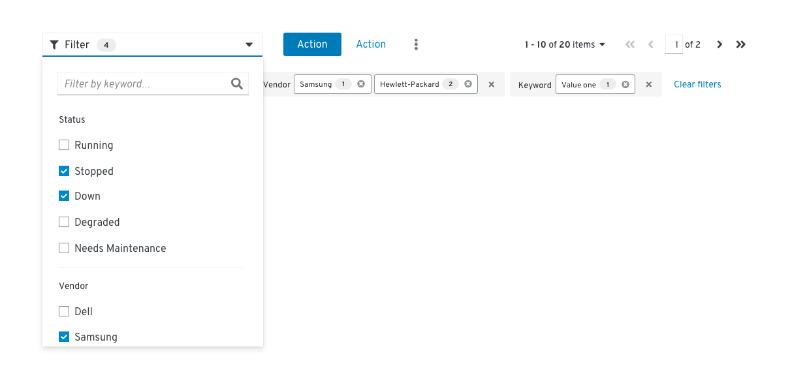
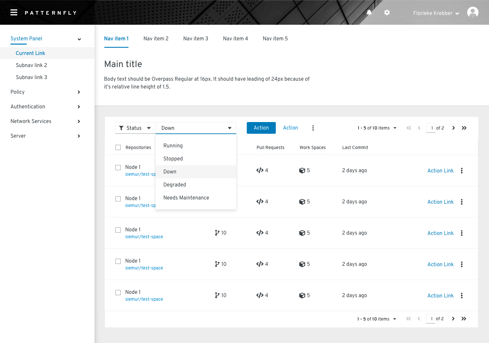
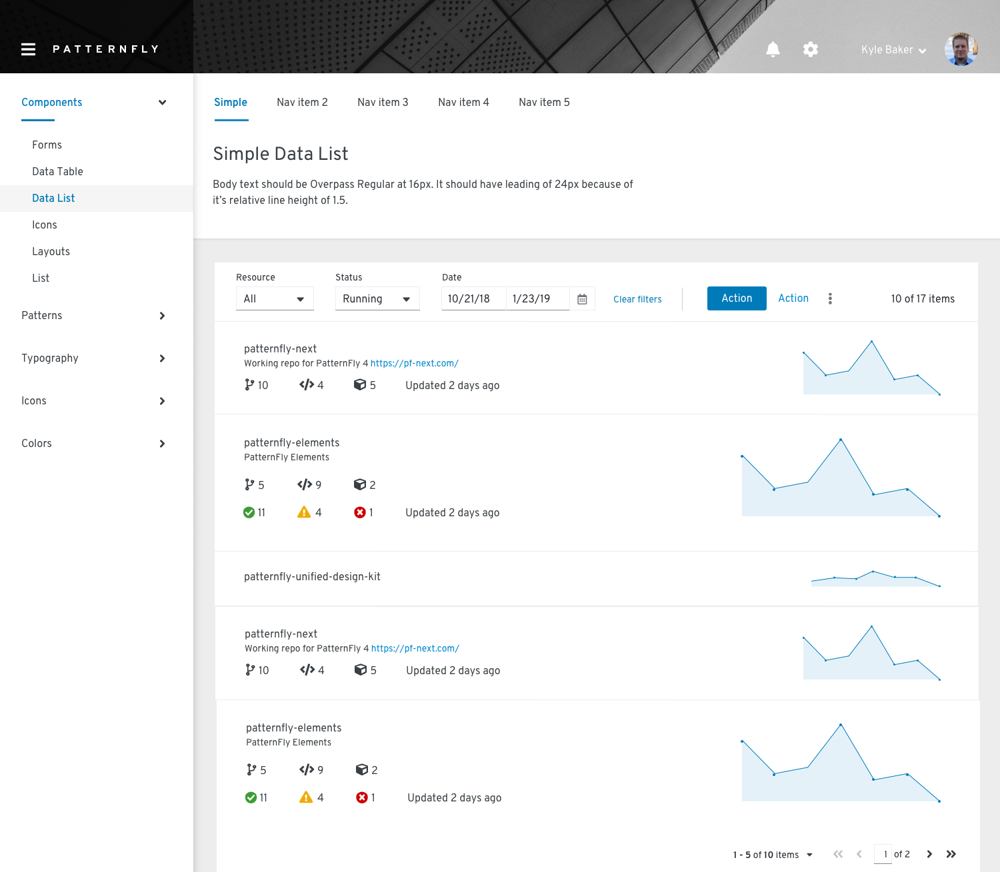

## About
PatternFly provides a number of common filters that can be used in a various combinations to create a custom filtering experience. These elements may be used in a toolbar or alone. You can use the decision tree below to help determine which filter best fits your use case.

## Elements
The following elements may be used to create a custom filter. Keep in mind that the following filter elements and variations only cover a number of use cases, and you may customize or combine them even further to fit your needs.
* [Basic filter](#basic-filter)
* [Attribute-value (textbox) filters](#attribute-value-textbox-filters)
* [Faceted (checkbox) filters](#faceted-checkbox-filters)
* [Type-ahead filters](#type-ahead-filters)
* Toggle filters
* Saved filters
* Expression builder
* [Filter chips](#filter-chips)

### Basic filter
The most basic filter gives the user the ability to filter by one attribute either using a single search field or a single select list with a fixed set of values.

**Single search field**

**Single select list**

#### When to use
Use a basic filter when there is only one attribute by which users can filter. Use the single search field when data is unbound and the single select list when data is bound.

#### Behavior
A filter query is triggered whenever a new value is set by the user. This can be done by pressing the Enter key or clicking the Search button in the search field, or by selecting an item in the list.

### Attribute-value (textbox) filters
The attribute-value filter gives the user the ability to specify an attribute-value pair for filtering a data set.

The following elements can be used in an attribute-value (textbox) filter.

1. **Attribute selector:** A select list that allows the user to select the attribute that they want to filter against.

2. **Value selector:** The value selector can be any data input component that is used to pass a value to the filter.

Common components used for value selection include:
  * A **search field** for entering a value from the keyboard. Use when you will enter the value as unbounded data (e.g. a name).
  * A **single select** for selecting a value from a predefined list.
  * A **checkbox select** for selecting multiple values from a predefined list. Multiple values will be combined using a logical OR operation. Items that meet both values will be shown higher in the results list.
  * A **date picker** for selecting a date, time, or a date/time range. Use when the value you want to filter on is expressed as a date and/or time stamp.

#### When to use
Use an attribute-value filter when the data to be filtered consists of sets of attribute-value pairs and values may be either unbounded (i.e text entry), a bounded value list, or temporal data like date and time. Attribute-value filters are also useful for cases where you expect your users to only be filtering by one thing at a time.

#### Behavior
A filter query is triggered whenever a new value is set by the user. The following are triggers applicable to the variations of the attribute-value filter shown above.

| Value selector | Trigger |
| ------- | ------ |
| Search field | The user presses the Enter key or clicks the Search button. |
| Select lists | The user selects or deselects an item in the list. |
| Date picker | The user selects a new date and/or time. |

### Faceted (checkbox) filters
Faceted filtering is useful when items can be described by categories according to multiple dimensions or facets.

The following elements can be used in a faceted (checkbox) filter.

1. **Facets:** In this example, Status and Vendor represent different facets, or categories.

2. **Values:** The checkboxes represent values that one might filter on.

**Note:** Consider adding an “Other” option to attribute lists where items may not fall under any of the specified values.

#### When to use
Use a faceted (checkbox) filter when:
* The user is browsing a set of items without robust knowledge of what is in the set.
* The important characteristics of the items to be filtered are mostly traits with a small and discrete set of choices like color, status, availability, or distributer rather than arbitrary text or numeric values such as name, date created, or amount of available space.
* If the important characteristics of the items are mostly open-ended values, consider using an attribute-value filter instead.

#### Behavior
New filters are applied or removed as the user selects/deselects values via the checkboxes.

### Type-ahead filters
Type-ahead filters are useful when there is a large number of items to select from the filter dropdown. Users can quickly find the value they would like to filter by typing in the field.

The following elements can be used in a type-ahead filter.

1. **Single select:** Single select type-ahead filters can handle one input. Users may scroll through the dropdown list or type in the box to find the desired option.

2. **Multi select:** Multi select type-ahead filters can handle multiple selections. Users may scroll through the dropdown list and select multiple options, or type in the box to find the desired options. Values will be shown in the input field as filter chips.

#### When to use
Use a type-ahead filter when:
* A dropdown list has a large number of options. In these cases, type-ahead can help a user find the desired option more quickly.
* Type-ahead filters can be used in place of a textbox filter in certain cases. For example, when filtering by name, using a type-ahead filter will ensure that only valid filters surface. This will avoid the need to present an empty state when invalid values are entered.

#### Behavior
A filter query is triggered whenever a new value is set by the user. The following are triggers applicable to the variations of the type-ahead filter shown above.

| Value selector | Trigger |
| ------- | ------ |
| Search field | The user presses the Enter key after typing in the input field. This action will create a filter for the first value shown in the filtered list. |
| Select lists | The user selects or deselects an item in the list. |

### Filter chips
When filters are applied, filter chips may be used to provide feedback.

**Basic filter chips**

As filters are applied, the value will be displayed as a filter chip. Each filter chip has an ‘x’ to remove the filter, or users may click “Clear filters” to clear all applied filters at once.

**Complex filter chips**

Filter chips may be used to show Boolean relationships between different attribute-value pairs. Individual filter chips can be removed by clicking the ‘x’ in each chip, and entire filter groups can be removed using the group ‘x’.

* Filters between attribute categories should be combined with a boolean AND operator.
* Filters within a category are shown grouped together and should be combined with a boolean OR operator.
  * **Example:** An item must be Stopped OR Down AND have Samsung OR Hewlett-Packard as a vendor.
* If the list is not otherwise sorted, items that satisfy a higher number of filters should be shown higher up the page.
  * **Example:** Items that have both Samsung and Hewlett-Packard as vendors are listed before items that only have Samsung or Hewlett-Packard.

In the example above, the result will be to show all items that have a status of stopped OR down AND are from vendor Samsung OR Hewlett-Packard AND match the keyword.

#### When to use
Use filter chips when:
* The value of the applied filter is not shown on the control itself.
* There is more than one value for a given facet.
* There are boolean filter rules being applied.

#### When not to use
Do not use filter chips when:
* The current settings of the controls are sufficient to convey applied filters.

## Variations
### Multiple filters
You can use multiple filters in combination to create a custom filtering experience.

#### When to use
Use multiple dropdown filters when you only have a handful of attributes that you want to show. Only use this filter when space allows; otherwise consider using a faceted filter.

#### Behavior
Filter queries are applied when the user selects or deselects an item in the list or selects a date/time range. A clear filters action to the right of the filters will remove all applied filters. If there are no applied filters, the icon will be disabled.

### Complex faceted filter
You can create a complex faceted filter by incorporating elements such as a search field into the dropdown component.

#### When to use
Use a complex faceted filter when you have limited space and multiple attributes with a variety of input types, for example, search field and checkbox selects.

#### Behavior
Filter queries are applied when the user selects or deselects an item in the list, or types a query in the input field and presses Enter.

## Usage
### Layout considerations
Filters may be included in a toolbar and are usually left aligned. There may be more than one filter used in a single toolbar, and in some cases, custom filters may make up a full toolbar. Filters may also be used alone outside of a toolbar.

### Mobile considerations
In responsive views, filters may be hidden within the filter icon. On click, the toolbar will expand to reveal the filter. If there are multiple filter elements, they will be collapsed into a single faceted filter.

## Examples
**Filter in toolbar on data list**

**Multiple filters in toolbar**

## Content

### Filters
Filter hint text in input fields should read “Filter by [attribute]...” and be in sentence case.

### Clearing filters
The option to clear all filters will be displayed after the last filter chip. It should read “Clear filters” in sentence case. When clicked, it should remove all applied filters and collapse the toolbar back into a single row.

## Related components and demos
**HTML/CSS**
* [Badges](/documentation/core/components/badge)
* [Chip](/documentation/core/components/chip)
* [Chip group](/documentation/core/components/chipgroup)
* [Input group](/documentation/core/components/inputgroup)
* [Options menus](/documentation/core/components/optionsmenu)
* [Select](/documentation/core/components/select)
* [Data Toolbar (experimental)](/documentation/core/experimental/toolbar)

**React**
* [Badges](/documentation/react/components/badge)
* [Chip group](/documentation/react/components/chipgroup)
* [Data Toolbar (experimental)](/documentation/react/experimental/toolbar)
