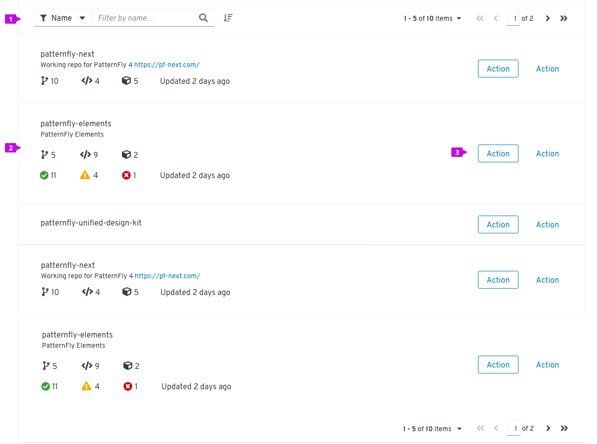
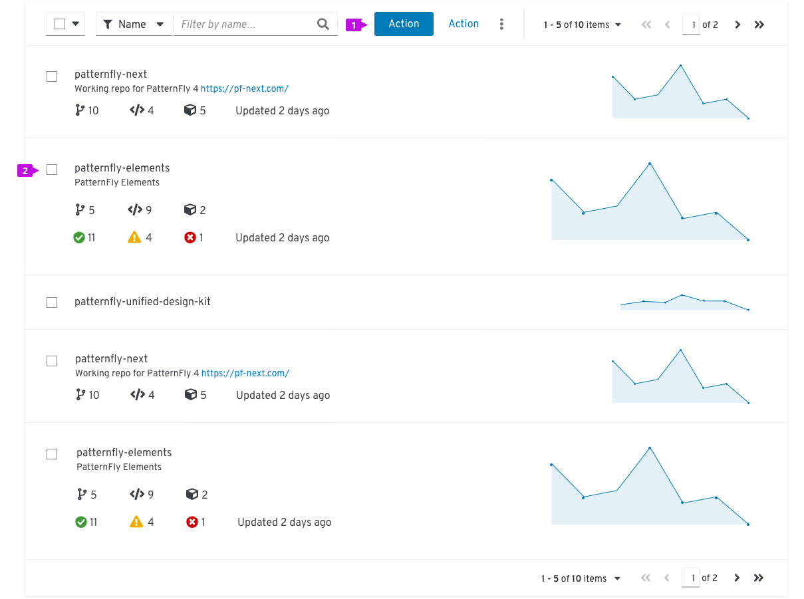
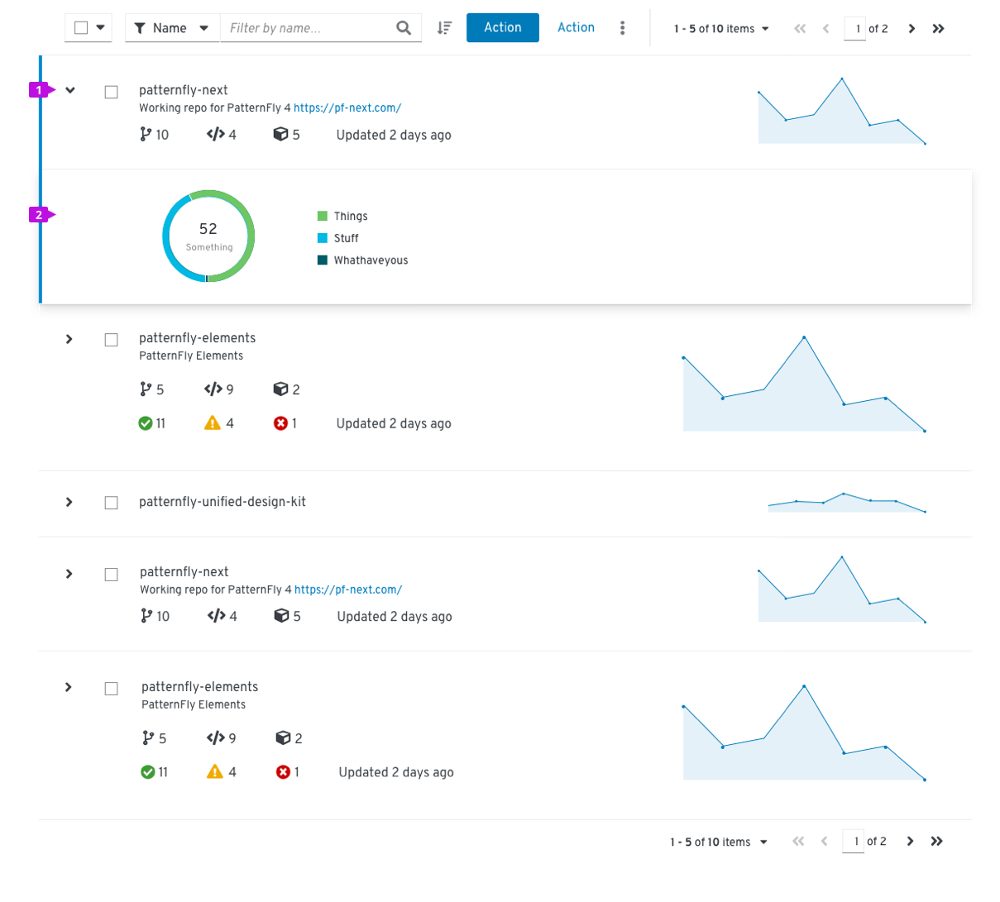
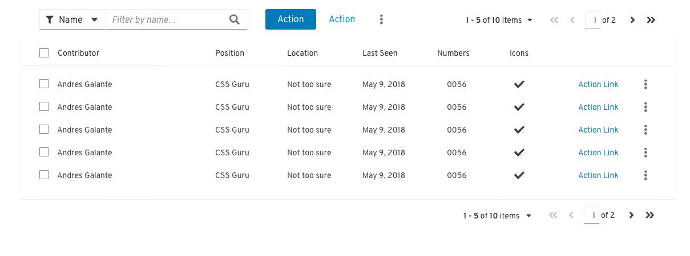
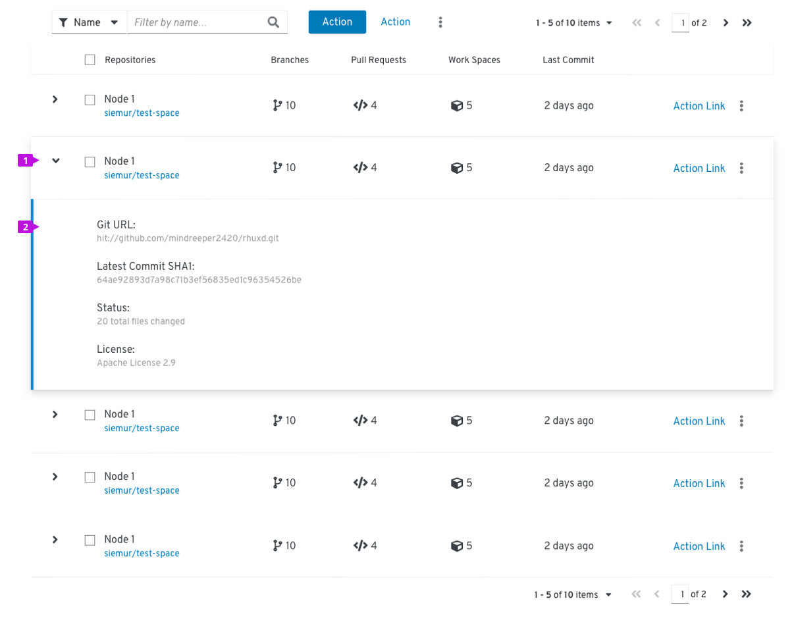
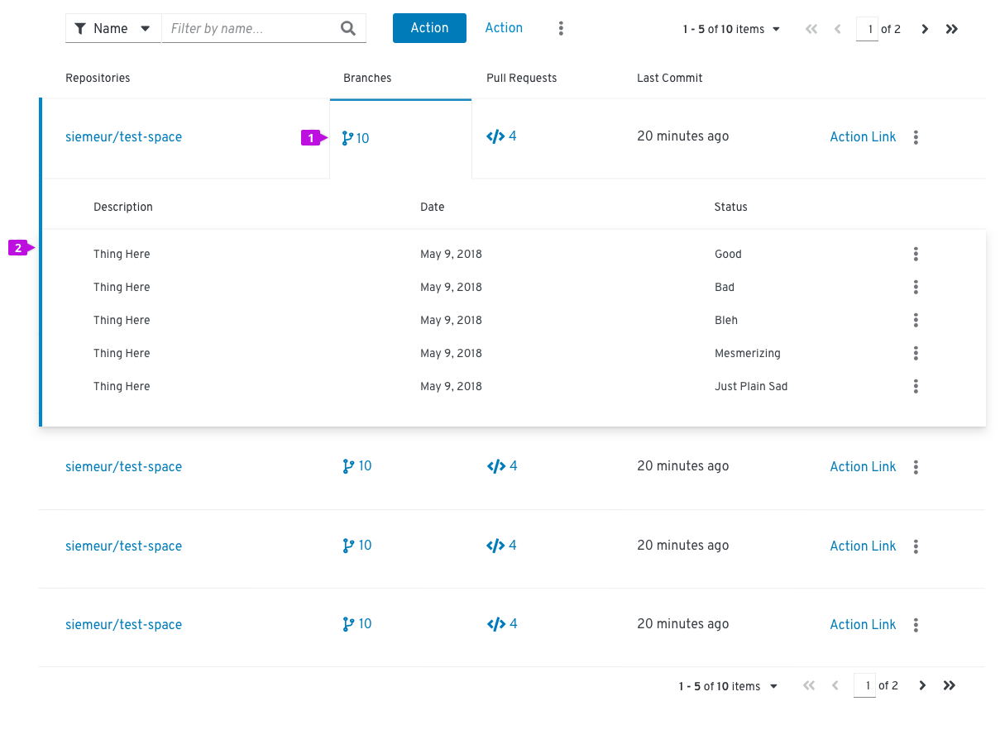

# Lists and tables
PatternFly offers two components for displaying large data sets, the Data List and the Data Table. They satisfy similar use cases, but choosing the correct component to use in your design will be dependent on the type of data you need to display.

Use Data Lists when:
* A flexible layout is more important than arranging information in a grid.
* You want to include active content like a chart.
* Content displayed may vary between rows.

Use a Data Tables when:
* Users will want to consume data as a grid (i.e. structured rows and columns).
* You want column headers.

## Data lists
PatternFly supports several variations of the Data List component.

### Standard data list

1. **Toolbar:** The toolbar sits above the list and contains controls for manipulating list data. Common actions include filtering, sorting, and pagination.
2. **Row:** Row height may be variable and sizes to the content. Rows in a data list may take any supported layout.
3. **Inline actions:** These actions apply only to the current row/item.

#### When to use
Use a Data List when the information you want to display is not easily structured into a tabular format, you want a more flexible layout within rows, of you plan to embed rich content like a chart or an image into a row.

#### When not to use
The Data List is not recommended for displaying content that is better presented in tabular format with well defined columns and headings. In these situations a Data Table should be used.

#### Alternative solutions
Alternative solutions include using a Data Table as referenced above or a [Card View](#). Card views have similar properties to the Data List except that information is displayed in a grid of cards. In choosing between a Data List and a Card View, consider the type of data that will be displayed and the format that best suits that data.

#### How to use
Think of each row in the Data List as a container for some formatted content. In PatternFly 4, Data List rows can accept any Layout supported by the PatternFly Design system. The only requirement is that all rows must apply the same layout. Here are some common layouts that may be useful in a Data List:

* **Grid:** when you want to lay out content in a responsive grid-like arrangement.
* **Level:** when you want to justify content evenly over the width of the row.
* **Split:** when you want to distribute content evenly with a main content area in the center.

### Actionable data list
The actionable list adds checkbox selection to select one or more rows to support global actions from the toolbar.

1. **Select checkbox:** Select this row.
2. **Global actions:** These actions apply to all selected items.

#### When to use
Use when your use case supports global actions performed against multiple selected items.

#### When not to use
Do not use when actions are restricted to a single row or object. In this case, placing actions inline within the row is recommended.

### Expandable data list
The expandable list adds an expansion panel to every row to reveal more detail about the item.

.
1. **Expansion caret:** Toggles the expansion open and closed.
2. **Expansion panel:** Revealed when the expansion is open. This is a container that can accept any supported layout to present some additional content to the user.

#### When to use
Use when you have more information than will comfortably fit inside a row or you want to provide a way for advanced users to access information that is not applicable to all users.

## Data tables
Two alternative stylings are available for Data Tables.
* **Standard** styling, sometimes been referred to as a hybrid list as it combines the styling of a list view with behaviors that are commonly associated with tables.
* **Compact** styling, when you want to maximize the amount of data that can be displayed in a small space.

### Standard Data Table

[image]

1. **Toolbar:** The toolbar sits above the list and contains controls for manipulating table data. Common actions include filtering, sorting, and pagination.
2. **Select all:** When present, selects all items in a table.
3. **Column headers:**
4. **Select checkbox:** Select this row.
5. **Global actions:** These actions apply to all selected items.
6. **Inline actions:** These actions apply only to the current row/item.
7. **Pagination footer:** If present, navigation to a new page.

#### When to use
Use a Data Table when the information you want to display is fits into a structured, tabular format, i.e. has distinct rows and columns.

#### When not to use
The Data Table is not recommended for less structured of variably structured data that cannot be easily organized into columns. In these situations a Data Table should be used.

#### How to use
Consider the structure of the data you want to display and organize that information into columns. Columns will typically have column headers. Every row within a table must have a consistent format, and if the table row includes actions, they should always be placed in the rightmost column(s).

### Compact Data Table

When to use
Use a Compact Data Table when you want to show as much data per page as possible and readability is a secondary concern.

Expandable Data Table

1. **Expansion:** When present, expands the row.
2. **Expansion panel:** contains details associated with a row.

When to use
Use a Compact Data Table when you want to show as much data per page as possible and readability is a secondary concern.

Compound-Expandable Data Table

Expansion: When present, expands the row.
Expansion panel: contains details associated with a row.

When to use
Use a Compact Data Table when you want to show as much data per page as possible and readability is a secondary concern.
