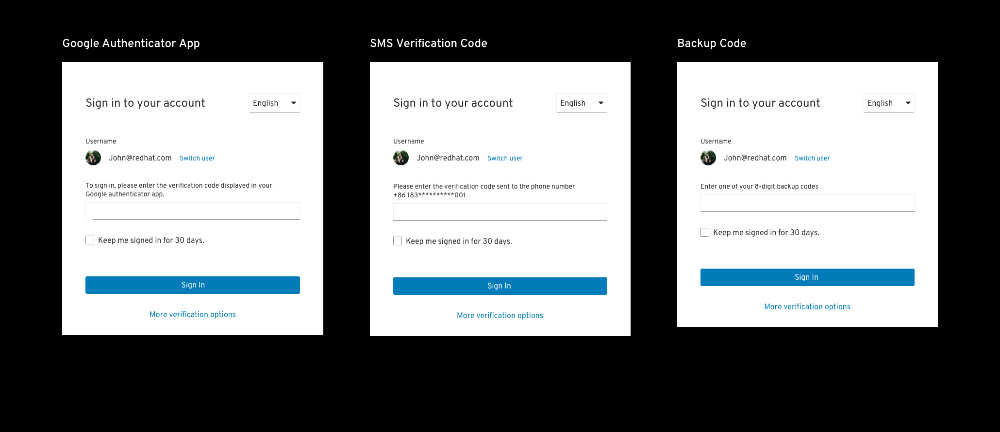
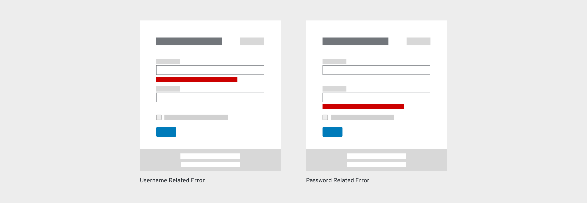

# Login Page

## About

The login page allows a user to gain access to an application by entering their username and password or by authenticating using a social media login.

## Elements of a Login page

**1. Title:** The title is located at the top of the login card. “Your Account” can be replaced by the product name or any other term that makes sense for your application. If the text is longer than the space allowed, text should wrap to the next line.

**2. Language Selector (optional):** The language selector is located in the top right of the login card.

**3. Required Fields:** Username and password are the required fields while additional fields are optional. Some applications may require additional fields such as a specific server or geo-location. When additional fields are required, they should be ordered on a case-by-case basis and placed directly below the password field. The login card will expand to accommodate the additional fields. Try to limit the total number of fields to less than five. Also, you may use progressive disclosure if the field value have dependency on the previous relevant field.

**4. Checkbox (optional):** A checkbox is located under the required (and any additional) fields, and is labeled based on the needs of the application. Checkbox labels should use sentence style capitalization according to the [Terminology and Wording Style Guide](https://www.patternfly.org/styles/terminology-and-wording/).

**5. Login Button:** The button should be labeled “Log in”. See [Common Terms and Words](https://www.patternfly.org/styles/terminology-and-wording/#common-terms-and-words) on the [Terminology and Wording Style Guide](https://www.patternfly.org/styles/terminology-and-wording/) for more information.

**6. Social Media Buttons:** All available social login methods should be displayed in the order of their highest usage, that is, the most frequently used items should be displayed towards the beginning of the list. Logos should wrap to a second line if they take up more than one line. Additionally each logo should have a tooltip display on hover stating the name of the social media application.

**7. Sign up (optional):** The user will be taken to the sign up flow after clicking the “Sign up” link.

**8. Forgot Password/Username Link (optional):** A help link should take users to a page where they can recover their password and or username.

**9. Background image:** any background image can be used for your application; it will automatically have a gradient applied to it to aid readability. Additional information regarding background image can be found at [insert link here]().

**10. Logotype:** The product logo is placed in the background image section towards the top.

**11. Description (optional):** Description of the website can be placed here.

**12. Links (optional):** You may add any additional links to pages where the user can get more information or help.

## Usage

There are three main usage scenarios related to the login page:

**1.** A user wants to gain access to an application

**2.** A user is automatically logged out due to inactivity and is redirected to the login page
  * If this happens, signing in should redirect the user back to the page they were on prior to being logged out.

**3.** A user has forgotten their username and/or password. A link is available to reset the username and/or password.
  * The login page should be replaced by the fields used to recover their username and/or password.

### Authentication Methods

#### Standard Login
The standard login is shown in the example above and provides a commonly used pattern where both the username and password input fields are displayed at the same time. This is commonly used by applications that don’t require additional types of authentication.

#### Multi Factor Login
The multi-factor login allows a user to gain access to an application by entering their authentication information step by step, such as username and password. Using a step by step process allows for the application to validate the username prior to allowing the password or additional type of factor to be added. This type of login allows for automatic redirecting to an external IdP when the user is linked to an external IdP.

When you need more security, you can incorporate additional authentication methods into the sign in process. An example showing both password and verification code is displayed below.

**1. More Verification Methods (optional):** Once the user has provided a valid password, the gray band that provides a way to sign up for an account and retrieve a lost or forgotten username or password is hidden and a link called “More verification options” is displayed. Clicking the link allows users to select an alternate type of verification if they can’t complete the default method. The link will lead to the next step where all allowable verification methods will be displayed.

Examples of additional multi-factor authentication that could be used include an authentication code, a SMS code or a backup code. An example of each is displayed below.

#### Single Sign On (SSO) Login
SSO (single sign-on) will allow a user to sign-in once and access multiple applications within the same organization. This type of login supports displaying both the username and password fields at the same time, or displaying one field at a time as in the multi factor login. Displaying one field at a time allows for greater security.

Additional Features for Single Sign-On

**1. Title:** The title is located at the top of the login card.

**2. Supported Services:** All the supported services logos will be displayed to the right of the form under the description.

#### Social Login
Some users may prefer to sign in with their social networks or IdPs accounts. A social login may utilize either a Standard, Multi Factor, or SSO login, depending on their security requirements. If a user decides to use a social login, when they click a social logo, they will be redirected to the social account’s login page. Once they successfully log in, they will be directed back to your application.

Please refer to branding guidelines when using logos for social login page. Examples of branding guidelines include:

* [Facebook brand guidelines](https://en.facebookbrand.com/guidelines/brand)
* [Twitter brand guidelines](https://about.twitter.com/en_us/company/brand-resources.html)
* [Github brand guidelines](https://github.com/logos)
* [Stack Exchange brand guidelines](https://stackexchange.com/legal/trademark-guidance)
* [Google brand guidelines](https://developers.google.com/identity/branding-guidelines)
* [LinkedIn brand guidelines](https://brand.linkedin.com/)
* [OpenID brand guidelines](http://openid.net/add-openid/logos/)
* [Instagram brand guidelines](https://en.instagram-brand.com/)

### Error States

Let users know when a form field submission results in an error. Always present error states on the form, and use inline errors whenever possible. The error state you use will depend on whether the validation happens on the client or the server.

#### Client-side Errors

Error messages are presented before the form is submitted. Client-side validation can be performed as soon as a field loses focus, and allows you to use inline validation to alert users of errors or issues immediately. In most cases, client-side validations are performed as inline validations for each field. Some common examples are shown below.

##### Empty Field(s)

An error message should be displayed below any required field that is empty once the action button (Log In/Next) has been clicked. Once the field has been filled, the error message should disappear. The following error messages are suggested for use.

| Situation     | Error Message
| ------------- |-------------|
| Username field is empty | Enter your email, phone number, or username|
| Password field is empty      | Enter your password |

##### Invalid Characters

An error message should be displayed when there is an invalid character in the username. Once the field has been modified, the error message should disappear. The following error messages are suggested for use.

| Situation     | Error Message
| ------------- |--------------|
| Invalid email address or phone number   | Enter a valid email address  |
| Invalid custom username                 | Invalid characters           |
| Invalid character in an email address/phone number | Enter a valid email address or phone number |

##### Caps lock is on

A warning message should be displayed when caps lock is on so users avoid making a mistake when typing a case-sensitive password. The warning message should be displayed in a popover when a user clicks into the input field. Once caps lock has been turned off, the warning message should disappear. The following warning message is suggested for use.

| Situation     | Error Message|
| ------------- |-------------|
| Caps lock is on   | Caps lock is on  |

#### Server-side Errors

When users submit a form, the entire page is reloaded if there are validation errors. At the same time, the password field should be cleared to provide additional security. Error messages can appear as inline errors for each field or as an inline error displayed below the application name and above the input fields. If there are multiple messages, each message appears on its own line; spacing between fields should be enough so that the form doesn’t jump to fit the messages.

##### Account doesn’t exist/password is wrong

An error message should be displayed when the user types an incorrect username that doesn’t exist or the wrong password. The most secure approach is to provide a generic message that the username or password is incorrect but to not point out which one is incorrect. This way the identity of a valid user is protected. If your application doesn’t require this level of security there are a few additional messages that can be used. Once the field has been modified, the error message should disappear. The following error messages are suggested for use.

| Situation | Error Message |
| ----------- | ----------- |
| Incorrect username or password (most secure error message) | Incorrect login credentials. |
| Username does not exist | This account does not exist. Try again or [sign up](). |
| Password is wrong | Incorrect password, try again |
| User inputs an old password | Incorrect password. Your password was modified in the last 2 days. |

##### General Warning Messages

Another form of error state message is a warning message. These messages are triggered by system level events or if a user is timed out of the application. Notifications should be displayed until the user attempts a new login. These messages should be displayed above the username field. The following are examples of general error messages.

| Situation | Error Message |
| --------- | ------------- |
| New account created and needs to verify email address | Confirm your email address. [Resend confirmation link](). |
| Too many unsuccessful attempts to log in | Your account is now locked. Contact your administrator for access. |
| Session timed out | Your session has expired. Please log back in.
