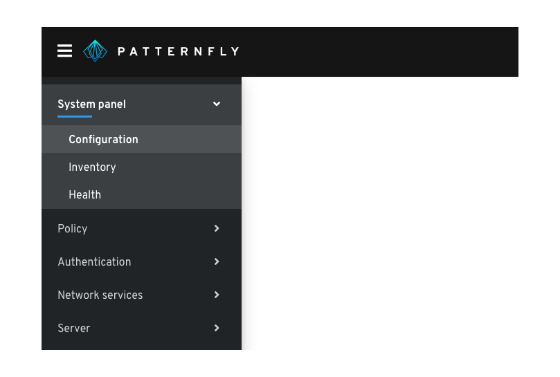
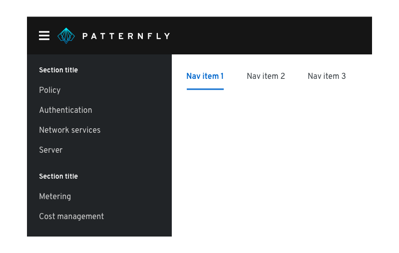
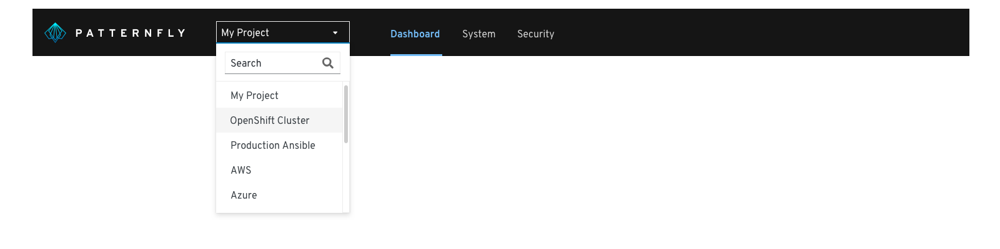

# Navigation system
Navigation is used to organize an application’s structure and content, making it easy to find information and accomplish tasks. Navigation communicates relationships, context, and actions a user can take within an application.

## Primary elements

1. Masthead
2. [Context selector (optional)](#context-selector) - enables a user to switch between different application contexts, like administration and monitoring
3. [Horizontal navigation](#horizontal-navigation)
4. [Breadcrumbs](#breadcrumbs)
5. Menu icon button - provides a way for users to toggle vertical navigation
6. [Vertical navigation](#vertical-navigation)
7. [Local navigation](#local-navigation)

## Components and demos used
The PatternFly components listed in the following sections can be used in a number of ways to suit specific needs or use-cases. We’ll explore several examples in this documentation.

**HTML/CSS components**
[Page](/documentation/core/demos/page), [Breadcrumb](/documentation/core/components/breadcrumb), [Nav](/documentation/core/components/nav), [Tabs](/documentation/core/components/tabs)

**React components**
[PageLayout](/documentation/react/demos/pagelayout), [Nav](/documentation/react/components/nav), [Breadcrumb](/documentation/react/components/breadcrumb),

## Usage
### Vertical navigation

Vertical navigation is hierarchical global navigation that displays navigation options from top to bottom on the left side of a screen. PatternFly vertical navigation can be collapsed to provide additional screen real estate by using a menu icon button at the top left.

#### When to use
* You have five or more primary navigation items
* You have secondary navigation items (even if you have less than five primary navigation items
* You expect your application to be used on desktop, laptop, and mobile devices

#### Variations
**Single level vertical navigation**

Use single level vertical navigation when you only have one level of navigation to display. If you have five navigation options or less, you could consider horizontal navigation.

**Two level vertical navigation**

When you have a small amount of secondary nav items, you can display them persistently beneath the primary navigation items.

**Expandable vertical navigation**

When you have a large number of secondary navigation items, you can use an expandable navigation to collapse and expand options as needed.

### Horizontal navigation

Horizontal navigation is global navigation that displays nav items from left to right at the top of an interface.

#### When to use
* You have less than five primary navigation items
* You have only one level of navigation and no secondary navigation items

### Local navigation

While global navigation controls what users are seeing at the application-level, local navigation provides more granular navigation specific to a particular page or window in the application. For example, a user might use global navigation to get to a settings page, and then use local navigation to access privacy and general user settings.

### Context selector

Use a context selector in addition to your global navigation when the data or resources you need to show in the interface are dependent on the users’ context.

### Breadcrumbs

Breadcrumbs act as a resource to help users navigate more efficiently and provide context to help users understand where they are in the application hierarchy. Use breadcrumbs in addition to your global navigation to display a user's location in the application.

#### When to use
* Use breadcrumbs when the primary and secondary navigation items are not always exposed.
* Don't use breadcrumbs as a replacement for global navigation.
