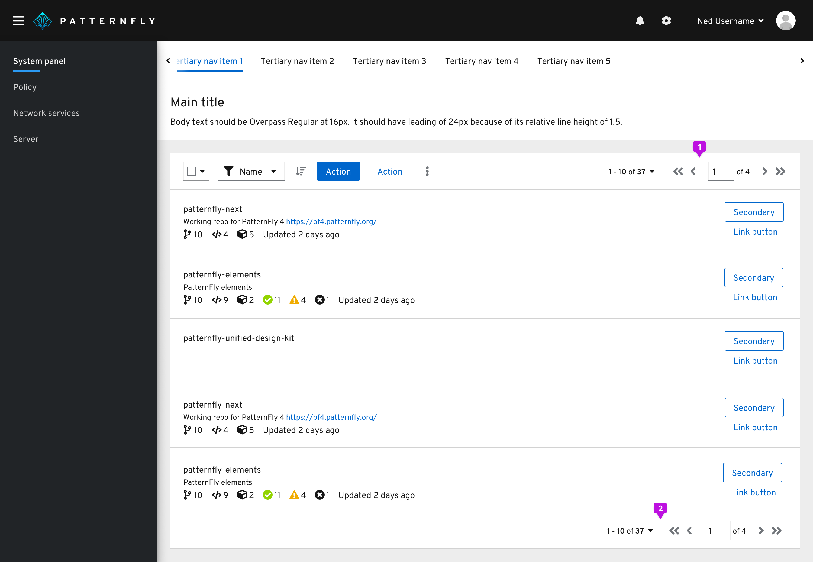
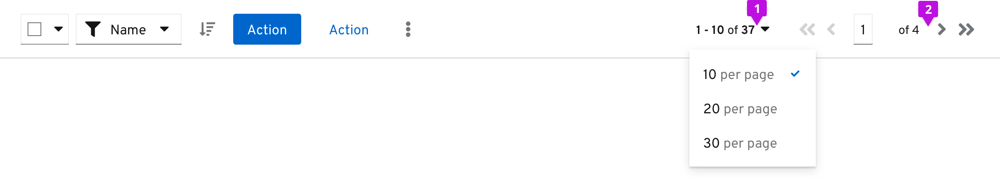
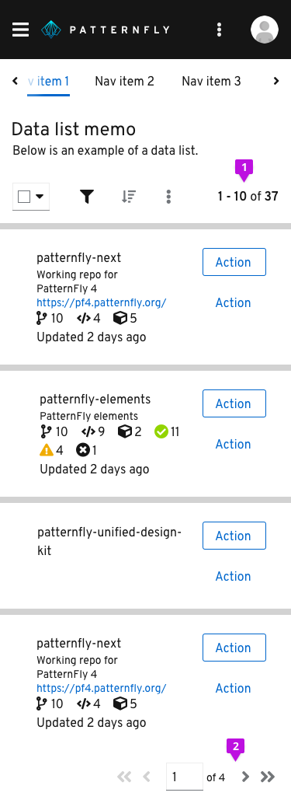
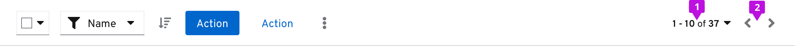

Pagination is used when you want to break up data into multiple pages. It is typically used within a table, list or card view.  If you choose to use infinite scrolling, then pagination would not be necessary. 

**1. Top pagination:** Pagination is always right-aligned in the toolbar. If pagination is required, we recommend using pagination both above and below content views.

**2. Bottom pagination:** Pagination should be shown below the content view as well.

## Full pagination

If you do not have to worry about spatial limitations within the top toolbar, we recommend you use full pagination. By adding this to your toolbar, you will have to limit the other actions added in the toolbar on desktop and tablet views. The full variation does condense into only an item count upon mobile.

Desktop full pagination in toolbar

**1. Items in view:** Selects the item count per page (how many total items are listed per page).

**2. Full pager:** Gives the user all pagination options necessary including page-back and page-forward, page-first and page-last, and a manual option to type in the page number.

Mobile full pagination in toolbar

**1. Items in view:** Pagination controls are hidden in the top toolbar at this screen size. Only the item count is shown to indicate items that are currently in view.

**2. Full pager:** In the bottom toolbar, this gives the user all pagination options necessary including page-back and page-forward, page-first and page-last, and a manual option to type in the page number.

## Compact pagination

We recommend using the compact pagination variation when you do have spatial limitations within the top toolbar. This variation allows for many more actions to be placed within the toolbar. The compact variation also condenses into only an item count upon mobile.

Desktop compact pagination in toolbar

**1. Items in view:** Selects the item count per page (how many total items are listed per page), as seen in full pagination.

**2. Compact pager:** This supplies the user with page-back and page-next controls only.

## Related components and demos
**Core HTML/CSS**
* [Pagination](/documentation/core/components/pagination)

**React**
* [Pagination](/documentation/react/components/pagination)