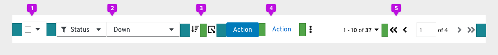
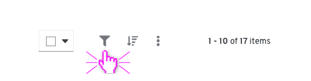

# Toolbar
The toolbar contains multiple components that allow a user to manage and manipulate a data set. Data can be presented in a variety of views (table, list, card, etc.). PatternFly supports multiple toolbar variations that address a variety of use cases.

## Elements

The following elements may be included in a typical toolbar.
1. **Bulk selection (optional)**: A bulk selector may be added when this functionality is not available from the data presentation component itself. Card views and data lists may require a bulk selector. Besides allowing the user to select and deselect all items on a page, other application specific options can be added. There should also be an indeterminate state where the bulk selector notifies the user that there are some items selected on a page. When a bulk selector is included, it will always be the left-most element in the toolbar. If the view type is a list, the bulk selector should be aligned with the checkboxes in each row.
2. **Filters**: PatternFly supports a variety of common filter types that can be used alone or in combination to construct a custom filter.
3. **Sort (optional)**: A sort component may to added when this functionality is needed. Tables have built in sorting, but card views and data lists may require toolbar sorting.
4. **Global actions**: Any global actions that apply to selected data items are included left-aligned following filter and sort controls. These may be exposed as buttons or collapsed into a kabob menu. No more than two items should be exposed as buttons. Button labels should be limited in length to preserve horizontal space.
5. **Pagination**: When pagination is supported, a pagination component will be included. Pagination will always be right aligned in the toolbar.

## Related components and demos
**Core HTML/CSS**
* [Badges](/documentation/core/components/badge)
* [Buttons](/documentation/core/components/button)
* [Chip](/documentation/core/components/chip)
* [Chip group](/documentation/core/components/chipgroup)
* [Dropdowns](/documentation/core/components/dropdown)
* [Input group](/documentation/core/components/inputgroup)
* [Options Menus](/documentation/core/components/optionsmenu)
* [Pagination](/documentation/core/components/pagination)
* [Select](/documentation/core/components/select)

**React**
* [Badges](/documentation/react/components/badge)
* [Buttons](/documentation/react/components/button)
* [Chip](/documentation/react/components/chip)
* [Dropdowns](/documentation/react/components/dropdown)
* [Toolbar demo](/documentation/react/demos/toolbar)

## Usage
### When to use
The toolbar should be used when users may need to manage and manipulate a data set, whether it is displayed in a table view, list view, card view, or any other view that requires manipulation and does not already offer controls to do so. There are multiple toolbar variations in order to address a variety of use cases. The toolbar may be further customized by using a unique set of components from the related components list.

### When not to use
The toolbar should not be used when the data view already includes the necessary controls to manipulate the data set.

### Layout considerations

The toolbar should appear below the page title, if one exists. It should always appear above the data set to which it applies. Toolbars should stretch to the width of the data view to which it applies, with the elements aligned as specified below. When filters are applied, the toolbar will expand in height to make space for a row of filter chips. Upon clearing the applied filters, the toolbar will collapse to it’s default height.

Within the toolbar, layouts may vary depending on the use case. When used, bulk selection should be the left-most element. Filters and global actions may follow. When pagination is used it should be the right-most element. When pagination is not used, the item count should be the right-most element.

## Variations
**Basic toolbar**

The basic toolbar is sufficient for most cases. It includes filters, global actions, and item count. The Toolbar is shown here with an Attribute-Value (textbox) filter, but a variety of filter types may be used.
1. **Item count**: When a filter is applied, the item count will be updated to represent the filtered subset of items. For example, “10 of 17 items.” The item count should be the right-most element.

**Toolbar with pagination**

When pagination is needed, a pagination component can be used.
1. **Pagination**: When pagination is used, the pagination component replaces the item count. It should be the right-most element.

**Toolbar with filter chips**

When the current settings of the controls are not sufficient to convey applied filters, filter chips should be used.
1. **Filter chips**: When filters are applied the toolbar will expand and filter chips will be displayed on the second row. Users can clear all filters by clicking the “Clear filters” link, and the toolbar will collapse back into one row.

**Custom toolbar**

When the current settings of the controls are not sufficient to convey applied filters, filter chips should be used.
1. **Filter chips**: When filters are applied the toolbar will expand and filter chips will be displayed on the second row. Users can clear all filters by clicking the “Clear filters” link, and the toolbar will collapse back into one row.

**Mobile toolbar**

Collapsed

Expanded

Footer with pagination

The toolbar adapts to smaller viewport sizes by collapsing or hiding elements that take significant space, including filters and actions. On mobile devices, when used, pagination will be available from the footer, only.

## Examples
**Toolbar in data table**

**Toolbar in data list**

**Responsive toolbar**

