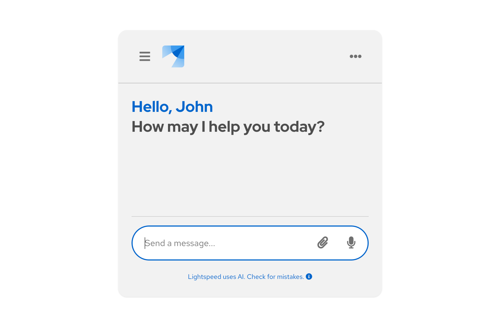
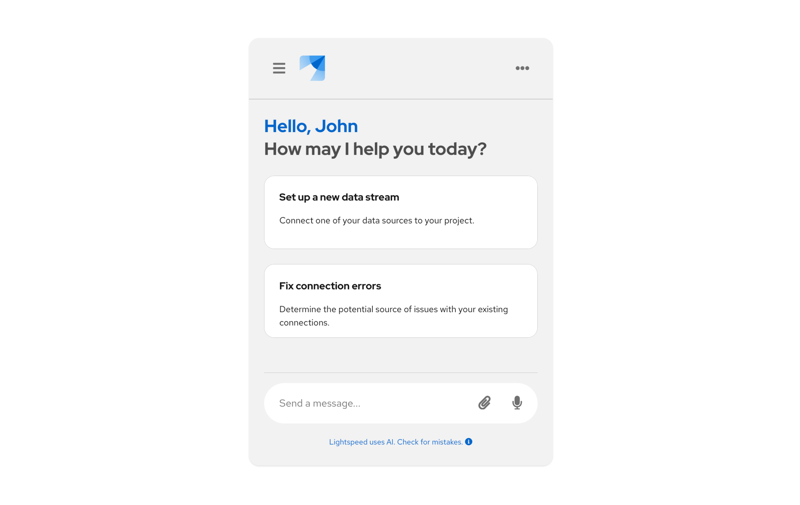

import { Button, Flex, FlexItem } from '@patternfly/react-core';
import ArrowRightIcon from '@patternfly/react-icons/dist/esm/icons/arrow-right-icon';

# Conversation design guidelines

**Conversation design** is a method of writing for conversational interfaces, like chatbots or voicebots. The goal of conversation design is to create an interactive experience that resembles human-to-human conversation as much as possible. Like traditional content design, conversation design is focused on using words to make experiences clear, concise, and well-timed.

Good conversation design combines content strategy, writing, and design to ensure that the development and use of chatbots is centered on real user needs. This includes making sure that all text related to the conversational UI supports easy engagement with chatbots, while staying aligned with brand standards.

When designing AI conversations alongside PatternFly-based projects, it is important to align with our established [brand voice and tone](/ux-writing/brand-voice-and-tone), as well as our [ethical guidelines for AI.](/patternfly-ai/ai-guidelines)

## Best practices 

Following these best practices to help ensure that your users can complete their goals through an AI-based conversation: 

- Be transparent about AI use. 
- Be direct, brief, and consistent. 
- Frame questions in terms of value for the user.
- If you ask for personal info, tell users "why" you're asking first. 
- Always have the last word.

## Writing for chatbots

When chatbots are designed to meet the needs of your users, they can improve the overall UX of your product. They are convenient, efficient, and persistent. 

[Our chatbot extension](/patternfly-ai/chatbot/about-chatbot) utilizes PatternFly components to create a foundation for an AI-based chatbot, with additional customization options.

<Flex>
<FlexItem>
<Button component="a" href="/patternfly-ai/chatbot/about-chatbot" target="_blank" variant="primary" size="lg">Use the chatbot extension <ArrowRightIcon /></Button>
</FlexItem>
</Flex>

Chatbots are only as good as the writing that goes into them. The language they use must build trust, clearly establish the “rules” of the conversation, and support users' goals. 

In addition to general microcopy, like headings or buttons, you will need to write:
- Welcome and goodbye messages. 
- Bot prompts. 
- AI disclosures.

### Welcome and goodbye messages 

It is important to always welcome users to the chatbot experience, and (if applicable) to say goodbye when they've ended the chat. A goodbye message isn't always necessary, like in instances where users can "minimize" a chat window to come back to it later. 

When you know your user's name, address them directly. 

### Bot prompts 

When writing your bot's prompts: 

- Keep messages short and simple. Try to stick to 3 lines of text in a message and only send 3 messages at most before allowing a user to provide input. 
- Be direct and limit choices for users as much as possible. 
- Unlike traditional content design, *don't lead with the benefit.* End with the benefit to be sure that it's read and acted upon. Users should be able to complete an action solely based on a chatbot's last sentence. 
- Frame any questions from the bot in terms of value for the user.
- Provide examples when relevant.
- Avoid open-ended questions. If you ask any, make them very simple, increase pause time between messages, and tell users when they should type. 
- Utilize different methods of presenting information, like cards or buttons. You don't have to always use plain text in your messages; sometimes different message types can be more convenient and engaging.

### AI disclosure 

Make sure to disclose any use of AI in chatbots. Our users should be able to trust that we are honest and transparent with them as much as possible.

- Use labels and other visual styling cues to clearly identify AI features. 
- Add necessary legal disclosures where you can, like in the chatbot footer. 
- Display an indicator when the bot is "thinking" or "typing," so that users know to expect feedback.
