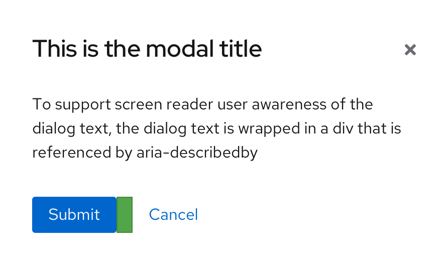
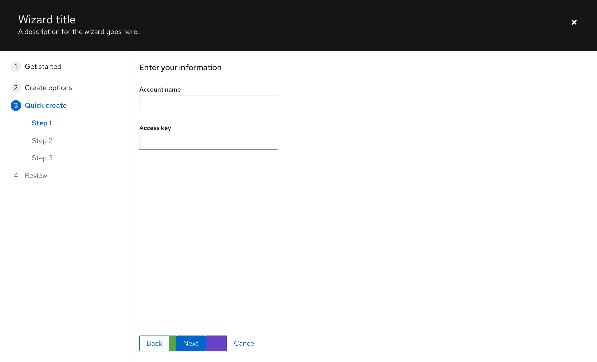
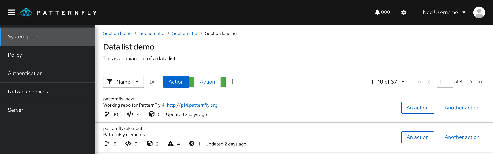

## Usage
Use an action list to determine which spacing guidelines to use for a group of actions in [toolbars](/components/toolbar), [modals](/components/modal), [forms](/components/forms/form), [data lists](/components/data-list), [wizards](/components/wizard), and more. Using an action list allows you to know what spacing to use for a group of actions, depending on your use case. 

Action lists are especially useful for situations that call for more than standard spacing between elements. For example, buttons are normally separated by 16px, but cases like cancel buttons in wizards call for 48px of spacing from other actions instead. Using an action list upholds spacing guidelines across different use cases.

Action lists are also designed to stack buttons correctly within the space they are in.

### Examples
#### Action list for actions in a modal
In this example, an action list is used for action buttons inside a modal. The action list allows for 16px spacing to be maintained between the action buttons.

#### Action list for actions in a wizard
In this example, an action list is used for the actions within a wizard. The action list allows for 16px spacing to be maintained between the main action buttons, and 48px of spacing to be maintained between them and the cancel button.

#### Action list for actions in a toolbar
In this example, an action list is used for the actions within a toolbar. The action list allows for 16px spacing to be maintained between action buttons.

## Accessibility
For information regarding accessibility, visit the [action list accessibility tab](/components/action-list/accessibility). 
